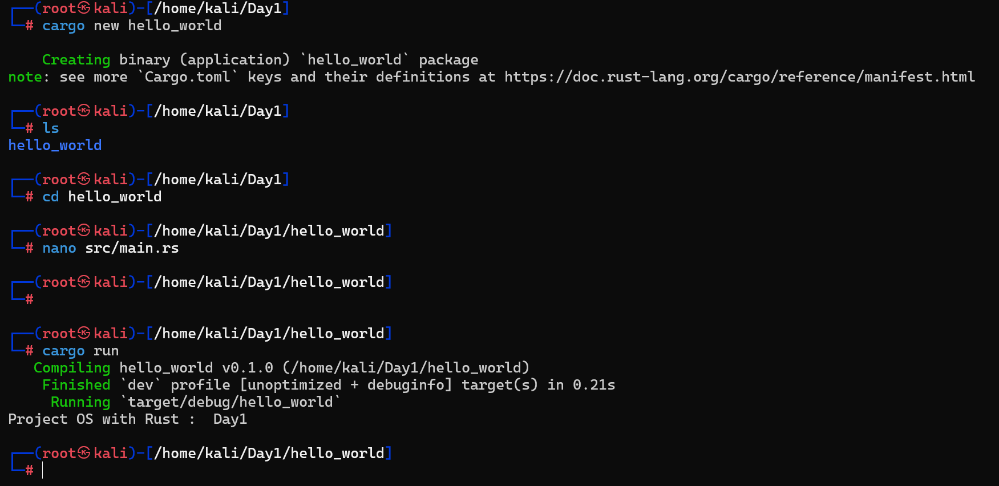

# Jour 1 : Environnement Bare-Metal en Rust

Bienvenue dans le premier jour du développement de notre OS moderne en Rust. L'objectif d'aujourd'hui est de mettre en place un environnement de travail solide pour le développement "Bare-Metal", tout en gardant une perspective de cybersécurité pour comprendre les vecteurs d'attaque potentiels dès la racine.

## 🛠️ Pourquoi Rust Nightly ?

Rust dispose de deux versions principales. Pour le développement d'OS, la version **Nightly** est obligatoire car elle permet d'utiliser des fonctionnalités expérimentales essentielles :

*   `#![no_std]` : Désactive la bibliothèque standard (qui suppose l'existence d'un OS).
*   `#![no_main]` : Nous permet de définir notre propre point d'entrée au lieu du `main()` classique.
*   **Inline Assembly (`asm!`)** : Pour communiquer directement avec le processeur.

---

## 🚀 Étapes d'installation

### Étape 1 : Dépendances système
Installation des outils de compilation, de l'émulateur QEMU et des utilitaires nécessaires.
```bash
sudo apt update && sudo apt install -y curl build-essential gcc lld nasm qemu-system-x86 git
```

### Étape 2 : Installer Rust
```bash
curl --proto '=https' --tlsv1.2 -sSf https://sh.rustup.rs | sh
# Choisissez l'option 1 (default)
```

### Étape 3 : Recharger le PATH
```bash
source $HOME/.cargo/env
```

### Étape 4 : Passer en Nightly
```bash
rustup default nightly
```

### Étape 5 : Target Bare-Metal
Ajout de la cible pour compiler sans système d'exploitation.
```bash
rustup target add x86_64-unknown-none
```

### Étape 6 : Cargo-xbuild
Outil pour recompiler les bibliothèques de base pour notre cible spécifique.
```bash
cargo install cargo-xbuild
```

### Étape 7 : Vérification
```bash
rustc --version && cargo --version
```

> [!WARNING]
> **Note Cyber :** L'utilisation de `curl ... | sh` est pratique mais risquée. Si le serveur `sh.rustup.rs` est compromis, un attaquant pourrait exécuter du code arbitraire sur votre machine. C'est un exemple classique d'attaque sur la chaîne d'approvisionnement (Supply Chain Attack).

---

## 📊 Workflow de l'Environnement

```mermaid
graph TD
    A[apt install tools] --> B[curl | sh rustup]
    B --> C[source .cargo/env]
    C --> D[rustup nightly]
    D --> E[target x86_64-none]
    E --> F[cargo-xbuild]
    F --> G[✅ Environnement Prêt]
```

---

## 📸 Résultat du Premier Test

Voici un aperçu de l'environnement opérationnel :



---

## 🛡️ Perspective Cyber : Analyse de la Supply Chain

Comprendre comment les choses sont construites permet de mieux voir où elles peuvent être cassées. Voici les vecteurs d'attaque dans une chaîne de compilation :

| Étape | Vecteur d'attaque | Exemple Réel |
| :--- | :--- | :--- |
| **Dépendances (crates)** | Crate malveillante sur crates.io | SolarWinds-style supply chain |
| **Le compilateur** | Compiler un compilateur backdooré | Ken Thompson "Trusting Trust" (1984) |
| **Linker Script** | Modifier la disposition mémoire | Écrasement de sections critiques |
| **Macros Procédurales** | Injection de code à la compilation | Exécution de code arbitraire au build |
| **Variables d'env** | `build.rs` malveillant | Exécution arbitraire au build |

### L'attaque mythique : "Trusting Trust"
Ken Thompson (créateur d'Unix) a démontré en 1984 qu'on peut backdoorer un compilateur de façon indétectable dans le code source. Le compilateur infecté injecte le backdoor dans les binaires qu'il produit, y compris les nouvelles versions de lui-même. C'est l'attaque ultime sur la confiance.
