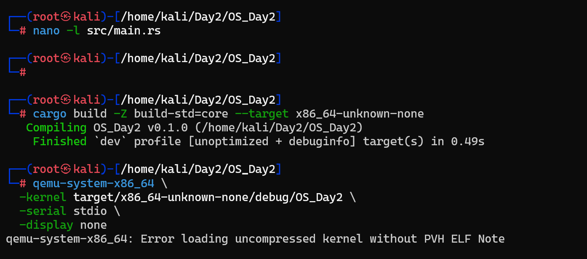
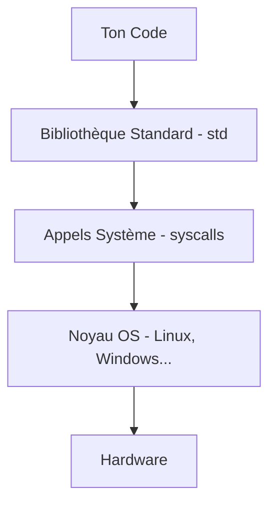

# Jour 2 : Zéro dépendance à l'OS 🛡️

L'objectif d'aujourd'hui est de s'affranchir totalement des bibliothèques standards pour créer un binaire "bare-metal". C'est une étape cruciale pour le développement d'un OS et fondamentale pour la sécurité du système.



## 🏗️ La Pile Logicielle Rust

D'abord, comprenons ce qui se passe quand on écrit un programme Rust classique :



La `std` de Rust donne accès à `println!`, `Vec`, `String`, `File`, `Thread`, etc. Tout cela suppose qu'un OS existe déjà en dessous. Dans notre projet, nous créons l'OS à partir de zéro, donc la `std` est impossible à utiliser.

```rust
#![no_std] // Cette ligne dit à Rust : "n'importe pas std"
```

---

## 🛡️ Focus Sécurité : Pourquoi `no_std` ?

Réduire les dépendances, c'est réduire la surface d'attaque.

### 1. Surface d'attaque réduite
*   **Avec std :** Ton code → std (100 000+ lignes) → OS → hardware. Chaque couche est un vecteur d'attaque potentiel.
*   **Sans std :** Ton code → core (minimal) → hardware. La confiance est concentrée.

### 2. Pas d'interface d'attaque OS
Sans `syscalls`, il n'y a pas d'interface exploitable par un attaquant pour interagir avec un noyau sous-jacent.

### 3. Immunité aux exploits de Heap
En `no_std`, il n'y a **pas de heap** par défaut (pas de `malloc`, pas de `free`).
> [!TIP]
> Les attaques comme le **Use-after-free**, le **Heap overflow** ou le **Double free** deviennent techniquement impossibles car la mémoire dynamique n'existe pas encore.

---

### 🛡️ Vision : Bypassing the OS


---

## 💻 Implémentation du Binaire Minimal

Voici notre point d'entrée minimal dans `src/main.rs` :

```rust
#![no_std]
#![no_main]

use core::panic::PanicInfo;

// Point d'entrée de ton OS
// "no_mangle" = garde le nom "_start" tel quel pour le linker
// "extern C" = utilise la convention d'appel du C
#[no_mangle]
pub extern "C" fn _start() -> ! {
    // Le "-> !" signifie que cette fonction ne retourne JAMAIS
    loop {}
}

// En no_std, tu DOIS définir ce qui se passe en cas de panic
#[panic_handler]
fn panic(_info: &PanicInfo) -> ! {
    loop {}
}
```

---

## 🛠️ Configuration du Linker

Pour compiler en bare-metal, nous devons donner des instructions spécifiques au linker via `.cargo/config.toml` :

```toml
[build]
target = "x86_64-unknown-none" # Toujours compiler en bare-metal

[target.x86_64-unknown-none]
rustflags = [
    "-C", "link-arg=-nostartfiles", # Pas de fichiers de démarrage C
]
```

---

## 📊 Comparaison des Binaires

| Type de Binaire | Composition | Contrôle |
| :--- | :--- | :--- |
| **Binaire Normal** | [code] + [std 100k lines] + [runtime C] + [syscalls OS] | Partiel (Code tiers) |
| **Binaire no_std** | [code] + [core minimal] | **Total (Full Control)** |

> [!IMPORTANT]
> En contrôlant tout ce qui s'exécute, nous éliminons le "code caché" et les runtimes qui pourraient contenir des vulnérabilités non documentées.
