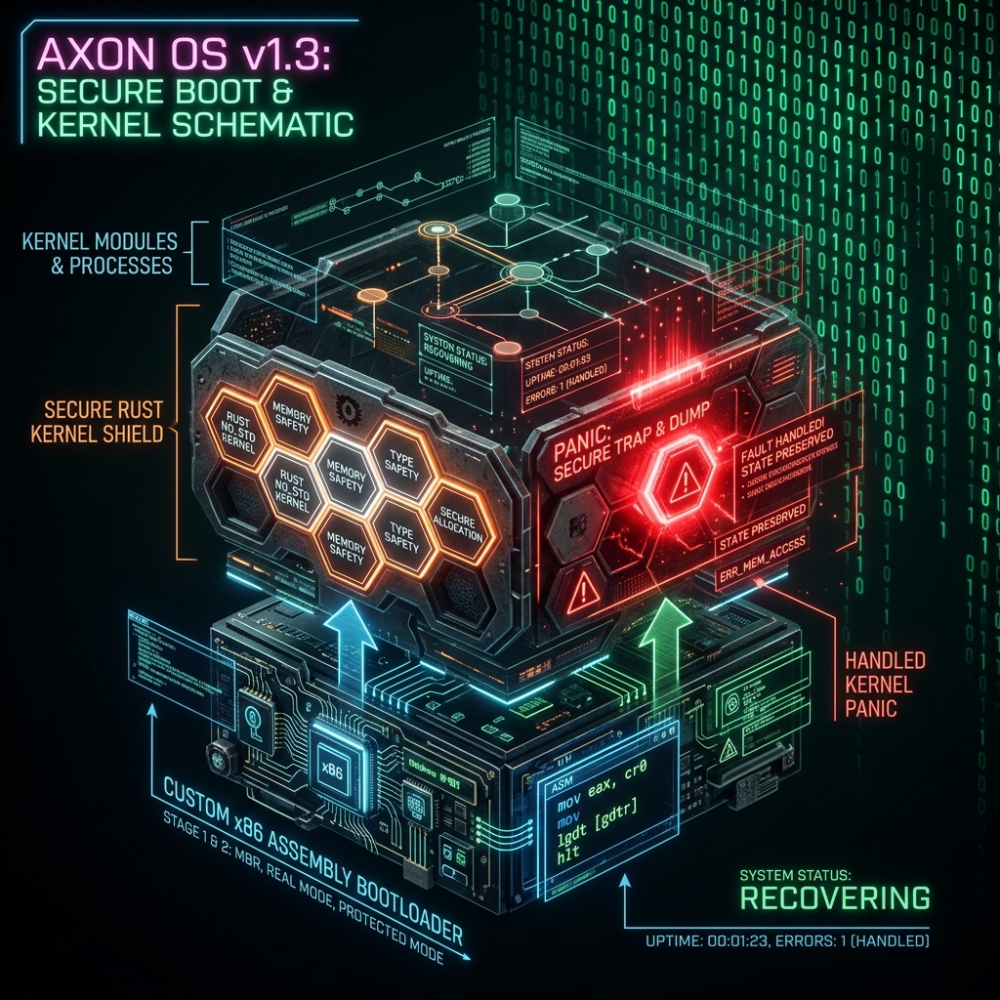
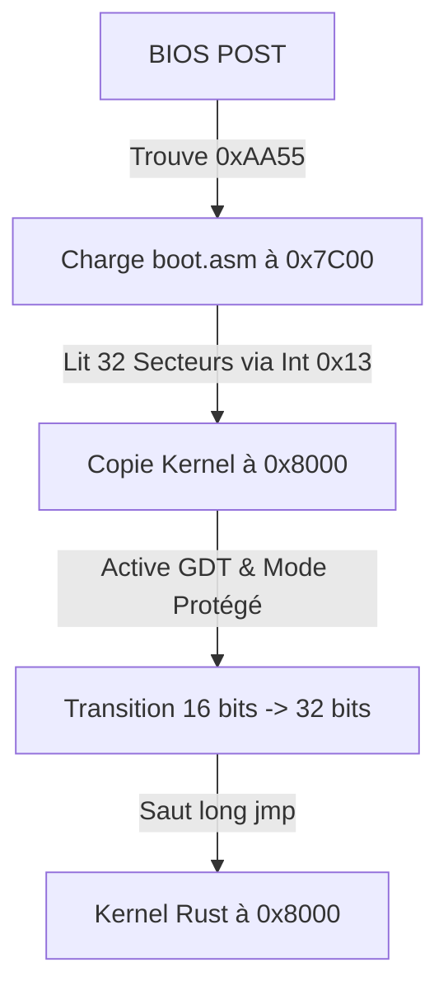
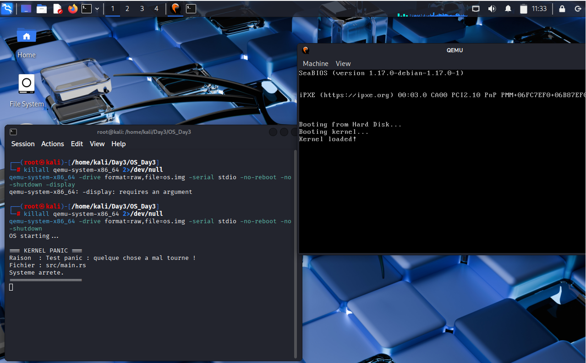

# Jour 3 : Panic Handler & Bootloader 🚀

Ce troisième jour marque une étape charnière : nous avons créé un **secteur d'amorçage (Boot Sector) en assembleur x86** pour charger notre noyau Rust, et nous avons conçu un **gestionnaire de panic (Panic Handler)** sécurisé pour éviter toute exécution instable du CPU.



---

## 📂 Structure finale du Projet (OS_Day3)

L'architecture des dossiers et fichiers créés pour cette étape se présente comme suit :

```
OS_Day3/
├── Cargo.toml
├── i686-unknown-none.json     <-- Cible 32 bits personnalisée
├── linker.ld                  <-- Script de liaison mémoire
├── .cargo/
│   └── config.toml
└── src/
    ├── main.rs
    └── boot.asm
```

---

## 💾 Partie 1 : Le Bootloader (Boot Sector ASM)

### Origine du Bootloader
Pour ce projet, nous n'avons pas réinventé la roue : nous avons utilisé et adapté un bootloader éducatif classique (très répandu dans la littérature de développement d'OS, comme le wiki *OSDev*). L'objectif est de comprendre la mécanique standard d'initialisation matérielle sur architecture x86 et d'étudier sa sécurité, sans perdre de temps sur les standards historiques d'IBM PC.

### Concept & BIOS Bootstrap
Au démarrage, le BIOS du PC cherche le premier secteur de 512 octets sur le disque qui se termine par la signature d'amorçage `0xAA55`. Ce secteur (le **boot sector**) est chargé à l'adresse mémoire `0x7C00` en mode réel 16 bits.

Notre bootloader réalise les étapes suivantes :
1. **Initialisation** des registres et de la pile (`sp = 0x7C00`).
2. **Chargement du Kernel** : on lit 32 secteurs du disque depuis le secteur 2 (où réside notre noyau Rust) et on les charge en mémoire à l'adresse `0x8000`.
3. **Transition de mode** : on charge la table des descripteurs globaux (**GDT**), on active le mode protégé 32 bits (via le registre `cr0`), puis on saute vers notre noyau.



---

## 🛡️ Partie 2 : Le Panic Handler (Kernel Rust)

### Pourquoi c'est critique en sécurité ?

Dans un OS classique (avec bibliothèque standard), une erreur fatale (`panic!`) provoque un crash propre géré par l'OS hôte. En mode bare-metal, sans gestionnaire de panic :
* Le CPU continue d'exécuter des instructions sur de la mémoire aléatoire ou non initialisée.
* Cela ouvre une **surface d'attaque critique** propice aux débordements et à l'exécution de code arbitraire.

Notre architecture sécurisée met en place une isolation stricte :
```
[ Comportement Sans Panic Handler ]
Panic ──> CPU divague ──> Mémoire aléatoire ──> [ Risque d'Exploit ]

[ Comportement Avec Notre Panic Handler ]
Panic ──> Capture de l'erreur ──> Sortie série debug COM1 ──> hlt (CPU halt) ──> [ Sécurité Totale ]
```

* **Port Série (COM1 - `0x3F8`)** : Utilisé pour extraire les logs d'erreurs hors bande.
* **Sécurisation via `hlt`** : En cas de panic, on stoppe immédiatement le système pour empêcher tout comportement indéfini.

---

## 🛠️ Configuration & Compilation

L'intégration d'un bootloader ASM 32 bits avec un noyau Rust repose sur deux configurations fondamentales :

### Cible de Compilation 32 bits
Pour s'accorder avec notre bootloader, Rust doit impérativement compiler un noyau 32 bits. Nous utilisons donc une cible personnalisée (`i686-unknown-none.json`) au lieu des cibles 64 bits par défaut.

### Alignement Mémoire (Linker)
Le bootloader est programmé pour sauter à l'adresse mémoire `0x8000`. Il est crucial que notre point d'entrée Rust (`_start`) s'y trouve. 
Pour garantir ce positionnement, nous plaçons la fonction dans une section `#[unsafe(link_section = ".text.entry")]` et utilisons un script de liaison (`linker.ld`) qui positionne cette section en tête :

```ld
ENTRY(_start)
SECTIONS {
    . = 0x8000;
    .text : {
        *(.text.entry)   /* Garanti d'être exécuté en premier */
        *(.text)
        *(.text.*)
    }
    /* ... rodata, data, bss ... */
}
```

### Commandes d'Assemblage
Pour générer et lancer l'image sur notre environnement de virtualisation (VM Kali) :

```bash
# 1. Compilation du Boot Sector
nasm -f bin src/boot.asm -o boot.bin

# 2. Compilation du Kernel Rust 32 bits avec la cible custom
cargo build -Z json-target-spec

# 3. Extraction du binaire brut
objcopy -O binary target/i686-unknown-none/debug/kernel kernel.bin

# 4. Création de l'image disque
dd if=/dev/zero of=os.img bs=512 count=2048
dd if=boot.bin of=os.img conv=notrunc
dd if=kernel.bin of=os.img bs=512 seek=1 conv=notrunc

# 5. Lancement avec QEMU (Redirection Série)
qemu-system-x86_64 -drive format=raw,file=os.img -serial stdio -no-reboot -no-shutdown -display none
```

### Résultat de l'Exécution



**Pourquoi le message s'affiche-t-il dans le terminal hôte et non dans la fenêtre QEMU ?**
Dans notre architecture bare-metal, nous n'avons pas encore développé de pilote pour l'affichage VGA. À la place, nous avons configuré le noyau pour envoyer ses textes directement au port de communication série matériel (`COM1 - 0x3F8`), une méthode couramment utilisée pour le débogage (out-of-band logging).
Lors de la commande d'exécution, l'option ` -serial stdio ` demande à QEMU de capturer les signaux de ce port série et de les afficher directement dans notre terminal Kali. C'est pour cette raison que la fenêtre QEMU reste noire (aucun pilote vidéo actif) tandis que notre fameux `=== KERNEL PANIC ===` s'affiche proprement dans la console hôte.

---

## 🛡️ Résumé - Analyse d'Angle Cyber

| Mécanisme | Vecteur d'Attaque | Mitigation / Protection |
| :--- | :--- | :--- |
| **Boot Sector signé `0xAA55`** | Menace de **Bootkit** et corruption du MBR. | Validation d'intégrité pré-boot (concept UEFI Secure Boot). |
| **Transition Réel 16 -> Protégé 32** | Contournement des privilèges ring 0/3. | Table GDT configurée de façon stricte pour isoler les segments. |
| **Panic Handler & `halt()`** | Fuite d'informations, contournement de logique. | Arrêt immédiat de l'exécution (`hlt`), zéro comportement indéfini. |
| **Port Série COM1 Debug** | Canal caché (Covert Channel) ou fuite d'infos sensibles. | Désactivable en version finale de production. |
