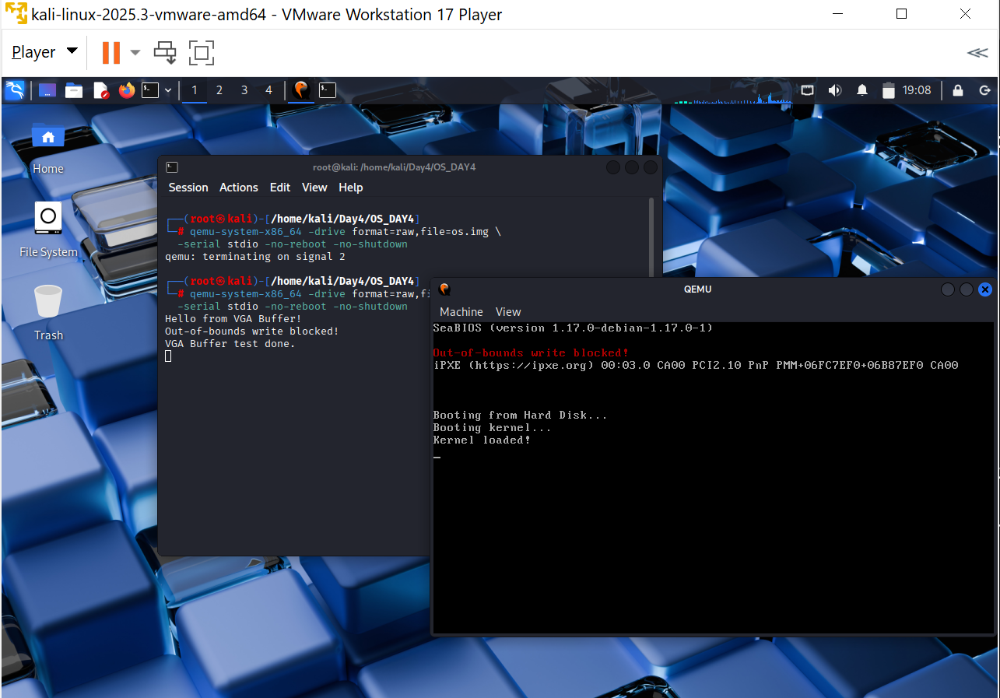

# Rapport Jour 4 – VGA Buffer & Kernel Integration

Après le bootloader du Jour 3, nous avons étendu le noyau avec un **driver VGA modulaire** permettant d'afficher du texte directement dans le buffer mémoire `0xb8000`, ainsi qu'un **débogage par port série** redirigeant toute sortie vers le terminal QEMU.

---

## 1. Bootloader (`src/boot.asm`)

Identique au Jour 3. Le secteur d'amorçage (512 octets) :

- Initialise les segments et la pile en mode réel 16 bits.
- Lit **32 secteurs** depuis le disque à l'adresse physique `0x8000` via l'interruption BIOS `INT 13h`.
- Charge le GDT et passe en **mode protégé 32 bits**.
- Effectue un saut long vers `0x8000` où le kernel est chargé.

---

## 2. Cible de compilation -`i686-unknown-none.json`

Cible personnalisée 32 bits bare-metal :

```json
{
  "llvm-target": "i686-unknown-none",
  "data-layout": "e-m:e-p:32:32-p270:32:32-p271:32:32-p272:64:64-i128:128-f64:32:64-f80:32-n8:16:32-S128",
  "arch": "x86",
  "os": "none",
  "vendor": "unknown",
  "linker": "rust-lld",
  "linker-flavor": "ld.lld",
  "disable-redzone": true,
  "executables": true,
  "panic-strategy": "abort",
  "relocation-model": "static",
  "code-model": "kernel",
  "target-c-int-width": 32,
  "target-pointer-width": 32,
  "target-endian": "little",
  "features": "-mmx,-sse",
  "pre-link-args": {
    "ld.lld": ["-z", "noexecstack"]
  }
}
```

Points clés :

- `features: "-mmx,-sse"` -désactive les instructions SIMD/SSE (inutiles et dangereuses en mode noyau).
- `panic-strategy: "abort"` -en cas de panic, le noyau stoppe immédiatement.
- `disable-redzone: true` -évite la corruption de la pile lors des interruptions.

---

## 3. Configuration Cargo -`.cargo/config.toml`

```toml
[build]
target = "i686-unknown-none.json"

[target.i686-unknown-none]
rustflags = [
    "-C", "link-arg=-Tlinker.ld",
    "-C", "linker=rust-lld",
    "-C", "opt-level=z",
    "-C", "strip=debuginfo",
    "-C", "panic=abort",
    "-C", "code-model=kernel",
    "-C", "relocation-model=static",
    "-C", "target-cpu=i686",
]
```

- `link-arg=-Tlinker.ld` -impose le script de lien qui place `_start` à **`0x8000`**.
- `opt-level=z` + `strip=debuginfo` -réduit la taille du binaire pour tenir dans les secteurs chargés par le bootloader.

---

## 4. Script de lien -`linker.ld`

```ld
ENTRY(_start)

SECTIONS {
    . = 0x8000;
    .text.entry : { *(.text.entry) }   /* _start placé ici exactement */
    .text       : { *(.text) }
    .rodata     : { *(.rodata) }
    .data       : { *(.data) }
    .bss        : { *(.bss) }
}
```

---

## 5. Driver VGA -`src/vga.rs`

```rust
//! VGA text‑mode driver – Day 4
#![allow(dead_code)]
#![allow(unsafe_op_in_unsafe_fn)]

pub const VGA_BUFFER: *mut u8 = 0xb8000 as *mut u8;
pub const VGA_WIDTH:  usize = 80;
pub const VGA_HEIGHT: usize = 25;

#[repr(u8)]
#[derive(Clone, Copy)]
pub enum Color {
    Black = 0, Blue = 1, Green = 2, Cyan = 3, Red = 4,
    Magenta = 5, Brown = 6, LightGray = 7, DarkGray = 8,
    LightBlue = 9, LightGreen = 10, LightCyan = 11,
    LightRed = 12, Pink = 13, Yellow = 14, White = 15,
}

pub const fn make_color(fg: Color, bg: Color) -> u8 {
    (bg as u8) << 4 | (fg as u8)
}

/// Écrit un caractère en (row, col) avec vérification de bornes.
pub unsafe fn write_char(row: usize, col: usize, ascii: u8, color: u8) {
    if row >= VGA_HEIGHT || col >= VGA_WIDTH { return; }
    let offset = (row * VGA_WIDTH + col) * 2;
    let ptr = VGA_BUFFER.add(offset);
    core::ptr::write_volatile(ptr,        ascii);
    core::ptr::write_volatile(ptr.add(1), color);
}

pub unsafe fn clear_screen() {
    let blank  = b' ';
    let colour = make_color(Color::White, Color::Black);
    for row in 0..VGA_HEIGHT {
        for col in 0..VGA_WIDTH {
            write_char(row, col, blank, colour);
        }
    }
}

pub unsafe fn write_str(row: usize, col: usize, s: &str, colour: u8) {
    for (i, byte) in s.bytes().enumerate() {
        if col + i >= VGA_WIDTH { break; }
        write_char(row, col + i, byte, colour);
    }
}
```

Points de sécurité :

- `write_char` vérifie les bornes avant tout accès -toute écriture hors `[0..25][0..80]` est silencieusement ignorée.
- `write_volatile` garantit que le compilateur n'optimise pas les écritures vers le hardware.

---

## 6. Kernel principal -`src/main.rs`

```rust
//! Day 4 – VGA Buffer kernel (bare‑metal i686)
#![no_std]
#![no_main]
#![allow(unsafe_op_in_unsafe_fn)]

mod vga;

use core::panic::PanicInfo;
use vga::{Color, make_color};

const COM1: u16 = 0x3F8;

unsafe fn write_serial(byte: u8) {
    core::arch::asm!("out dx, al", in("dx") COM1, in("al") byte);
}

unsafe fn print_serial(s: &str) {
    for b in s.bytes() { write_serial(b); }
}

unsafe fn halt() -> ! {
    loop { core::arch::asm!("hlt"); }
}

#[unsafe(no_mangle)]
#[unsafe(link_section = ".text.entry")]
pub extern "C" fn _start() -> ! {
    unsafe {
        vga::clear_screen();

        let yellow = make_color(Color::Yellow, Color::Black);
        vga::write_char(0, 0, b'A', yellow);
        print_serial("A\n");

        let cyan = make_color(Color::Cyan, Color::Black);
        let msg = "Hello from VGA Buffer!";
        vga::write_str(1, 0, msg, cyan);
        print_serial(msg); print_serial("\n");

        let red = make_color(Color::Red, Color::Black);
        vga::write_char(99, 99, b'X', red);           // ignoré (hors bornes)
        vga::write_str(2, 0, "Out-of-bounds write blocked!", red);
        print_serial("Out-of-bounds write blocked!\n");

        print_serial("VGA Buffer test done.\n");
        halt();
    }
}

#[panic_handler]
fn panic(info: &PanicInfo) -> ! {
    unsafe {
        let panic_color = make_color(Color::White, Color::Red);
        vga::write_str(24, 0, "KERNEL PANIC", panic_color);
        print_serial("\n=== KERNEL PANIC ===\n");
        if let Some(msg) = info.message().as_str() {
            print_serial("Reason: "); print_serial(msg); print_serial("\n");
        }
        if let Some(loc) = info.location() {
            print_serial("File: "); print_serial(loc.file()); print_serial("\n");
        }
        print_serial("System halted.\n");
        halt();
    }
}
```

Point clé -Rust nightly ≥ 1.97 requiert la syntaxe `#[unsafe(no_mangle)]` et `#[unsafe(link_section)]` pour les attributs qui manipulent des symboles de bas niveau. Le flag `#![allow(unsafe_op_in_unsafe_fn)]` supprime les avertissements liés aux appels unsafe imbriqués.

---

## 7. Compilation & exécution

```bash
# 1. Assembler le boot sector (512 bytes)
nasm -f bin src/boot.asm -o boot.bin

# 2. Compiler le kernel
cargo build -Z json-target-spec -Z build-std=core --target i686-unknown-none.json

# 3. Convertir l'ELF en binaire plat
objcopy -O binary target/i686-unknown-none/debug/kernel kernel.bin

# 4. Créer l'image disque (1 MiB)
dd if=/dev/zero of=os.img bs=512 count=2048
dd if=boot.bin   of=os.img conv=notrunc               # secteur 0
dd if=kernel.bin of=os.img bs=512 seek=1 conv=notrunc # secteur 1+

# 5. Lancer QEMU
qemu-system-x86_64 -drive format=raw,file=os.img \
  -serial stdio -no-reboot -no-shutdown -display none
```

---

## 8. Résultats obtenus

### Compilation réussie


### Sortie QEMU



Le résultat affiché dans le terminal est :

```
Booting kernel...
Kernel loaded!
A
Hello from VGA Buffer!
Out-of-bounds write blocked!
VGA Buffer test done.
```

### Pourquoi la sortie apparaît dans le terminal et non dans la fenêtre QEMU ?

L'option `-serial stdio` redirige le **port série COM1** (`0x3F8`) vers le terminal courant. Toutes les chaînes que le kernel envoie via `print_serial` arrivent donc dans ce terminal.

La fenêtre QEMU graphique, elle, affiche le **buffer VGA** (`0xb8000`). Mais nous avons lancé QEMU avec `-display none` qui désactive la fenêtre graphique -c'est pourquoi rien n'y apparaît.

**Pour afficher le résultat dans la fenêtre QEMU graphique**, il suffit de supprimer `-display none` :

```bash
qemu-system-x86_64 -drive format=raw,file=os.img \
  -serial stdio -no-reboot -no-shutdown
```

Avec cette commande, vous verrez simultanément :

- La **fenêtre QEMU** : `A` (jaune), `Hello from VGA Buffer!` (cyan), `Out-of-bounds write blocked!` (rouge) -écrits directement dans le buffer VGA `0xb8000`.
- Le **terminal** : les mêmes messages envoyés via le port série `COM1`.

---

## 9. Analyse cyber

| Mécanisme | Risque exploitable | Mitigation implémentée |
|-----------|-------------------|------------------------|
| Accès direct à `0xb8000` via pointeur brut | Corruption mémoire si offset mal calculé | `write_char` refuse toute écriture hors `[0..25][0..80]` |
| Absence de pilote vidéo | Toute donnée écrite s'affiche sans filtrage | Seuls des octets ASCII valides sont écrits, palette contrôlée |
| Panic non géré | Le CPU exécute du code aléatoire | Panic-handler affiche un message distinct et stoppe avec `hlt` |
| `unsafe` Rust 1.97 | Attributs bas niveau sans isolation explicite | `#[unsafe(no_mangle)]` / `#[unsafe(link_section)]` requis explicitement |

> En C, écrire à `row=99` passerait silencieusement et corromprait la mémoire. En Rust, le mot-clé `unsafe` force le développeur à assumer consciemment chaque accès direct au hardware.

---
