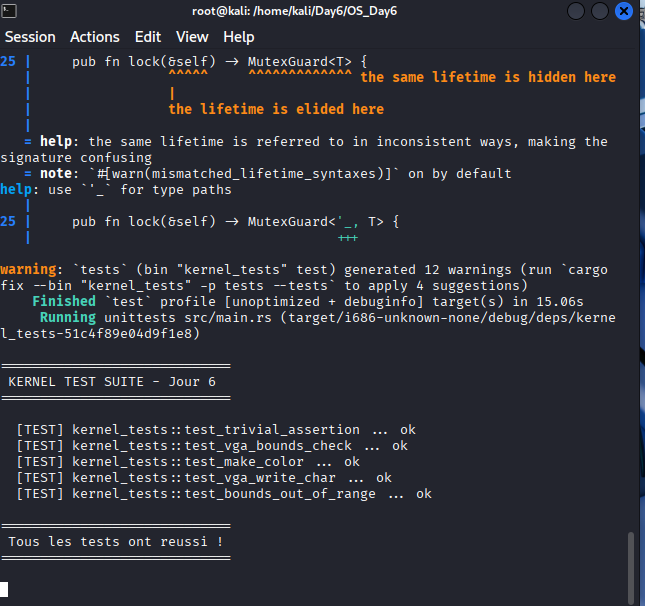

# Rapport Jour 6 : Tests Kernel

---

## Transition depuis le Jour 5

Au Jour 5, on a construit un Safe Wrapper VGA complet avec `println!`, un `Mutex` spinlock et un scroll automatique. Le kernel affiche du texte proprement et de façon sécurisée.

Mais une question reste ouverte : **comment savoir que tout ça fonctionne vraiment et continue de fonctionner quand on ajoute du code ?**

C'est le problème du Jour 6 : mettre en place une infrastructure de tests automatisés qui tourne directement dans QEMU et rapporte les résultats dans le terminal via le port série.

---

## Concept - Pourquoi tester un kernel ?

En développement normal, `cargo test` suffit. En bare-metal, ce n'est pas possible directement car le code suppose qu'il tourne sans OS. Il faut faire tourner les tests **dans QEMU lui-même**.

```
cargo test normal :
[ton code] → compilé pour ton OS → exécuté → résultat

cargo test kernel :
[tes tests] → compilé bare-metal → image disque → QEMU → résultat via port série → lu par cargo
```

---

## Concept - Les failles logiques que les tests préviennent

Une **faille logique** ce n'est pas un bug de syntaxe - c'est un bug de comportement que le compilateur ne détecte pas :

| Faille logique | Exemple | Conséquence |
|---|---|---|
| Bounds check cassé | `write_char` accepte `row=26` | Corruption mémoire silencieuse |
| Scroll incorrect | Scroll décale d'une ligne de trop | Données affichées corrompues |
| Calcul d'offset faux | `(row * 80 + col) * 2` avec erreur | Écriture au mauvais endroit |
| Mutex non relâché | Deadlock dans le Writer | Kernel figé indéfiniment |
| Couleur mal encodée | `make_color` inverse fg/bg | Affichage illisible |

---

## Architecture du projet

```
OS_Day6/
├── Cargo.toml              ← workspace racine
├── linker.ld               ← CRITIQUE : doit placer _start à 0x8000
├── i686-unknown-none.json  ← target bare-metal custom
├── boot.bin                ← boot sector compilé
├── run_tests.sh            ← script runner QEMU
├── .cargo/
│   └── config.toml         ← config compilateur + runner
├── src/
│   ├── main.rs
│   ├── vga1.rs             ← spinlock maison
│   ├── vga2.rs             ← Writer + couleurs
│   ├── vga.rs              ← couche compat fonctions libres
│   ├── serial.rs           ← port série COM1
│   ├── test_runner.rs      ← infrastructure de test
│   └── boot.asm
└── tests/
    ├── Cargo.toml
    └── src/
        └── lib.rs          ← point d'entrée et intégration des tests
```

---

## Points critiques - Ce qu'il faut absolument retenir

* **Adresse de chargement (_start à 0x8000)** : Le bootloader charge le noyau à l'adresse mémoire `0x8000` et y effectue un saut direct. Si la fonction `_start` est localisée ailleurs par le linker script, le CPU exécutera du code aléatoire.
* **Héritage du Workspace** : Le fichier `.cargo/config.toml` à la racine régit l'intégralité du workspace, éliminant le besoin de configurer les membres individuellement.
* **Harnais personnalisé (harness = false)** : Requis pour désactiver le framework de test standard de Rust (qui présuppose la présence de la bibliothèque standard `std`).
* **Non-retour de run_tests (type !)** : En bare-metal, un point d'entrée ne peut pas retourner proprement. Le runner doit forcer l'arrêt de l'émulateur.

---

## Commandes - Compilation & Run

### Étape 1 - Préparation des fichiers d'exécution

```bash
nasm -f bin src/boot.asm -o boot.bin
chmod +x run_tests.sh
```

### Étape 2 - Lancement de la suite de tests

```bash
cargo test -Z build-std=core -Z json-target-spec --target i686-unknown-none.json
```

---

## Résultat obtenu

Les tests s'exécutent avec succès dans QEMU et renvoient les résultats via la liaison série :



### Interprétation des résultats

| Test | Ce que ça prouve |
|---|---|
| `test_trivial_assertion` ✅ | L'infrastructure de test fonctionne, QEMU reçoit bien la sortie série |
| `test_vga_bounds_check` ✅ | Aucun des 4 accès hors limite n'a crashé le kernel → bounds check solide |
| `test_make_color` ✅ | L'encodage fg/bg est correct → pas d'inversion de couleurs |
| `test_vga_write_char` ✅ | La valeur lue en mémoire correspond à ce qu'on a écrit → offset calculé correctement |
| `test_bounds_out_of_range` ✅ | Une string de 160+ chars sur 80 colonnes ne déborde pas |

---

## Résumé - Angle Cyber

| Concept | Risque | Ce que le test prouve |
|---|---|---|
| Bounds check VGA | Buffer overflow → corruption mémoire | `write_char(99,99)` ignoré silencieusement |
| Calcul d'offset | Écriture au mauvais endroit mémoire | Lecture vérifiée à l'adresse exacte |
| Encodage couleur | Donnée mal représentée | Valeur binaire vérifiée bit à bit |
| String trop longue | Débordement de tampon | `write_str` s'arrête proprement à 80 chars |
| Linker script `0x8000` | Code exécuté au mauvais endroit | `nm` confirme l'adresse avant de lancer |
| `isa-debug-exit` | Pas de retour de code de sortie | cargo interprète succès/échec automatiquement |

> Un kernel non testé est un kernel avec des failles inconnues. Les tests automatisés sont la première ligne de défense contre les **failles logiques** - celles que le compilateur ne peut pas détecter mais qu'un attaquant trouvera. La mécanique `isa-debug-exit` est aussi un vecteur d'attaque à connaître : tout code capable d'écrire sur le port `0xf4` peut forcer QEMU à quitter - c'est un exemple concret de **side channel via I/O**.
