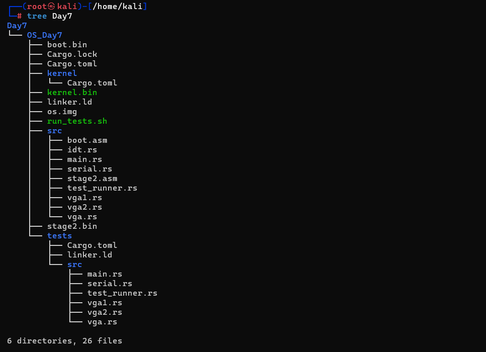
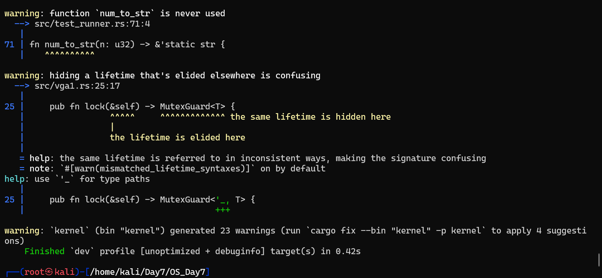
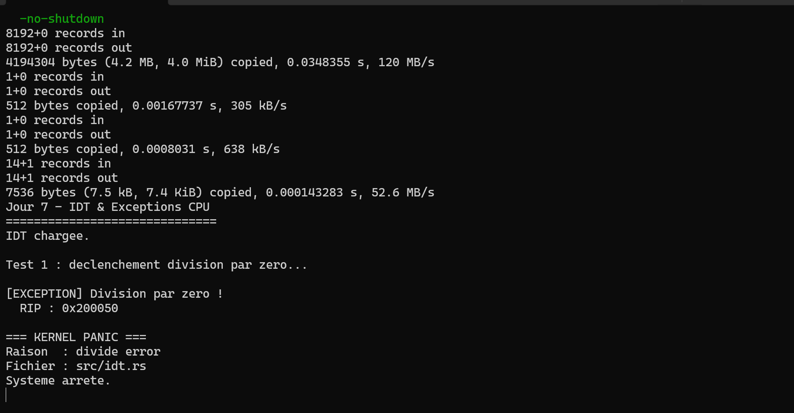

# Jour 7 - Exceptions CPU & IDT

---

## Introduction

Au Jour 6.5, le kernel tourne en Long Mode 64 bits avec paging fonctionnel. Mais sans IDT configurée, toute erreur CPU cause un **Triple Fault** , le système reboot instantanément sans laisser de trace. Le Jour 7 implémente l'IDT pour intercepter et analyser ces erreurs proprement.

---

## C'est quoi l'IDT ?

L'**Interrupt Descriptor Table** est une table de 256 entrées en mémoire. Chaque entrée pointe vers un handler pour un type d'exception précis. Le CPU la consulte automatiquement via le registre **IDTR** à chaque exception.

```
Exception CPU
    ↓
CPU lit IDTR → trouve l'IDT en mémoire
    ↓
CPU consulte IDT[numéro]
    ↓
CPU sauvegarde : RIP, CS, RFLAGS, RSP, SS sur la stack
    ↓
CPU saute vers le handler
    ↓
Handler : log → panic → halt
```

Sans IDT → Triple Fault → reboot. Avec IDT → contrôle total.

---

## Les 5 exceptions implémentées

| # | Nom | Déclencheur | Error Code | Intérêt cyber |
|---|---|---|---|---|
| 0 | Divide Error | `div 0` | Non | DoS, crash contrôlé |
| 6 | Invalid Opcode | Instruction inconnue | Non | Anti-debug (`UD2`) |
| 8 | Double Fault | Exception dans un handler | Oui (0) | Stack corruption |
| 13 | General Protection Fault | Violation segment/privilège | Oui | Privilege escalation |
| 14 | Page Fault | Page absente ou protégée | Oui | Buffer overflow, UAF |

---

## La crate `x86_64`

Fournit des abstractions typées sur le CPU - évite de manipuler des bits bruts :

```rust
// Sans x86_64 : structs manuelles, 200+ lignes, erreurs faciles
// Avec x86_64 :
let idt = InterruptDescriptorTable::new();
idt.divide_error.set_handler_fn(mon_handler);
idt.load(); // → instruction LIDT
```

Feature obligatoire dans `Cargo.toml` :

```toml
x86_64 = { version = "0.15", default-features = false, features = ["instructions", "abi_x86_interrupt"] }
```

Et dans `main.rs` (racine de crate uniquement) :

```rust
#![feature(abi_x86_interrupt)]
```

---

## Portion de code cruciale - `src/idt.rs`

### Initialisation

```rust
static mut IDT: InterruptDescriptorTable = InterruptDescriptorTable::new();

pub fn init() {
    unsafe {
        // addr_of_mut! obligatoire en Rust 2024
        // interdit de créer une référence directe à un static mut
        let idt = &mut *addr_of_mut!(IDT);
        idt.divide_error.set_handler_fn(divide_error_handler);
        idt.double_fault.set_handler_fn(double_fault_handler);
        idt.general_protection_fault.set_handler_fn(gpf_handler);
        idt.page_fault.set_handler_fn(page_fault_handler);
        idt.load(); // charge IDTR
    }
}
```

### Handler  Division par zéro

```rust
// ABI spéciale : le CPU sauvegarde automatiquement les registres
// InterruptStackFrame contient : RIP, CS, RFLAGS, RSP, SS
extern "x86-interrupt" fn divide_error_handler(frame: InterruptStackFrame) {
    serial::println("[EXCEPTION] Division par zero !");
    print_hex(frame.instruction_pointer.as_u64()); // RIP exact
    panic!("divide error");
}
```

### Handler Page Fault , le plus informatif

```rust
extern "x86-interrupt" fn page_fault_handler(
    frame: InterruptStackFrame,
    error_code: PageFaultErrorCode,
) {
    // CR2 = adresse virtuelle qui a causé le fault
    // Information clé pour détecter buffer overflow ou UAF
    let cr2 = x86_64::registers::control::Cr2::read_raw();

    // Décode l'error code bit par bit
    if error_code.contains(PageFaultErrorCode::PROTECTION_VIOLATION) {
        // Page présente mais accès interdit → exploit probable
    } else {
        // Page absente → null deref ou OOB
    }
    if error_code.contains(PageFaultErrorCode::CAUSED_BY_WRITE) {
        // Tentative d'écriture → buffer overflow
    }
    panic!("page fault");
}
```

---

## Arborescence du projet



## Résultat obtenu





**`RIP : 0x200050`** - adresse exacte de l'instruction `DIV RBX` fautive dans le kernel. Plus de reboot - le CPU halt proprement après avoir loggé l'erreur.

---

## Angle Cyber

**RIP et CR2 sont des informations forensiques critiques.** Capturer le RIP au moment d'une exception permet de localiser exactement quelle instruction a causé le problème. En exploitation :

- Un attaquant qui **contrôle RIP** au moment d'un GPF peut rediriger l'exécution → shellcode
- **CR2 contrôlé** lors d'un Page Fault = null pointer dereference ou use-after-free exploitable
- **Double Fault** = stack corrompue → si non géré → Triple Fault → reboot = DoS garanti

Notre IDT intercepte tout ça **avant** que le système perde le contrôle.

Le **Double Fault** mérite une attention particulière : si le handler de Double Fault lui-même plante (stack overflow par exemple), le CPU déclenche un **Triple Fault** et reboot sans aucune trace. Les OS modernes utilisent une **stack dédiée** (IST - Interrupt Stack Table) pour le Double Fault handler - c'est l'étape suivante.
