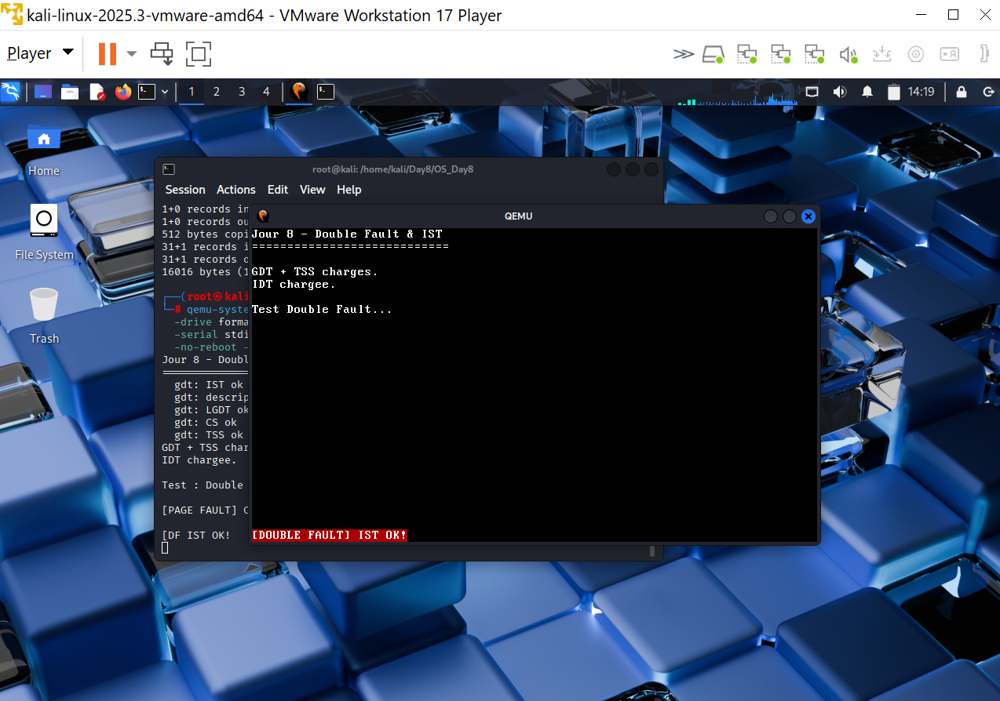

# Jour 8 - Double Fault & IST (Résumé Technique)

## Introduction

Au Jour 7, le Double Fault handler existait mais utilisait la même stack que le kernel. Stack corrompue → handler inutilisable → Triple Fault silencieux → reboot sans trace.

Au Jour 8, on configure l'**IST** pour donner au Double Fault handler sa propre stack dédiée à `0x380000`. Le CPU y switche automatiquement - le handler s'exécute toujours, même quand tout le reste est détruit.

## Les 3 structures en jeu

```
IDT[8] → IST index = 1
              ↓
         CPU lit TR
              ↓
         GDT[TSS descriptor]
              ↓
         TSS.interrupt_stack_table[0] = 0x380000
              ↓
         CPU place RSP = 0x380000
              ↓
         Double Fault handler s'exécute
```

---

## Points critiques à retenir

### `rex64 retf` - recharger CS après lgdt

```rust
// Après gdt.load(), CS pointe encore sur l'ancienne GDT
// Far return obligatoire pour recharger CS atomiquement
core::arch::asm!(
    "push {sel}",
    "lea {tmp}, [rip + 2f]",
    "push {tmp}",
    "rex64 retf",    // ← pas "retfq" (LLVM ne comprend pas)
    "2:",            // ← pas "1:" (ambiguïté littéral binaire LLVM)
    sel = in(reg) cs_val,
    tmp = lateout(reg) _,
);
```

### Handler ASM pur - zéro prologue Rust

Le compilateur Rust génère `push rax / sub rsp, N` avant toute fonction. Si la stack IST n'est pas parfaitement configurée, ce prologue plante. Solution : handler entièrement en NASM :

```nasm
double_fault_handler_asm:
    mov byte [0xb8F00], 'D'   ; écriture directe VGA ligne 24
    mov byte [0xb8F01], 0x4F  ; blanc sur rouge
    mov dx, 0x3F8             ; COM1
    mov al, 'D'
    out dx, al
.halt:
    hlt
    jmp .halt
```

### Warm up TLB obligatoire

```rust
// Accéder à la zone IST avant le test pour charger le TLB
// Sans ça, le CPU peut faire un page walk qui échoue pendant le switch
unsafe {
    core::ptr::write_volatile(0x37f000 as *mut u64, 0);
    core::ptr::write_volatile(0x380000 as *mut u64, 0);
}
```

### `.data` pas `.bss`

`objcopy -O binary` n'inclut pas `.bss`. Toute donnée statique utilisée par l'IST doit être dans `.data` (valeur non nulle).

---

## Arborescence

```
OS_Day8/
├── src/
│   ├── main.rs          ← init GDT→IDT, warm up TLB, trigger
│   ├── gdt.rs           ← NOUVEAU : TSS + IST + GDT crate x86_64
│   ├── idt.rs           ← Double Fault + set_stack_index
│   ├── trigger_df.asm   ← NOUVEAU : trigger + handler ASM pur
│   ├── boot.asm
│   └── stage2.asm
├── trigger_df.o         ← compilé avec nasm -f elf64
└── ...
```

---

## Code crucial - `src/gdt.rs`

```rust
pub const DOUBLE_FAULT_IST_INDEX: u16 = 0;
const IST_STACK_TOP: u64 = 0x380000;

static mut TSS: TaskStateSegment = TaskStateSegment::new();
static mut GDT: GlobalDescriptorTable = GlobalDescriptorTable::new();

pub fn init() {
    unsafe {
        // IST[0] = top de la stack dédiée
        (*addr_of_mut!(TSS))
            .interrupt_stack_table[DOUBLE_FAULT_IST_INDEX as usize] =
            VirtAddr::new(IST_STACK_TOP);

        let gdt = &mut *addr_of_mut!(GDT);
        let cs_sel  = gdt.append(Descriptor::kernel_code_segment());
        let tss_sel = gdt.append(Descriptor::tss_segment(&*addr_of_mut!(TSS)));

        gdt.load();

        // Far return pour recharger CS
        let cs_val = cs_sel.0 as u64;
        core::arch::asm!(
            "push {sel}", "lea {tmp}, [rip + 2f]",
            "push {tmp}", "rex64 retf", "2:",
            sel = in(reg) cs_val, tmp = lateout(reg) _,
        );

        load_tss(tss_sel);
    }
}
```

## Code crucial - `src/idt.rs`

```rust
// Double Fault avec IST - une seule ligne clé
idt.double_fault
    .set_handler_fn(double_fault_handler)
    .set_stack_index(gdt::DOUBLE_FAULT_IST_INDEX); // ← IST activé

// Handler Rust délègue immédiatement à l'ASM pur
extern "x86-interrupt" fn double_fault_handler(
    _frame: InterruptStackFrame, _error_code: u64,
) -> ! {
    unsafe extern "C" { fn double_fault_handler_asm() -> !; }
    unsafe { double_fault_handler_asm() }
}
```

---

## Commandes

```bash
nasm -f elf64 src/trigger_df.asm -o trigger_df.o
cargo build -Z build-std=core --target x86_64-unknown-none

objcopy -O binary \
  --only-section=.text --only-section=.rodata --only-section=.data \
  target/x86_64-unknown-none/debug/kernel kernel.bin

dd if=/dev/zero  of=os.img bs=512 count=8192
dd if=boot.bin   of=os.img conv=notrunc
dd if=stage2.bin of=os.img bs=512 seek=1 conv=notrunc
dd if=kernel.bin of=os.img bs=512 seek=2 conv=notrunc

qemu-system-x86_64 \
  -drive format=raw,file=os.img \
  -serial stdio -display sdl \
  -no-reboot -no-shutdown
```

---

## Résultat obtenu



---

## Angle Cyber

| Situation | Sans IST | Avec IST |
|---|---|---|
| Stack overflow | Triple Fault → reboot silencieux | Double Fault attrapé + loggé |
| Stack corrompue | Handler inutilisable | CPU switche vers `0x380000` |
| Trace forensique | Aucune | Message + halt propre |
| Attaque indétectable | Oui | Non - toujours une trace |

> Le handler ASM pur est la leçon clé : en sécurité système, les handlers d'urgence doivent être **totalement indépendants** du reste - c'est ainsi que sont écrits les handlers dans les TPM, HSM et firmware UEFI sécurisés.
