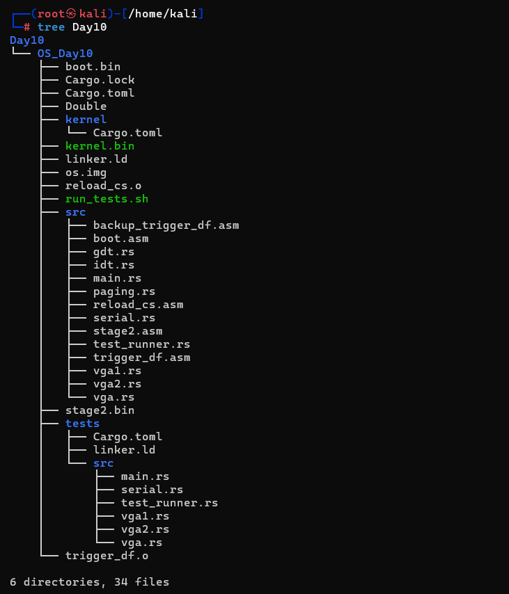
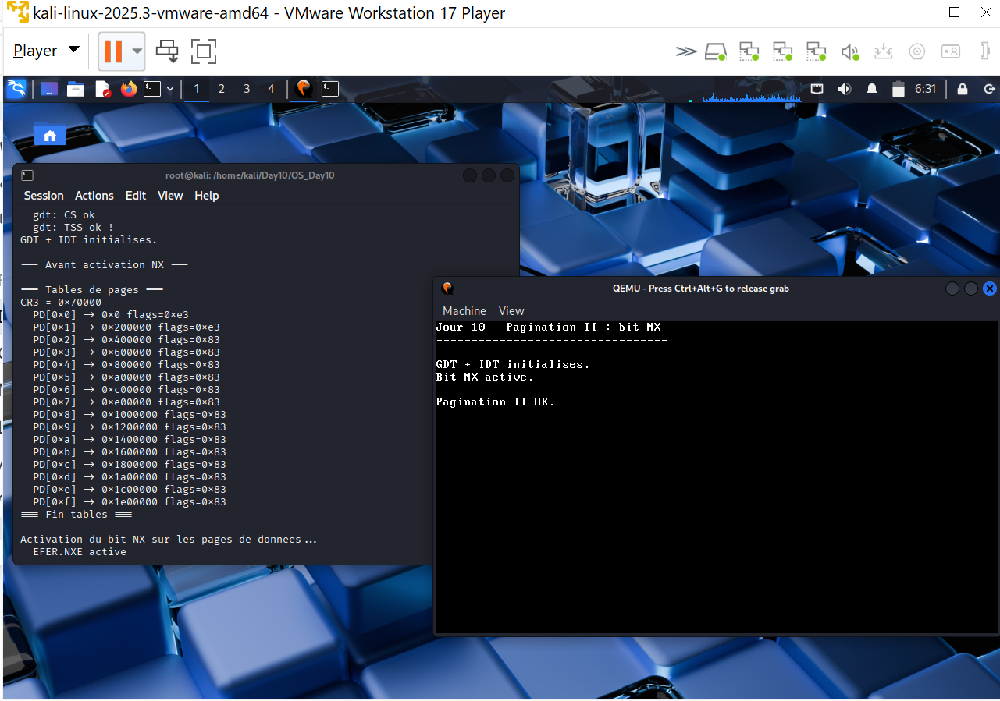
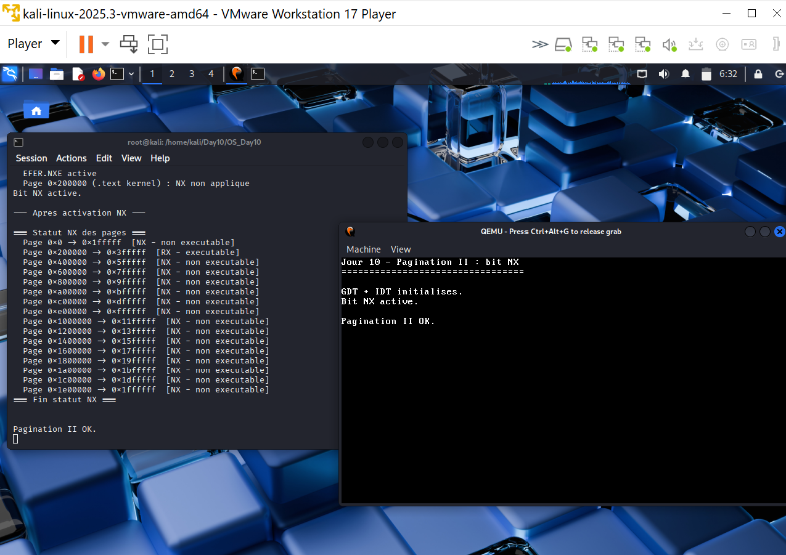

# Jour 10 - Pagination II : bit NX

---

## Introduction

Au Jour 9, toutes les pages étaient R/W/X - lisibles, modifiables et exécutables. Au Jour 10, on active le **bit NX** (No-Execute, bit 63 des entrées de tables) pour interdire l'exécution des pages de données. Seule la page du kernel `.text` reste exécutable.

---

## Le bit NX

```
Bit 63 d'une entrée PD/PT :
NX = 0 → page exécutable (défaut)
NX = 1 → page non exécutable → Page Fault si CPU tente d'y exécuter
```

**Prérequis obligatoire :** activer `EFER.NXE` (bit 11 du MSR `0xC0000080`) avant de mettre NX dans les entrées, sinon GPF immédiat car bit 63 est réservé.

**Après modification :** appeler `invlpg` pour invalider le TLB, sinon l'ancienne entrée reste en cache.

---

## Code crucial

```rust
const NX_BIT: u64 = 1 << 63;

pub unsafe fn enable_nx_on_data_pages() {
    // 1. Activer EFER.NXE
    let efer: u64;
    core::arch::asm!("rdmsr", in("ecx") 0xC0000080u32,
                     out("rax") efer, out("rdx") _);
    core::arch::asm!("wrmsr", in("ecx") 0xC0000080u32,
                     in("rax") efer | (1 << 11),
                     in("rdx") ((efer | (1 << 11)) >> 32));

    // 2. Pour chaque huge page sauf 0x200000 (kernel .text)
    //    → appliquer NX + invalider TLB
    let new_entry = pd_entry | NX_BIT;
    write_entry(pd_entry_addr, new_entry);
    core::arch::asm!("invlpg [{addr}]", addr = in(reg) page_phys);
}
```

---

## Arborescence



```
```

---

## Résultat obtenu





```
--- Avant NX ---
PD[0x0] -> 0x0       flags=0xe3  (RWX)
PD[0x1] -> 0x200000  flags=0xe3  (RWX) ← kernel
PD[0x2] -> 0x400000  flags=0x83  (RWX)
...

EFER.NXE active
Page 0x200000 (.text kernel) : NX non applique

--- Apres NX ---
Page 0x0      -> 0x1fffff   [NX - non executable]
Page 0x200000 -> 0x3fffff   [RX - executable]      ← seule page exécutable
Page 0x400000 -> 0x5fffff   [NX - non executable]
... (toutes les autres NX)
```

---

## Angle Cyber

### NX contre shellcode injection

```
Sans NX : écrire shellcode -> rediriger RIP -> exécution -> compromission
Avec NX : écrire shellcode -> rediriger RIP -> Page Fault -> attaque bloquée
```

### Flags observés

```
0xe3 = Present + Write + Accessed + Dirty + Huge
0x83 = Present + Write + Huge
Après NX : bit 63 ajouté sur toutes les pages sauf 0x200000
```

### Limites

| Attaque | NX suffit ? |
|---|---|
| Shellcode classique | ✅ Bloquée |
| Return-Oriented Programming (ROP) | ❌ Réutilise du code existant |
| JIT spraying | ❌ Code JIT dans pages exécutables |

> NX + ASLR = protection de base contre l'exploitation mémoire. Notre kernel a maintenant les deux fondamentaux. Les Jours 11-12 ajoutent l'allocateur de frames et le heap pour une gestion mémoire complète.
