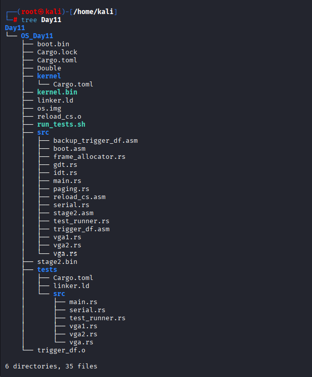
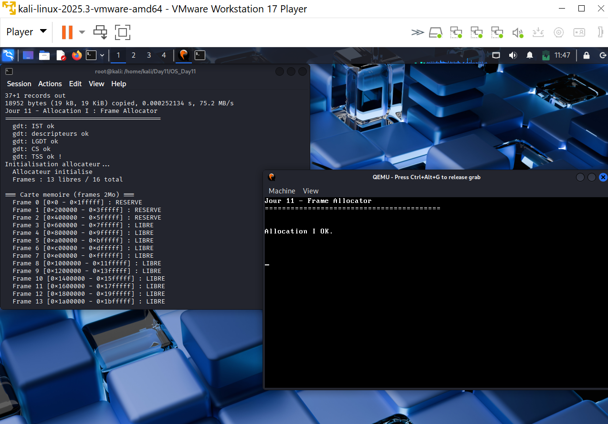
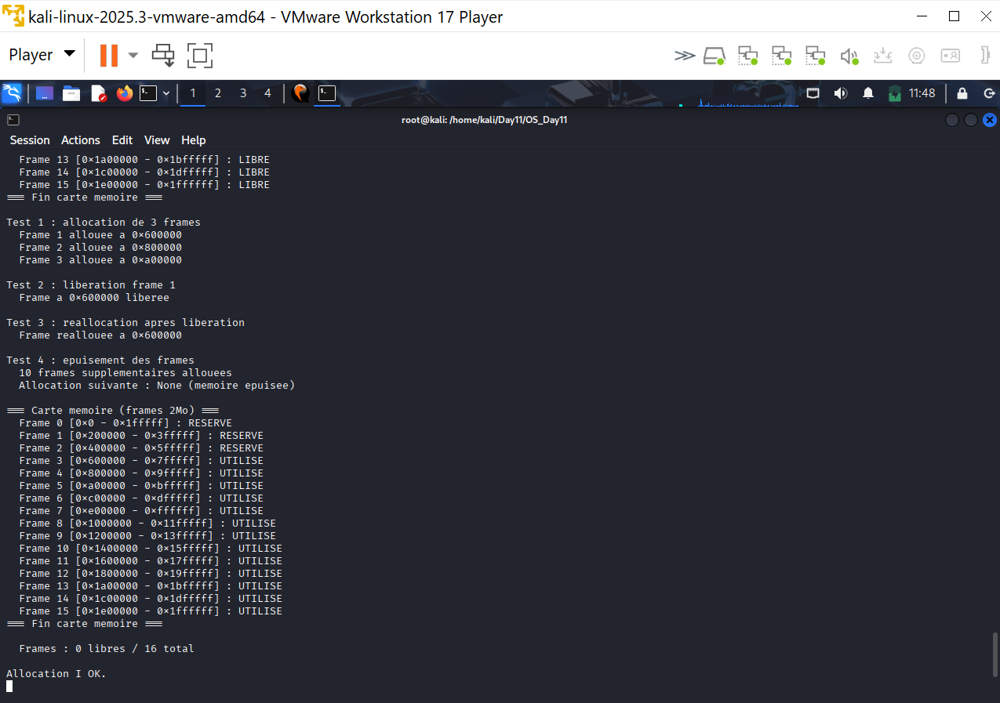

# Jour 11 - Allocation I : Allocateur de Frames Physiques

---

## Introduction

Aux Jours 9-10, on a lu et modifié les tables de pages existantes - mais on travaillait avec un mapping fixe créé dans `stage2.asm`. Pour allouer dynamiquement de la mémoire (heap, nouvelles tables de pages, espaces d'adressage pour les processus), il faut un **allocateur de frames physiques** : une structure qui sait quelles pages physiques sont libres et peut en distribuer ou en récupérer à la demande.

Au Jour 11, on implémente cet allocateur avec un **bitmap simple** (tableau d'états) pour nos 16 frames de 2Mo.

---

## Concepts fondamentaux

### Frame vs Page

```
Frame physique :
→ Zone de mémoire RAM physique
→ Taille fixe (4Ko standard, 2Mo huge page chez nous)
→ Identifiée par son adresse physique

Page virtuelle :
→ Vue du processus sur la mémoire
→ Mappée vers une frame physique via les tables de pages
→ Plusieurs pages virtuelles peuvent pointer vers la même frame
```

### Pourquoi un allocateur de frames ?

```
Sans allocateur :
→ Les frames sont allouées manuellement dans stage2.asm
→ Impossible d'allouer dynamiquement (heap, nouveaux processus)
→ Pas de réutilisation des frames libérées

Avec allocateur :
→ alloc() → retourne une frame libre
→ free()  → marque une frame comme disponible
→ Gestion automatique des frames réservées (kernel, tables)
```

### Fragmentation mémoire

C'est le problème central de tout allocateur :

```
État initial : [LIBRE][LIBRE][LIBRE][LIBRE][LIBRE]

Après alloc × 3 : [LIBRE][USED][LIBRE][USED][USED]

Après free(1) :   [LIBRE][FREE][LIBRE][USED][USED]

Réalloc :         [LIBRE][USED][LIBRE][USED][USED]
→ La frame 1 est réutilisée immédiatement ✅
```

Notre bitmap alloue **first-fit** (première frame libre trouvée) - simple et efficace pour un petit nombre de frames.

---

## Architecture de l'allocateur

### Les 3 états d'une frame

```rust
pub enum FrameState {
    Free,      // disponible pour allocation
    Used,      // allouée et utilisée
    Reserved,  // réservée en permanence (kernel, tables de pages)
}
```

### Répartition de nos 16 frames

```
Frame 0  [0x000000 - 0x1fffff] : RESERVE  (zone basse BIOS, VGA)
Frame 1  [0x200000 - 0x3fffff] : RESERVE  (kernel .text + .data)
Frame 2  [0x400000 - 0x5fffff] : RESERVE  (tables de pages à 0x70000)
Frame 3  [0x600000 - 0x7fffff] : LIBRE    ← première frame allouable
...
Frame 15 [0x1e00000 - 0x1ffffff]: LIBRE
```

13 frames libres sur 16 au démarrage.

### Pourquoi Frame 2 est réservée ?

Les tables de pages sont à `0x70000` - dans la frame 0 (0x000000-0x1fffff). En fait Frame 2 est réservée par précaution car elle pourrait contenir des données critiques. C'est une approche conservatrice - mieux vaut réserver trop que pas assez.

---

## Implémentation — `src/frame_allocator.rs`

### Structure principale

```rust
pub const FRAME_SIZE:  u64   = 2 * 1024 * 1024; // 2Mo
pub const FRAME_COUNT: usize = 16;
pub const MAPPING_START: u64 = 0x0;

pub struct FrameAllocator {
    frames: [FrameState; FRAME_COUNT],
    free_count: usize,
}
```

### Allocation — first-fit

```rust
pub fn alloc(&mut self) -> Option<u64> {
    for i in 0..FRAME_COUNT {
        if self.frames[i] == FrameState::Free {
            self.frames[i] = FrameState::Used;
            self.free_count -= 1;
            // Adresse physique = index × taille d'une frame
            let phys_addr = MAPPING_START + (i as u64 * FRAME_SIZE);
            return Some(phys_addr);
        }
    }
    None // mémoire épuisée
}
```

### Libération avec vérifications

```rust
pub fn free(&mut self, phys_addr: u64) -> bool {
    let index = ((phys_addr - MAPPING_START) / FRAME_SIZE) as usize;

    if index >= FRAME_COUNT           { return false; } // hors mapping
    if self.frames[index] == Reserved { return false; } // jamais libérer réservé
    if self.frames[index] == Used {
        self.frames[index] = FrameState::Free;
        self.free_count += 1;
        return true;
    }
    false // déjà libre = double free détecté
}
```

**Point cyber :** le `free()` refuse de libérer une frame réservée et détecte les double-free (retourne `false` si déjà libre). En C, un double-free est une vulnérabilité critique - ici Rust + notre vérification l'empêchent.

### Accès au static mutable - `addr_of_mut!`

Rust 2024 interdit les références directes à un `static mut`. On utilise `addr_of_mut!` :

```rust
pub static mut ALLOCATOR: FrameAllocator = FrameAllocator::new();

pub fn init() {
    unsafe { (*core::ptr::addr_of_mut!(ALLOCATOR)).init(); }
}

pub fn alloc_frame() -> Option<u64> {
    unsafe { (*core::ptr::addr_of_mut!(ALLOCATOR)).alloc() }
}
```

---

## Arborescence



```
OS_Day11/
└── src/
    ├── main.rs             ← "Jour 11 - Allocation I"
    ├── frame_allocator.rs  ← NOUVEAU : FrameAllocator + bitmap
    ├── paging.rs
    ├── gdt.rs
    ├── idt.rs
    └── ...
```

---

## Commandes

```bash
cargo build -Z build-std=core --target x86_64-unknown-none

objcopy -O binary \
  --only-section=.text \
  --only-section=.rodata \
  --only-section=.data \
  target/x86_64-unknown-none/debug/kernel kernel.bin

dd if=/dev/zero   of=os.img bs=512 count=8192
dd if=boot.bin    of=os.img conv=notrunc
dd if=stage2.bin  of=os.img bs=512 seek=1 conv=notrunc
dd if=kernel.bin  of=os.img bs=512 seek=2 conv=notrunc

qemu-system-x86_64 \
  -drive format=raw,file=os.img \
  -serial stdio \
  -display none \
  -no-reboot -no-shutdown
```

---

## Résultat obtenu





```
Initialisation allocateur...
  Allocateur initialise
  Frames : 13 libres / 16 total

=== Carte memoire (frames 2Mo) ===
  Frame 0  [0x0       - 0x1fffff ] : RESERVE
  Frame 1  [0x200000  - 0x3fffff ] : RESERVE
  Frame 2  [0x400000  - 0x5fffff ] : RESERVE
  Frame 3  [0x600000  - 0x7fffff ] : LIBRE
  Frame 4  [0x800000  - 0x9fffff ] : LIBRE
  ...
  Frame 15 [0x1e00000 - 0x1ffffff] : LIBRE

Test 1 : allocation de 3 frames
  Frame 1 allouee a 0x600000   ← first-fit : frame 3 (index 3)
  Frame 2 allouee a 0x800000   ← frame 4
  Frame 3 allouee a 0xa00000   ← frame 5

Test 2 : liberation frame 1
  Frame a 0x600000 liberee     ← remise à Free

Test 3 : reallocation apres liberation
  Frame reallouee a 0x600000   ← réutilisation immédiate ✅

Test 4 : epuisement des frames
  10 frames supplementaires allouees
  Allocation suivante : None (memoire epuisee)

  Frames : 0 libres / 16 total
```

### Interprétation

| Test | Ce que ça prouve |
|---|---|
| 13 frames libres | Réservation correcte des zones critiques |
| first-fit à 0x600000 | Allocation séquentielle depuis la première frame libre |
| Réallocation à 0x600000 | Libération + réutilisation fonctionnelles |
| None après épuisement | Pas de débordement - `Option<u64>` force la gestion d'erreur |

---

## Résumé - Angle Cyber

| Risque | Notre protection |
|---|---|
| Double free | `free()` détecte et refuse si déjà `Free` |
| Free d'une zone réservée | `free()` refuse si état `Reserved` |
| Allocation hors mapping | `free()` vérifie `index >= FRAME_COUNT` |
| Dépassement de capacité | `alloc()` retourne `None` - pas de crash |
| Accès concurrent | `addr_of_mut!` - pas de référence partagée |

> L'allocateur de frames est la fondation de toute la sécurité mémoire. Un bug ici - double free, use-after-free, corruption du bitmap - compromet tout le système. En Rust, `Option<u64>` **force** le code appelant à gérer le cas d'échec (`None`) - contrairement à C où `malloc()` retourne `NULL` que les développeurs oublient souvent de vérifier, causant des crashes ou des exploits.
>
> Notre implémentation est délibérément simple (bitmap linéaire, first-fit). Les allocateurs de production (Linux `buddy allocator`, `SLAB`) sont plus complexes pour éviter la fragmentation sur des milliers de frames - c'est l'objet du Jour 12.
