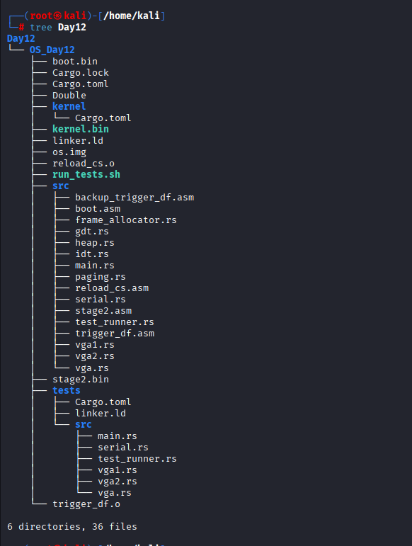
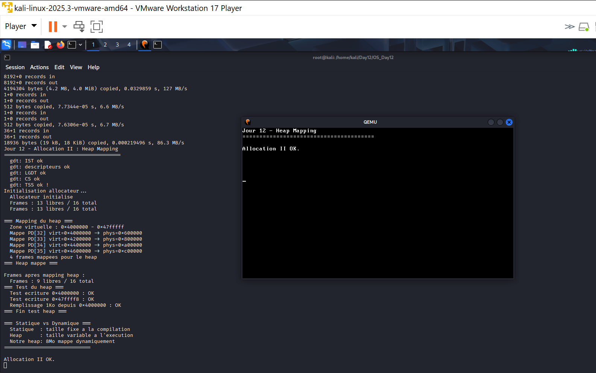
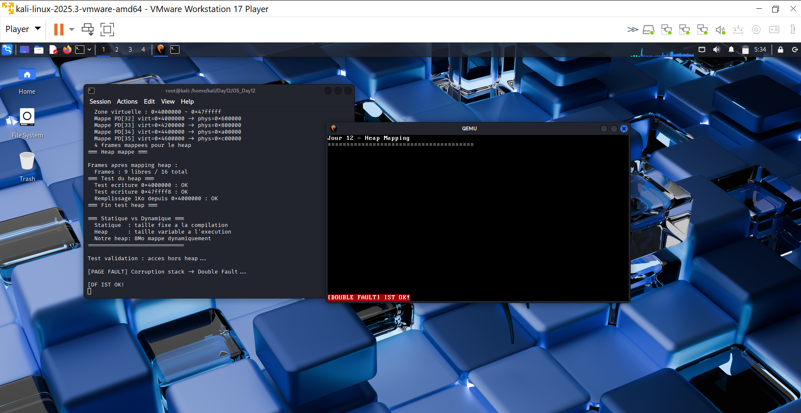

# Jour 12 - Allocation II : Heap Mapping

---

## Introduction

Au Jour 11 on a un allocateur de frames. Au Jour 12 on l'utilise pour **mapper dynamiquement un heap** - allouer des frames physiques et les insérer dans les tables de pages pour créer une zone mémoire virtuelle utilisable.

---

## Architecture

```
0x4000000 - 0x47fffff : HEAP (8Mo = 4 frames x 2Mo)
  PD[32] -> phys=0x600000
  PD[33] -> phys=0x800000
  PD[34] -> phys=0xa00000
  PD[35] -> phys=0xc00000

0x8000000+            : NON MAPPÉ -> Page Fault si accès
```

---

## Code crucial - `src/heap.rs`

```rust
pub const HEAP_START: u64 = 0x4000000;
pub const HEAP_SIZE:  u64 = 4 * 2 * 1024 * 1024; // 8Mo
pub const HEAP_END:   u64 = HEAP_START + HEAP_SIZE;

pub fn map_heap() -> bool {
    // index PD = adresse virtuelle / taille huge page
    let heap_pd_start = (HEAP_START / (2 * 1024 * 1024)) as usize; // = 32

    for i in 0..4usize {
        let pd_index = heap_pd_start + i;
        let pd_entry_addr = pd_addr + (pd_index * 8) as u64;

        match frame_allocator::alloc_frame() {
            Some(phys_addr) => {
                // Present + Write + Huge
                let pd_entry = phys_addr | 0x83;
                unsafe {
                    core::ptr::write_volatile(pd_entry_addr as *mut u64, pd_entry);
                    // Invalider TLB obligatoire après modification des tables
                    core::arch::asm!("invlpg [{addr}]",
                        addr = in(reg) HEAP_START + (i as u64 * 2 * 1024 * 1024));
                }
            }
            None => return false,
        }
    }
    true
}
```

---

## Arborescence



```

```

---

## Les deux runs effectués

### Run 1 - code normal (mapping + tests lecture/écriture)

```bash
qemu-system-x86_64 -drive format=raw,file=os.img -serial stdio -display sdl \
  -no-reboot -no-shutdown
```

```
Frames : 13 libres / 16 total

=== Mapping du heap ===
  Mappe PD[32] virt=0x4000000 -> phys=0x600000
  Mappe PD[33] virt=0x4200000 -> phys=0x800000
  Mappe PD[34] virt=0x4400000 -> phys=0xa00000
  Mappe PD[35] virt=0x4600000 -> phys=0xc00000
  4 frames mappees pour le heap

Frames apres mapping : 9 libres / 16 total

=== Test du heap ===
  Test ecriture 0x4000000  : OK   ← début heap
  Test ecriture 0x47ffff8  : OK   ← fin heap (HEAP_END - 8)
  Remplissage 1Ko depuis 0x4000000 : OK

Allocation II OK.
```



### Run 2 - test validation (preuve que le mapping est réel)

On ajoute dans `main.rs` avant `halt()` :

```rust
serial::println("Test validation : acces hors heap...");
unsafe {
    let bad_ptr = 0x8000000 as *mut u64; // hors heap, non mappé
    core::ptr::write_volatile(bad_ptr, 42); // → Page Fault attendu
}
// "Allocation II OK." ne s'affiche jamais
```

```
Test validation : acces hors heap...
[PAGE FAULT] Corruption stack -> Double Fault...
[DOUBLE FAULT] IST OK!
```

**"Allocation II OK." ne s'affiche jamais** car le Page Fault est déclenché avant. Sur la fenêtre QEMU SDL on voit `[DOUBLE FAULT] IST OK!` en blanc sur rouge sur la dernière ligne.

---

## Interprétation des résultats

| Observation | Signification |
|---|---|
| `Frames : 13 → 9` | 4 frames physiques réellement consommées par l'allocateur |
| `PD[32..35] mappés` | Tables de pages modifiées directement en RAM |
| `Test ecriture : OK` | CPU accepte les accès à `0x4000000-0x47fffff` |
| `Page Fault sur 0x8000000` | CPU refuse les accès hors mapping → isolation réelle |
| `[DF IST OK!]` | Double Fault handler sur IST → système stable même après Page Fault |

---

## Angle Cyber

### Statique vs Dynamique en sécurité

| | Statique | Heap |
|---|---|---|
| Vulnérabilités | Stack/BSS overflow | Heap overflow, UAF, double-free |
| Protection Rust | Bornes vérifiées | Ownership, `Option<T>` |
| Détection | Compile-time | Runtime (Page Fault) |

### La preuve du test validation

```
Sans mapping réel :
→ L'écriture à 0x8000000 aurait AUSSI réussi
→ Ou le kernel aurait crashé sans message propre

Avec mapping réel :
→ 0x8000000 non mappé → Page Fault précis
→ IDT intercepte → message affiché
→ IST prend le relais → système stable
→ Preuve que SEUL 0x4000000-0x47fffff est accessible
```



  > Le heap est la zone la plus exploitée : heap overflow, use-after-free, double-free sont à l'origine de la majorité des CVEs modernes (Chrome, Linux kernel, Firefox). Notre implémentation démontre les principes fondamentaux tels que isolation par le CPU, détection par le Page Fault handler, stabilité garantie par l'IST.
