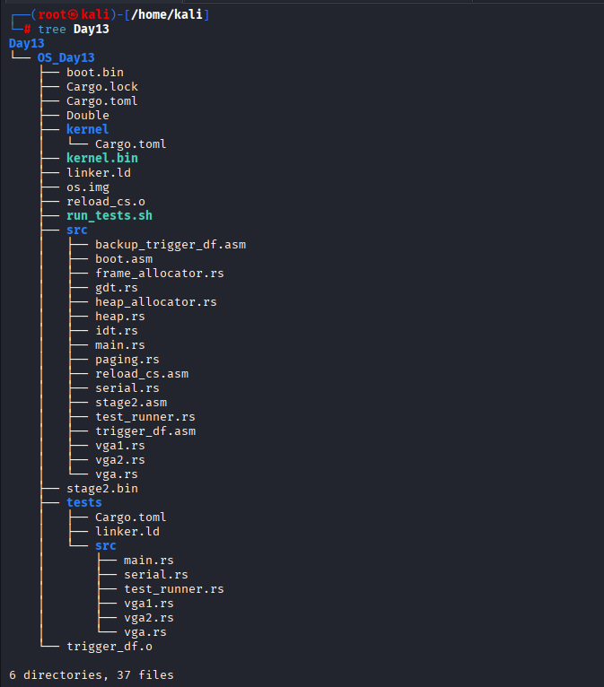
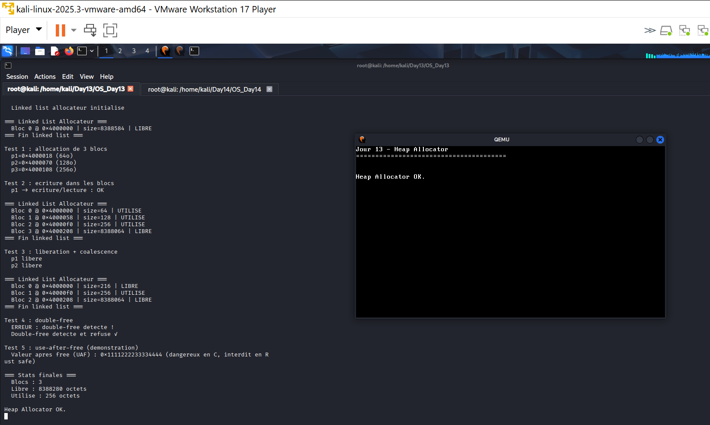

# Jour 13 - Heap Allocator : Linked List

---

## Introduction

Au Jour 12 le heap est un bloc unique de 8Mo. Au Jour 13 on implémente un **linked list allocator** : alloc/free de blocs de taille variable, avec division des blocs et fusion (coalescence) des blocs libres adjacents.

---

## Structure d'un bloc

```rust
struct BlockHeader {
    size: usize,            // taille de la zone de données
    free: bool,
    next: *mut BlockHeader, // liste chaînée
}
```

```
[Header|Data] -> [Header|Data] -> [Header|Data] -> NULL
```

---

## Code crucial

### Allocation avec division

```rust
pub fn alloc(&mut self, size: usize) -> Option<*mut u8> {
    let size = align_up(size.max(1), ALIGN);
    let mut current = self.head;
    while !current.is_null() {
        if (*current).free && (*current).size >= size {
            let remaining = (*current).size - size;
            if remaining > HEADER_SIZE + ALIGN {
                // Diviser le bloc trop grand
                let new_block = (current as *mut u8)
                    .add(HEADER_SIZE + size) as *mut BlockHeader;
                (*new_block).size = remaining - HEADER_SIZE;
                (*new_block).free = true;
                (*new_block).next = (*current).next;
                (*current).size = size;
                (*current).next = new_block;
            }
            (*current).free = false;
            return Some((current as *mut u8).add(HEADER_SIZE));
        }
        current = (*current).next;
    }
    None
}
```

### Libération avec détection double-free

```rust
pub fn free(&mut self, ptr: *mut u8) -> bool {
    let header = unsafe { (ptr.sub(HEADER_SIZE)) as *mut BlockHeader };
    if (*header).free {
        return false; // double-free refusé
    }
    (*header).free = true;
    self.coalesce();
    true
}
```

### Coalescence (fusion)

> **Coalescence** : fusion automatique de blocs memoire libres adjacents.
> Sans coalescence, liberer deux blocs voisins laisse deux petits trous inutilisables separement.
> Avec coalescence, ils fusionnent en un seul grand bloc - ce qui lutte contre la **fragmentation memoire**.
>
> Exemple : `free(bloc_64o)` + `free(bloc_128o)` adjacents -> un seul bloc de `64 + 24(header) + 128 = 216 octets`.

```rust
fn coalesce(&mut self) {
    let mut current = self.head;
    while !current.is_null() {
        let next = (*current).next;
        if !next.is_null() && (*current).free && (*next).free {
            (*current).size += HEADER_SIZE + (*next).size;
            (*current).next  = (*next).next;
        } else {
            current = (*current).next;
        }
    }
}
```

---

## Arborescence



```

```

---

## Résultat



### Allocation - calcul d'offset vérifiable

```
p1 = 0x4000018 = HEAP_START(0x4000000) + HEADER_SIZE(24) OK
p2 = 0x4000070 = p1 + 64 + 24 OK
```

Chaque adresse découle exactement du calcul `précédent + taille + en-tête`. Ce n'est pas un affichage figé - si l'allocateur était cassé, ces adresses ne s'enchaîneraient pas aussi précisément.

### Coalescence - calcul exact

```
free(p1[64o]) + free(p2[128o]) ->
Bloc fusionné size=216

Vérification : 64 + 24(header) + 128 = 216 OK
```

Deux blocs libérés séparément fusionnent en un seul bloc de taille exacte `216`, prouvant que la coalescence agit réellement en mémoire et lutte contre la fragmentation.

### Double-free détecté

```
ERREUR : double-free detecte !
```

Un deuxième `free()` sur le même bloc est intercepté avant toute corruption - l'allocateur vérifie l'état `free` du bloc avant d'agir.

### Use-After-Free démontré (volontairement en `unsafe`)

```
Valeur apres free (UAF) : 0x1111222233334444
```

La donnée reste lisible après `free()` - exactement le danger d'un vrai bug UAF. Ce test n'est possible qu'en `unsafe` ; le Rust safe interdit ce pattern via l'ownership.

---

## Angle Cyber

| Mécanisme | Risque |
|---|---|
| `BlockHeader` avant chaque allocation | Cible privilégiée d'un heap overflow |
| Vérification dans `free()` | Bloque le double-free simple |
| Pas de vérification du `next` pointer | Un overflow adjacent peut le corrompre -> arbitrary write |
| Test UAF en `unsafe` | Démontre que Rust `unsafe` = mêmes risques que C |

> Notre allocateur reproduit le fonctionnement (et les faiblesses) des allocateurs C classiques. Un overflow dans le bloc précédent peut corrompre le `BlockHeader` suivant et forger un faux pointeur `next` - c'est le mécanisme du **heap overflow -> arbitrary write**, une des classes de vulnérabilités les plus exploitées (glibc, Windows heap, etc.). Rust safe empêche ce scénario via l'ownership, mais un allocateur doit nécessairement utiliser `unsafe` - d'où l'importance d'auditer ce code avec la même rigueur qu'un allocateur C.
