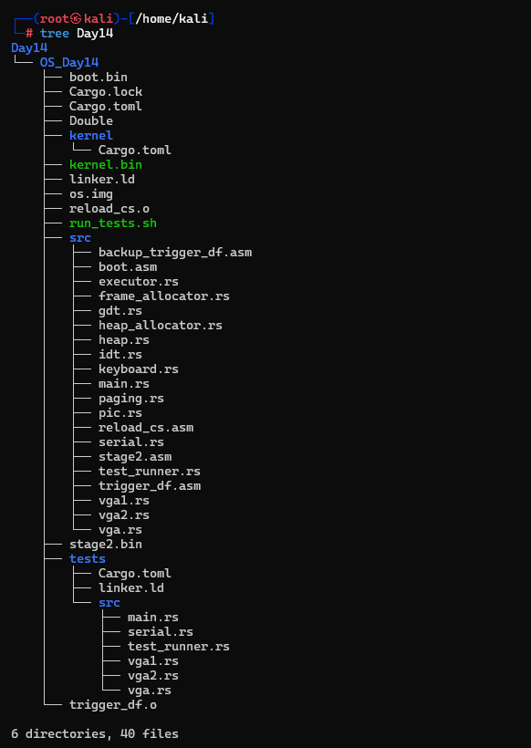
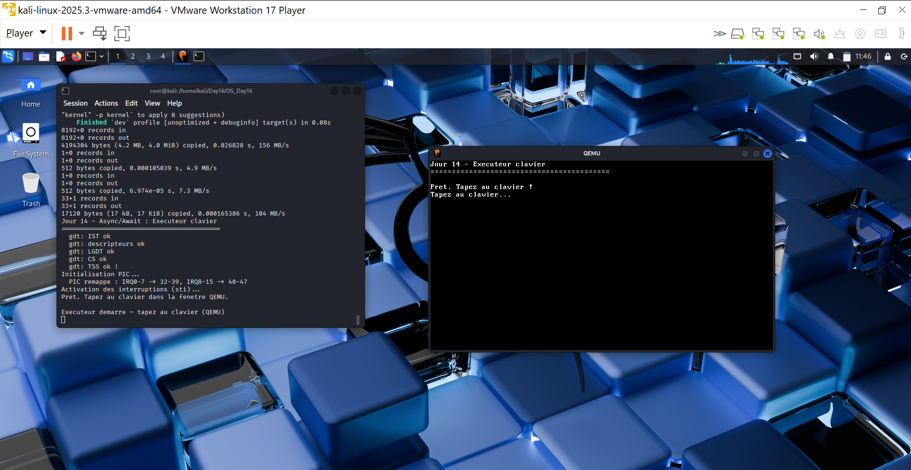
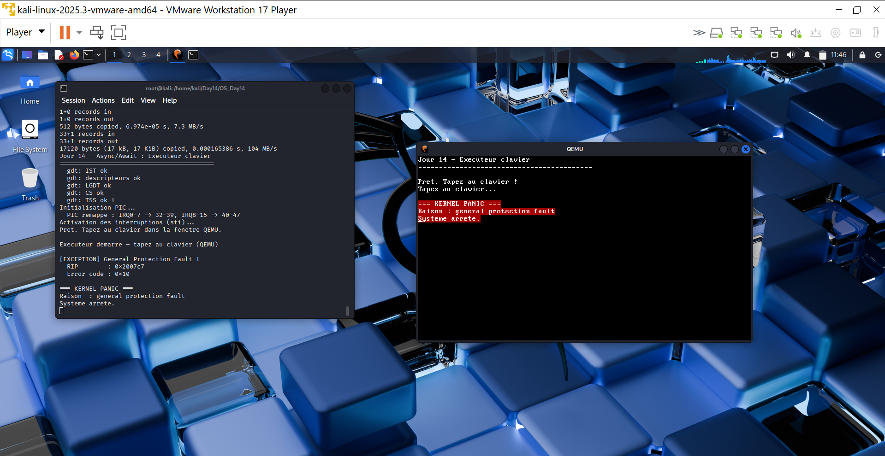
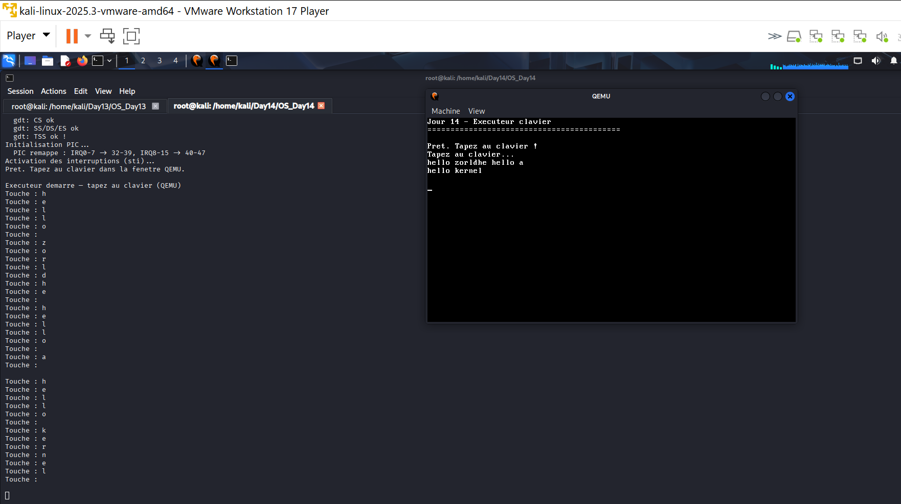

# Jour 14 - Async/Await : Executeur de taches et driver clavier

---

## Introduction

Au Jour 13, on avait un allocateur heap fonctionnel. Au Jour 14, on passe au **multitâche coopératif** : un executeur de taches qui poll en boucle un driver clavier interruptible. Sans `alloc` ni `Future` Rust complet, on reproduit le principe fondamental du modele async/await - une boucle d'evenements non bloquante dirigee par les interruptions materielle.

Le probleme resolu : avant ce jour, les interruptions CPU etaient configurees mais aucune logique ne traitait les frappes clavier. Le PIC 8259 devait etre remappe pour eviter les conflits avec les exceptions CPU (GPF), et un buffer circulaire devait relier le handler d'interruption a l'affichage.

---

## Concepts fondamentaux

### Multitache cooperatif vs preemptif

```
Cooperatif :
  Tache A poll() -> "rien a faire" -> rend la main
  Tache B poll() -> "rien a faire" -> rend la main
  IRQ clavier -> handler -> push(scancode)
  Tache A poll() -> "touche !" -> affiche

Preemptif :
  Timer (IRQ0) -> OS force le changement de contexte
  La tache ne choisit pas quand elle cede le CPU
```

Le cooperatif est plus simple a implementer (pas de sauvegarde de contexte), mais une tache qui boucle sans rendre la main bloque tout le systeme.

### Le modele poll()

```
async/await Rust complet :
  Future::poll(cx: &Context) -> Poll<Output>
  Waker notifie quand la Future peut progresser

Notre implementation (principe identique) :
  KeyboardFuture::poll() -> Option<char>
  None = "rien a faire" (Poll::Pending)
  Some(ch) = "touche disponible" (Poll::Ready)
```

### PIC 8259 - remappage obligatoire

Sans remappage, l'IRQ1 (clavier) genere l'interruption 9 - qui correspond a l'exception CPU "Coprocesseur segment overrun". Le PIC doit etre reconfigure pour decaler les IRQ au-dessus des 32 exceptions CPU reservees :

```
Avant remappage :
  IRQ0 (timer)   -> interruption 8  <- CONFLIT avec Double Fault
  IRQ1 (clavier) -> interruption 9  <- CONFLIT avec Coprocesseur

Apres remappage :
  IRQ0 (timer)   -> interruption 32 (0x20)
  IRQ1 (clavier) -> interruption 33 (0x21)
```

---

## Architecture du systeme

```
+------------------+
|   Touche clavier |
+--------+---------+
         |
    [IRQ1 - PIC]
         |
  keyboard_handler()        <- dans idt.rs
    -> push(scancode)       <- dans keyboard.rs
         |
  [SCANCODE_QUEUE]          <- buffer circulaire 64 scancodes
         |
  executor.run()            <- boucle hlt + poll
    -> KeyboardFuture::poll()
       -> scancode_to_ascii()
       -> serial::println!()
       -> vga::write_char()
```

---

## Implementation

### PIC - `src/pic.rs`

```rust
pub const PIC1_OFFSET: u8 = 32; // IRQ0 -> interruption 32
pub const PIC2_OFFSET: u8 = 40; // IRQ8 -> interruption 40

pub unsafe fn init() {
    // ICW1 : initialisation cascade
    outb(PIC1_COMMAND, 0x11);
    outb(PIC2_COMMAND, 0x11);
    // ICW2 : nouveaux offsets
    outb(PIC1_DATA, PIC1_OFFSET);
    outb(PIC2_DATA, PIC2_OFFSET);
    // Masquer tout sauf IRQ1 (clavier) : 0xFD = 11111101
    outb(PIC1_DATA, 0xFD);
    outb(PIC2_DATA, 0xFF);
}
```

### Buffer circulaire - `src/keyboard.rs`

```rust
const QUEUE_SIZE: usize = 64;

pub struct ScancodeQueue {
    buffer: [u8; QUEUE_SIZE],
    head: usize, // prochain a lire
    tail: usize, // prochain a ecrire
    count: usize,
}

impl ScancodeQueue {
    pub fn push(&mut self, scancode: u8) -> bool {
        if self.count >= QUEUE_SIZE { return false; } // queue pleine
        self.buffer[self.tail] = scancode;
        self.tail = (self.tail + 1) % QUEUE_SIZE;
        self.count += 1;
        true
    }

    pub fn pop(&mut self) -> Option<u8> {
        if self.count == 0 { return None; }
        let val = self.buffer[self.head];
        self.head = (self.head + 1) % QUEUE_SIZE;
        self.count -= 1;
        Some(val)
    }
}
```

Le buffer circulaire est sans allocation dynamique - taille fixe de 64 scancodes en statique. Pas de mutex (no_std), l'acces est protege par le fait que le handler IRQ ne peut pas interrompre un pop() a cause de `hlt`.

### KeyboardFuture - poll non bloquant

```rust
pub struct KeyboardFuture;

impl KeyboardFuture {
    pub fn poll(&self) -> Option<char> {
        loop {
            let scancode = unsafe {
                (*core::ptr::addr_of_mut!(SCANCODE_QUEUE)).pop()
            };
            match scancode {
                Some(sc) => {
                    if let Some(ch) = scancode_to_ascii(sc) {
                        return Some(ch); // Poll::Ready
                    }
                    // scancode de release (bit 7 = 1) ignore, continuer
                }
                None => return None, // Poll::Pending - queue vide
            }
        }
    }
}
```

### Executeur - `src/executor.rs`

```rust
pub struct Executor {
    keyboard_task: keyboard::KeyboardFuture,
}

pub fn run(&mut self) -> ! {
    loop {
        // Poll la tache clavier - non bloquant
        if let Some(ch) = self.keyboard_task.poll() {
            serial::print("Touche : ");
            // encoder et afficher
            vga::WRITER.lock().write_fmt(format_args!("{}", ch)).ok();
        }

        // Ici on pourrait poll() d'autres taches (reseau, timer...)
        // C'est le principe du multitache cooperatif

        unsafe { core::arch::asm!("hlt"); } // attendre la prochaine interruption
    }
}
```

Le `hlt` est crucial : sans lui, la boucle tourne a 100% CPU indefiniment. Avec `hlt`, le CPU se met en veille jusqu'a la prochaine interruption (IRQ clavier ou autre), puis reprend le poll. C'est l'equivalent du `epoll_wait` sous Linux.

### Conversion scancode -> ASCII

```rust
fn scancode_to_ascii(scancode: u8) -> Option<char> {
    if scancode & 0x80 != 0 { return None; } // key release ignore
    match scancode {
        0x1E => Some('a'), 0x30 => Some('b'), /* ... */
        0x39 => Some(' '), // espace
        0x1C => Some('\n'), // entree
        _ => None,
    }
}
```

---

## Arborescence



```
OS_Day14/
└── src/
    ├── main.rs          <- init GDT/IDT/PIC, sti, lance Executor
    ├── keyboard.rs      <- NOUVEAU : ScancodeQueue + KeyboardFuture
    ├── executor.rs      <- NOUVEAU : Executor::run() poll loop
    ├── pic.rs           <- NOUVEAU : init PIC 8259, remappage IRQ
    ├── idt.rs           <- handler IRQ1 (keyboard_handler)
    ├── heap_allocator.rs
    ├── heap.rs
    ├── frame_allocator.rs
    ├── paging.rs
    ├── gdt.rs
    └── serial.rs
```

---

## Commandes

```bash
cargo build -Z build-std=core --target x86_64-unknown-none

objcopy -O binary \
  --only-section=.text \
  --only-section=.rodata \
  --only-section=.data \
  target/x86_64-unknown-none/debug/kernel kernel.bin

dd if=/dev/zero   of=os.img bs=512 count=8192
dd if=boot.bin    of=os.img conv=notrunc
dd if=stage2.bin  of=os.img bs=512 seek=1 conv=notrunc
dd if=kernel.bin  of=os.img bs=512 seek=2 conv=notrunc

qemu-system-x86_64 \
  -drive format=raw,file=os.img \
  -serial stdio \
  -display sdl \
  -no-reboot -no-shutdown
```

---

## Resultat obtenu

### Ecran d'accueil QEMU avant le test clavier



Le kernel affiche "Pret. Tapez au clavier !" en VGA et "Executeur demarre" en serie. Le PIC est configure, les interruptions sont activees (`sti`), l'executeur attend en boucle `hlt`.

### Le bug GPF avant le fix du PIC



Avant le remappage du PIC, appuyer sur une touche generait une interruption 9 (sans handler defini), ce qui declenchait un **General Protection Fault** (#GP). L'IDT ne connaissait pas ce vecteur -> le kernel crashait immediatement a la premiere frappe.

Le fix : appeler `pic::init()` avant `sti` pour remapper IRQ1 vers le vecteur 33, et enregistrer un handler IDT a cet index qui appelle `keyboard::handle_keyboard_interrupt()`.

### Clavier fonctionnel - frappes reussies



Apres le fix :
- Chaque frappe declenche IRQ1 -> `keyboard_handler()` -> `SCANCODE_QUEUE.push()`
- L'executeur `poll()` vide la queue -> `scancode_to_ascii()` -> affichage
- La sortie serie montre chaque touche sur une ligne ("Touche : a", etc.)
- La fenetre VGA affiche les caracteres directement a l'ecran

---

## Interpretation des resultats

| Observation | Signification |
|---|---|
| "PIC remappe : IRQ0-7 -> 32-39" | Remappage reussi, plus de conflit avec les exceptions CPU |
| "Executeur demarre" | Boucle poll active, `sti` effectif |
| Touche affichee serie + VGA | Chemin IRQ1 -> handler -> queue -> poll -> affichage complet |
| `hlt` entre deux polls | CPU en veille entre les interruptions - 0% CPU inutile |

---

## Resume - Angle Cyber

| Mecanisme | Point de securite |
|---|---|
| PIC remappe | Evite la confusion IRQ/exception - attaque par injection d'IRQ |
| Buffer circulaire taille fixe | Pas d'overflow dynamique possible |
| Bit 7 ignore (key release) | Filtre les scancodes parasites |
| `hlt` dans la boucle | Pas d'attente active - side-channel timing reduit |
| Queue pleine = scancode perdu | Comportement deterministe, pas de crash |

> Le driver clavier est une surface d'attaque directe sur les systemes embarques et les hyperviseurs. Une IRQ injectee (via un peripherique malveillant ou un bug de VMM) peut rediriger l'execution si le vecteur d'interruption n'a pas de handler enregistre. Notre IDT refuse les vecteurs non configures via le handler de General Protection Fault - c'est la defense de base contre les attaques par injection d'interruption. Le buffer circulaire a taille fixe evite tout debordement heap, contrairement a une file dynamique qui pourrait etre epuisee par un clavier malveillant en spam.
