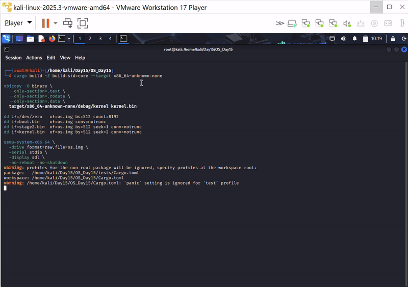

# Jour 15 — Synthèse finale : démonstration intégrée

---

## Introduction

Le Jour 15 n'introduit **aucun nouveau concept technique**. C'est une journée de **validation et de démonstration** : prouver que les quatre couches construites sur 14 jours fonctionnent ensemble, sans régression, dans un seul binaire kernel.

La vidéo de démonstration **est** le livrable principal de cette journée.

---

## Les 4 sous-systèmes validés

```
[1/4] Sécurité CPU  → GDT + IDT + IST        (Jours 7-8)
[2/4] Mémoire       → Pagination + Heap       (Jours 9-13)
[3/4] Écran         → VGA multicolore         (Jours 4-5)
[4/4] Clavier       → PIC + IRQ + Exécuteur   (Jour 14)
```

---

## Séquence de démarrage (`main.rs`)

```
_start()
  │
  ├─ Bannière jaune "JOUR 15 - SYNTHESE FINALE"
  │
  ├─ [1/4] gdt::init() + idt::init()           → OK vert
  │
  ├─ [2/4] frame_allocator + map_heap + init
  │         alloc(128) → write 0xC0FFEE_C0FFEE → read → free  → OK/ECHEC
  │
  ├─ [3/4] Demo couleurs Rouge Vert Bleu Magenta               → OK vert
  │
  ├─ [4/4] pic::init() + sti + executor.run()                  → OK vert
  │
  ├─ Bannière "TOUS LES SOUS-SYSTEMES : OK"
  │
  └─ Mode interactif clavier (boucle poll + hlt)
```

---

## Nouveautés du Jour 15 (uniquement présentation + test)

### Affichage multicolore structuré

| Élément | Couleur VGA |
|---------|-------------|
| Bannières | Jaune sur noir |
| Labels `[1/4]` … `[4/4]` | Cyan |
| Statut `OK` | Vert clair |
| Statut `ECHEC` | Rouge clair |
| Démo couleurs | Rouge / Vert / Bleu / Magenta |

### Test mémoire réel (Phase 2)

```rust
let test_ptr = heap_allocator::alloc(128);
if let Some(ptr) = test_ptr {
    core::ptr::write_volatile(ptr as *mut u64, 0xC0FFEE_C0FFEE);
    let val = core::ptr::read_volatile(ptr as *const u64);
    mem_ok = val == 0xC0FFEE_C0FFEE;
    heap_allocator::free(ptr);
}
```

Ce test valide en une passe : **frame allocator → mapping heap → linked list allocator → lecture/écriture volatile → free**.

---

## Démonstration



Vidéo complète : [jour15_demo_finale.mp4](./jour15_demo_finale.mp4) — enregistrement QEMU du 7 juillet 2026.

La démo montre :
1. Les 4 phases s'afficher une par une avec `OK`
2. La démo couleurs sur l'écran VGA
3. La bannière finale `TOUS LES SOUS-SYSTEMES : OK`
4. La saisie clavier interactive (chaque touche sur série + VGA)

---

## Lancer la démo

```bash
cd Day15/OS_Day15
cargo run
```

---

## Code

```
Day15/OS_Day15/src/
├── main.rs           ← séquence de synthèse (Jour 15)
├── gdt.rs / idt.rs   ← Jours 7-8
├── paging.rs / heap.rs / heap_allocator.rs / frame_allocator.rs  ← Jours 9-13
├── vga.rs / vga1.rs / vga2.rs  ← Jours 4-5
├── pic.rs / keyboard.rs / executor.rs  ← Jour 14
└── ...
```

---

## Bilan cyber (vue d'ensemble)

| Couche | Ce qu'on défend | Ce qui manque pour la prod |
|--------|-----------------|---------------------------|
| Boot / GDT | Segmentation correcte | Secure Boot, mesure d'intégrité |
| IDT / IST | Plus de triple fault silencieux | ASLR kernel, stack canaries |
| Pagination NX | W^X sur pages données | KASLR, SMEP/SMAP |
| Heap | Détection double-free basique | Guard pages, heap hardening |
| PIC / Clavier | IRQ remappées, buffer fixe | Input validation, rate limiting |

> Un OS de production ajouterait des milliers de lignes de durcissement. Ce projet prouve la **chaîne complète** — de l'amorçage à l'interaction utilisateur — avec une surface d'attaque documentée à chaque couche.

---

## Suite possible

- Timer IRQ0 → multitâche **préemptif**
- Processus / threads avec changement de contexte
- Système de fichiers, réseau, userspace
- Consolidation en **livre** (reprise rétrospective Jours 1–15)
