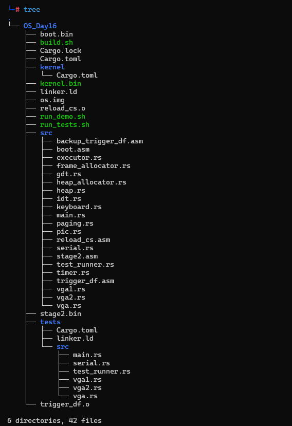
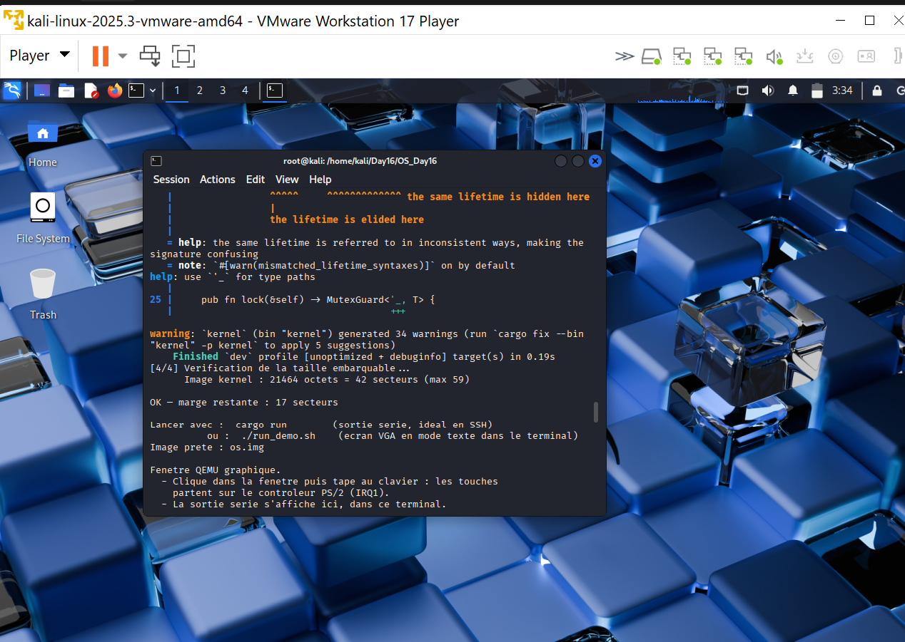
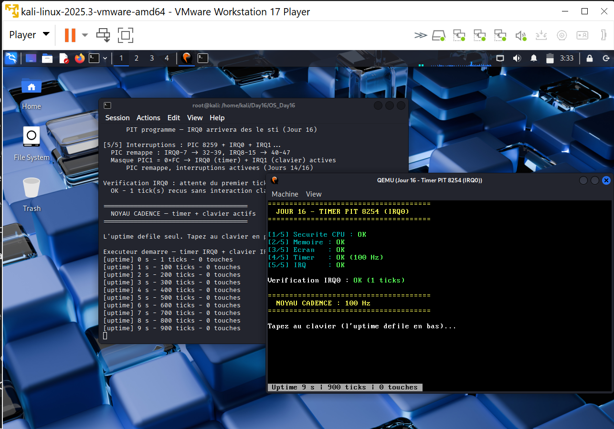

# Jour 16 : Timer PIT 8254, donner un pouls au noyau

---

## Introduction

Au Jour 15, le noyau validait quatre sous-systèmes et passait en mode interactif clavier. Mais il souffrait d'une limitation invisible dans la démo : **sans frappe clavier, il ne faisait rien du tout**. La dernière instruction de la boucle principale était :

```rust
unsafe { core::arch::asm!("hlt"); } // attendre la prochaine interruption
```

Le `hlt` endort le CPU jusqu'à la prochaine interruption. Or une seule IRQ était démasquée dans le PIC (`0xFD`, soit uniquement IRQ1, le clavier). Conséquence : pas de frappe, pas d'interruption, pas de réveil. Le noyau était littéralement gelé entre deux touches.

Le Jour 16 corrige cela en programmant le **PIT 8254** pour générer **IRQ0** de façon périodique. Le noyau acquiert une notion du temps indépendante de l'utilisateur, et c'est le prérequis absolu du multitâche préemptif du Jour 18.

---

## Concepts fondamentaux

### Pourquoi un timer matériel est indispensable

```
Sans timer :
  Le noyau ne sait pas combien de temps s'est ecoule
  -> impossible de dire "cette tache tourne depuis 10 ms, je change"
  -> impossible de detecter un timeout
  -> une tache qui boucle bloque tout le systeme, definitivement

Avec timer :
  IRQ0 arrive 100 fois par seconde, quoi qu'il arrive
  -> le noyau reprend la main de force, periodiquement
  -> base du scheduling, des timeouts, de l'uptime
```

C'est la différence structurelle entre le **coopératif** (Jour 14 : une tâche rend la main quand elle veut) et le **préemptif** (Jour 18 : l'OS force le changement).

### Le PIT 8254

Le *Programmable Interval Timer* est une puce présente sur tous les PC x86 depuis l'IBM PC de 1981. Elle possède trois canaux ; le **canal 0** est câblé sur **IRQ0** du PIC.

```
Oscillateur a 1 193 182 Hz  (frequence gravee, non modifiable)
        |
        v
  Compteur 16 bits  <- on y charge un DIVISEUR
        |
  decrement a chaque oscillation
        |
  atteint zero -> IRQ0 + rechargement du diviseur
```

La fréquence des interruptions est donc :

```
f_IRQ0 = 1 193 182 / diviseur
```

Pour 100 Hz (un tick toutes les 10 ms, choix classique) :

```
diviseur = 1 193 182 / 100 = 11 931,82  ->  11 931
f_reelle = 1 193 182 / 11 931 = 100,006 Hz
```

L'arrondi introduit une dérive d'environ 0,5 seconde par jour. Négligeable ici, mais c'est exactement le problème que NTP corrige sur un vrai OS.

### Les ports du PIT

| Port | Rôle |
|---|---|
| `0x40` | Données du canal 0 |
| `0x41` | Données du canal 1 (historiquement : rafraîchissement RAM) |
| `0x42` | Données du canal 2 (haut-parleur PC) |
| `0x43` | Registre de commande (écriture seule) |

### L'octet de commande

```
Bit  7-6 : canal          (00 = canal 0)
Bit  5-4 : mode d'acces   (11 = lobyte puis hibyte)
Bit  3-1 : mode operatoire(011 = mode 3, onde carree)
Bit  0   : format         (0 = binaire, 1 = BCD)

0x36 = 0011 0110
```

Le **mode 3** (onde carrée) est le choix historique du PC pour le canal 0. Le mode 2 (générateur de fréquence, `0x34`) fonctionne également.

---

## Implémentation

### `src/timer.rs`, nouveau module

```rust
use core::sync::atomic::{AtomicU64, Ordering};
use crate::serial;

const PIT_BASE_FREQUENCY: u32 = 1_193_182;
pub const TICKS_PER_SECOND: u32 = 100;

const PIT_COMMAND: u16 = 0x43;
const PIT_CHANNEL0_DATA: u16 = 0x40;
const PIT_MODE3_SQUARE_WAVE: u8 = 0x36;

pub static TICKS: AtomicU64 = AtomicU64::new(0);

unsafe fn outb(port: u16, val: u8) {
    core::arch::asm!("out dx, al", in("dx") port, in("al") val);
}

pub unsafe fn init() {
    let divisor = (PIT_BASE_FREQUENCY / TICKS_PER_SECOND) as u16;

    outb(PIT_COMMAND, PIT_MODE3_SQUARE_WAVE);
    outb(PIT_CHANNEL0_DATA, (divisor & 0xFF) as u8); // octet bas d'abord
    outb(PIT_CHANNEL0_DATA, (divisor >> 8) as u8);   // puis octet haut
}

pub fn on_tick() {
    TICKS.fetch_add(1, Ordering::Relaxed);
}

pub fn ticks() -> u64          { TICKS.load(Ordering::Relaxed) }
pub fn uptime_seconds() -> u64 { ticks() / TICKS_PER_SECOND as u64 }
pub fn uptime_ms() -> u64      { ticks() * (1000 / TICKS_PER_SECOND as u64) }
```

**L'ordre d'envoi du diviseur compte** : le PIT attend l'octet de poids faible puis celui de poids fort, parce qu'on l'a configuré en mode d'accès `11` (lobyte/hibyte). Inverser les deux donne une fréquence complètement fausse.

### Pourquoi `AtomicU64` et pas `static mut`

Le compteur est **écrit depuis un handler d'interruption** et **lu depuis la boucle principale**. Avec un `static mut` classique, deux problèmes :

1. Le compilateur peut mettre la valeur en cache dans un registre lors de la lecture en boucle et ne jamais voir les mises à jour du handler. La boucle attendrait éternellement.
2. Sur d'autres architectures, une lecture 64 bits non atomique peut être « déchirée », c'est-à-dire renvoyer deux moitiés incohérentes.

`Ordering::Relaxed` suffit ici : on ne synchronise aucune autre donnée avec ce compteur, on veut juste l'atomicité de l'incrément et la visibilité de la valeur.

### `src/pic.rs`, démasquer IRQ0

Le masque du PIC fonctionne à l'envers de l'intuition : **un bit à 1 signifie IRQ masquée**.

```
Jour 14 : 0xFD = 1111 1101
                        ^-- bit 1 a 0 -> IRQ1 (clavier) autorisee
          -> IRQ0 masquee, pas de timer

Jour 16 : 0xFC = 1111 1100
                       ^^-- bits 0 et 1 a 0
          -> IRQ0 (timer) ET IRQ1 (clavier) autorisees
```

```rust
outb(PIC1_DATA, 0xFC);
outb(PIC2_DATA, 0xFF); // tout masque sur PIC2
```

### `src/idt.rs`, enregistrer le handler

Le remappage du Jour 14 place les IRQ à partir du vecteur 32, donc IRQ0 tombe sur l'entrée 32 et IRQ1 sur 33 :

```rust
// IRQ0 (timer PIT) -> interruption 32
idt[32].set_handler_fn(timer_interrupt_handler);

// IRQ1 (clavier) -> interruption 33
idt[33].set_handler_fn(keyboard_interrupt_handler);
```

```rust
extern "x86-interrupt" fn timer_interrupt_handler(_frame: InterruptStackFrame) {
    timer::on_tick();
    unsafe { pic::send_eoi(0); } // IRQ0
}
```

Le handler fait **deux choses et rien de plus**. La raison est détaillée dans la section « pièges » ci-dessous.

### `src/main.rs`, séquence de démarrage

L'ordre est important :

```rust
unsafe { timer::init(); }                  // [4/5] programme le PIT
unsafe { pic::init(); }                    // [5/5] demasque IRQ0 + IRQ1
unsafe { core::arch::asm!("sti"); }        //       autorise les interruptions
```

Programmer le PIT avant le `sti` évite de recevoir une IRQ0 avant que l'IDT et le PIC soient prêts. Le `sti` doit venir en dernier : c'est lui qui ouvre les vannes.

---

## La vérification automatique d'IRQ0

C'est le test central de la journée. Sans toucher au clavier, le compteur doit passer de zéro à une valeur non nulle :

```rust
let mut spins: u64 = 0;
let timer_irq_ok = loop {
    if timer::ticks() > 0 {
        break true;
    }
    spins += 1;
    if spins > 200_000_000 {
        break false;
    }
    core::hint::spin_loop();
};
```

Deux décisions de conception méritent explication.

**Pourquoi une boucle bornée et pas un `hlt` ?** Si le masque PIC ou l'EOI est mal configuré, aucune IRQ0 n'arrivera jamais. Un `hlt` figerait le noyau sans message d'erreur, ce qui est le pire scénario de debug. La boucle bornée affiche `ECHEC` avec la liste des causes probables.

**Pourquoi `spin_loop()` ?** C'est un indice donné au CPU (instruction `pause` sur x86) qui réduit la consommation et la pression sur le pipeline pendant une attente active. Sans lui, la boucle reste correcte mais gaspille davantage.

En cas d'échec, le message oriente directement :

```
ECHEC - aucun tick recu.
Verifier : masque PIC1 = 0xFC, idt[32] enregistre, send_eoi(0) present.
```

---

## Les deux pièges classiques

### Piège 1 : l'EOI oublié

Le PIC attend un accusé de réception (*End Of Interrupt*) avant d'envoyer l'interruption suivante. La fonction existait déjà depuis le Jour 14 :

```rust
pub unsafe fn send_eoi(irq: u8) {
    if irq >= 8 {
        outb(PIC2_COMMAND, PIC_EOI);
    }
    outb(PIC1_COMMAND, PIC_EOI);
}
```

Si on oublie l'EOI dans le handler timer, on reçoit **exactement un tick** puis plus rien. Le symptôme est trompeur : comme IRQ0 a une priorité supérieure à IRQ1 sur le même PIC, une IRQ0 non acquittée bloque également le clavier. On croit alors avoir cassé le driver clavier alors que le problème est dans le timer.

### Piège 2 : le deadlock du Mutex VGA

Celui-ci est spécifique à cette architecture et c'est le plus instructif. Le `Mutex` du Jour 5 est un **spinlock** : celui qui ne peut pas prendre le verrou tourne en boucle en attendant.

```
Boucle principale : WRITER.lock()        <- detient le verrou
        |
        v  IRQ0 arrive pile a cet instant
Handler timer     : WRITER.lock()        <- spin, attend la liberation
        |
        v
Le detenteur du verrou est interrompu.
Il ne reprendra son execution qu'apres la fin du handler.
Le handler n'avancera qu'a la liberation du verrou.
        |
        v
INTERBLOCAGE DEFINITIF
```

D'où la règle de conception : **un handler d'interruption ne prend jamais un verrou partagé avec le code normal**. C'est le réflexe déjà appliqué au Jour 14, où le handler clavier se contente d'empiler un scancode, et on le reproduit ici : le handler incrémente `TICKS`, la boucle principale se charge de l'affichage.

Si un jour du code normal doit absolument tenir un verrou aussi pris par un handler, la parade est de désactiver les interruptions pendant la section critique :

```rust
use x86_64::instructions::interrupts;

interrupts::without_interrupts(|| {
    vga::WRITER.lock().write_fmt(args).ok();
});
```

La crate `x86_64` est déjà une dépendance du projet, donc cette parade est disponible immédiatement.

---

## La barre d'état VGA

Afficher l'uptime avec le `Writer` habituel poserait un problème cosmétique : chaque ligne écrite déplace le curseur et finit par faire défiler l'écran, ce qui perturberait la zone de saisie clavier. La solution est d'écrire à une **position fixe** via la fonction bas niveau qui n'utilise pas le curseur :

```rust
unsafe fn write_str(row: usize, col: usize, s: &str, color: u8)
```

Reste à construire la ligne sans allocation dynamique, et sans passer par `core::fmt` pour les nombres (voir la section sur le bug `RIP : 0x3`). On implémente donc un tampon à taille fixe avec ses propres méthodes d'ajout :

```rust
struct FixedLine {
    buf: [u8; vga2::VGA_WIDTH],
    len: usize,
}

impl FixedLine {
    fn push_str(&mut self, s: &str) {
        for &b in s.as_bytes() {
            if self.len < self.buf.len() {
                self.buf[self.len] = b;
                self.len += 1;
            }
        }
    }

    fn push_dec(&mut self, mut value: u64) {
        let mut tmp = [0u8; 20];
        let mut i = tmp.len();

        if value == 0 {
            i -= 1;
            tmp[i] = b'0';
        }
        while value > 0 {
            i -= 1;
            tmp[i] = b'0' + (value % 10) as u8;
            value /= 10;
        }

        for k in i..tmp.len() {
            if self.len < self.buf.len() {
                self.buf[self.len] = tmp[k];
                self.len += 1;
            }
        }
    }

    fn as_str(&self) -> &str {
        core::str::from_utf8(&self.buf[..self.len]).unwrap_or("")
    }
}
```

Le test `if self.len < self.buf.len()` est le garde-fou contre le débordement : écrire plus de 80 caractères tronque au lieu de corrompre la mémoire. Construction de la ligne :

```rust
let mut line = FixedLine::new();
line.push_str(" Uptime ");
line.push_dec(seconds);
line.push_str(" s | ");
line.push_dec(ticks);
line.push_str(" ticks | ");
line.push_dec(self.keys_typed);
line.push_str(" touches ");
```

Rendu final sur la dernière ligne de l'écran :

```
 Uptime 27 s | 2700 ticks | 5 touches
```

---

## La nouvelle boucle principale

```rust
loop {
    // Tache 1 : le timer
    let seconds = timer::uptime_seconds();
    if seconds != self.last_second {
        self.last_second = seconds;
        let ticks = timer::ticks();

        serial::print("[uptime] ");
        serial::print_dec(seconds);
        serial::print(" s - ");
        serial::print_dec(ticks);
        serial::print(" ticks - ");
        serial::print_dec(self.keys_typed);
        serial::println(" touches");

        self.draw_status_bar(seconds, ticks);
    }

    // Tache 2 : le clavier
    if let Some(ch) = self.keyboard_task.poll() {
        self.keys_typed += 1;

        let mut utf8 = [0u8; 4];
        serial::print("Touche : ");
        serial::print(ch.encode_utf8(&mut utf8));
        serial::print(" (t=");
        serial::print_dec(timer::uptime_ms());
        serial::println(" ms)");

        vga::WRITER.lock().write_byte(ch as u8);
    }

    unsafe { core::arch::asm!("hlt"); }
}
```

La nature du `hlt` a changé du tout au tout. Au Jour 14, il pouvait dormir indéfiniment. Au Jour 16, il est garanti de se réveiller **au plus tard 10 ms plus tard** grâce à IRQ0. Le noyau est passé d'un système purement réactif à un système **cadencé**.

C'est aussi la première fois que la boucle traite deux sources d'événements de nature différente : un vrai embryon de boucle d'événements, comparable à un `epoll_wait` avec timeout sous Linux.

---

## Résultat obtenu

### Arborescence du projet



### Compilation et contrôle de taille



Le script `build.sh` assemble le bootloader, compile le noyau, puis mesure l'image réellement embarquée :

```
[4/4] Verification de la taille embarquable...
      Image kernel : 21464 octets = 42 secteurs (max 59)

OK - marge restante : 17 secteurs
```

Ces 42 secteurs sur 59 sont à retenir pour la section sur les limites du bootloader : la marge n'est que de 8,5 Ko.

### Séquence de démarrage



La fenêtre QEMU affiche un récapitulatif condensé : bannière jaune, les cinq phases en cyan avec leur `OK` en vert, la vérification `Verification IRQ0 : OK (1 ticks)`, puis la bannière finale `NOYAU CADENCE : 100 Hz`. Tout en bas, la barre d'état indique `Uptime 9 s | 900 ticks | 0 touches` et progresse seule, sans qu'aucune touche n'ait été pressée.

Le port série, lui, reçoit le déroulé détaillé :

```
======================================
  JOUR 16 - TIMER PIT 8254 (IRQ0)
======================================

[1/5] Securite CPU : GDT + IDT + IST...
      GDT/IDT/IST operationnels (Jours 7-8)

[2/5] Memoire : pagination + allocateur + heap...
  Frames : 13 libres / 16 total
  Zone virtuelle : 0x4000000 - 0x47fffff
      Pagination/Frames/Heap operationnels (Jours 9-13)

[3/5] Ecran : VGA Safe Wrapper multicolore...
      VGA Writer + Mutex operationnel (Jours 4-5)

[4/5] Timer : programmation du PIT 8254 canal 0...
  PIT programme : diviseur 11931 -> 100 Hz (1 tick = 10 ms)

[5/5] Interruptions : PIC 8259 + IRQ0 + IRQ1...
  PIC remappe : IRQ0-7 -> 32-39, IRQ8-15 -> 40-47
  Masque PIC1 = 0xFC -> IRQ0 (timer) + IRQ1 (clavier) actives

Verification IRQ0 : attente du premier tick...
  OK - 1 tick(s) recus sans interaction clavier

======================================
  NOYAU CADENCE - timer + clavier actifs
======================================
```

Le diviseur affiché est bien `11931`, conforme au calcul `1193182 / 100`.

### Les deux IRQ en parallèle, la preuve


C'est la capture la plus importante de la journée, et elle montre les deux sorties en même temps : dans la fenêtre QEMU, le mot `hello` s'affiche à l'écran VGA et la barre d'état indique `Uptime 27 s | 2700 ticks | 5 touches` ; dans le terminal, la trace série détaille chaque frappe **intercalée entre les ticks**, sans que l'une perturbe l'autre :

```
[uptime] 20 s - 2000 ticks - 0 touches
[uptime] 21 s - 2100 ticks - 0 touches
Touche : h (t=21200 ms)
Touche : e (t=21860 ms)
[uptime] 22 s - 2200 ticks - 2 touches
Touche : l (t=22880 ms)
[uptime] 23 s - 2300 ticks - 3 touches
Touche : l (t=23030 ms)
Touche : o (t=23510 ms)
[uptime] 24 s - 2400 ticks - 5 touches
[uptime] 25 s - 2500 ticks - 5 touches
...
[uptime] 39 s - 3900 ticks - 5 touches
Touche : c (t=39630 ms)
Touche : c (t=39920 ms)
[uptime] 40 s - 4000 ticks - 7 touches
Touche : c (t=40220 ms)
Touche : c (t=40440 ms)
Touche : c (t=40670 ms)
[uptime] 41 s - 4100 ticks - 10 touches
```

Cette vingtaine de lignes établit cinq faits distincts, et il vaut la peine de les séparer.

**L'EOI du timer est correct.** Le flux de ticks est continu sur quarante et une secondes. Sans `send_eoi(0)`, le compteur se serait figé à 1 définitivement, ce qui est le piège numéro un décrit plus haut.

**Le diviseur est juste et les octets dans le bon ordre.** Exactement 100 ticks par seconde, sans dérive perceptible sur la durée. Avoir inversé octet bas et octet haut aurait donné une fréquence absurde.

**Le noyau vit sans l'utilisateur.** Les vingt et une premières secondes affichent `0 touches` : l'uptime progresse alors qu'aucune frappe n'a lieu. C'est exactement le verrou levé aujourd'hui, puisqu'au Jour 14 la boucle restait bloquée sur son `hlt` entre deux touches.

**Les deux lignes d'interruption coexistent.** IRQ0 et IRQ1 sont servies sans se voler mutuellement. Si l'EOI de l'une avait été oublié, l'autre serait morte avec elle, IRQ0 étant prioritaire sur IRQ1 au sein du même PIC.

**L'horodatage des frappes est cohérent.** `t=21200 ms` correspond à 2120 ticks, soit exactement l'instant entre les affichages de 21 et 22 secondes. Les cinq `c` tapés rapidement entre `t=39630` et `t=40670` sont tous captés, ce qui valide le buffer circulaire : aucun scancode perdu malgré des frappes espacées de deux à trois centièmes de seconde.

### Protocole de test, un piège à connaître

`cargo run` lance QEMU avec `-display none -serial stdio`. Dans ce mode, ce qu'on tape dans le terminal part sur le **port série** et non sur le clavier PS/2 émulé : aucune IRQ1 n'est générée et le compteur de touches reste désespérément à zéro. Aucune capture de l'écran VGA n'est possible non plus.

Le script `run_demo.sh` ouvre une **vraie fenêtre QEMU**, avec l'écran VGA visible et le clavier routé vers le contrôleur PS/2, tout en laissant la trace série dans le terminal :

```bash
./run_demo.sh
```

C'est le mode à utiliser pour les captures et les enregistrements vidéo. Le script bascule automatiquement sur le backend curses si aucun serveur graphique n'est détecté, ce qui le rend utilisable aussi en session SSH.

**Critère de réussite de la journée :** l'uptime défile tout seul, et le clavier continue de répondre en parallèle. Si l'un des deux s'arrête quand l'autre fonctionne, le coupable est presque toujours l'EOI.

---

## Le bug rencontré en pratique : `RIP : 0x3`

Première exécution du Jour 16, le noyau s'écroule exactement au moment d'afficher le diviseur :

```
[4/5] Timer : programmation du PIT 8254 canal 0...
  PIT programme : diviseur
[EXCEPTION] Opcode invalide !
  RIP : 0x3
```

Le texte littéral s'affiche, puis l'exécution part à l'adresse `0x3`. Ce chiffre est l'indice décisif : `0x3` n'est pas une adresse de code du noyau, qui est chargé à `0x200000`. Le CPU a donc **sauté à l'adresse 0**, exécuté les quelques octets de la table des vecteurs d'interruption laissée là par le BIOS, puis levé `#UD` trois octets plus loin.

Un saut vers zéro signifie un **appel indirect à travers un pointeur lu comme nul**. Restait à comprendre pourquoi un pointeur valait zéro.

### Fausse piste : la taille du noyau

Le premier réflexe a été de suspecter la limite du bootloader, car `boot.asm` ne charge que soixante secteurs :

```asm
    ; Charger 60 secteurs à 0x8000
    mov al, 60
    int 0x13
```

Un pour `stage2`, donc **59 secteurs, soit 30 208 octets** pour le noyau. L'hypothèse était que le moteur de formatage d'entiers de `core::fmt` avait fait déborder cette limite, laissant la fin du binaire jamais lue depuis le disque. La mesure a invalidé la théorie :

```
22040 octets = 44 secteurs (max 59)
```

Quarante-quatre secteurs sur cinquante-neuf : le noyau tenait largement. La leçon est de **mesurer avant de conclure**. Le raisonnement était plausible et cohérent avec les symptômes, mais faux.

### Vraie cause 1 : les sections perdues par `objcopy`

L'image disque était fabriquée en filtrant explicitement les sections :

```bash
objcopy -O binary \
  --only-section=.text \
  --only-section=.rodata \
  --only-section=.data \
  --only-section=.bss \
  "$BINARY" kernel.bin
```

Ce filtrage était l'origine du problème. `format_args!` avec un argument génère des **tables de pointeurs de fonctions** vers les routines de formatage. Selon les relocations nécessaires, `lld` place ces tables dans `.got` ou `.data.rel.ro`, deux noms que le script de liaison ne nommait pas et que le filtre `--only-section` excluait donc de l'image.

Le piège est que `objcopy -O binary` positionne chaque section à son adresse virtuelle : une section absente ne décale pas les autres, elle laisse un **trou de zéros**. La table de pointeurs était donc présente en mémoire, à la bonne adresse, mais entièrement nulle. D'où le `call 0`.

Le script de liaison nomme désormais ces sections explicitement :

```
.data.rel.ro : { *(.data.rel.ro*) }
.got         : { *(.got) *(.got.plt) *(.igot*) }
```

Et la commande `objcopy` ne filtre plus rien :

```bash
objcopy -O binary "$BINARY" kernel.bin
```

`-O binary` ne recopie que les sections allouables, dans l'ordre des adresses. Le filtre manuel n'apportait rien et faisait silencieusement disparaître tout ce qui n'avait pas été anticipé.

### Vraie cause 2 : SSE non autorisé dans CR4

Un second défaut latent attendait au même endroit. `stage2.asm` ne configurait qu'un seul bit de `CR4` :

```asm
    mov eax, cr4
    or eax, 0x20        ; PAE uniquement
    mov cr4, eax
```

Le bit 5 (`PAE`) est obligatoire pour entrer en long mode, mais il manque **`OSFXSR` (bit 9)**, qui autorise l'exécution des instructions SSE, et `OSXMMEXCPT` (bit 10) pour leur gestion d'exceptions. Sans `OSFXSR`, toute instruction SSE lève `#UD`.

Or la cible `x86_64-unknown-none` active **SSE2 par défaut**, puisque c'est la base de l'ABI x86_64. LLVM émet donc librement des `movaps`, `movdqu` ou `xorps` pour les copies de structures et les initialisations. Les journées 1 à 15 y ont échappé par chance : leurs chemins de code n'en contenaient pas.

```asm
    ; PAE (bit 5) + OSFXSR (bit 9) + OSXMMEXCPT (bit 10)
    mov eax, cr4
    or eax, 0x620
    mov cr4, eax
```

Cette correction n'est pas optionnelle pour la suite : dès qu'on manipulera des contextes de tâches (Jour 17), le compilateur émettra du SSE.

### La parade côté code : éviter `core::fmt` sur les entiers

Formater les entiers à la main, exactement comme le fait déjà `print_hex` dans `idt.rs` depuis le Jour 7 :

```rust
pub fn print_dec(mut value: u64) {
    let mut buf = [0u8; 20];
    let mut i = buf.len();

    if value == 0 {
        i -= 1;
        buf[i] = b'0';
    }
    while value > 0 {
        i -= 1;
        buf[i] = b'0' + (value % 10) as u8;
        value /= 10;
    }

    for &b in &buf[i..] {
        unsafe { write_byte(b); }
    }
}
```

Le même helper est ajouté au `Writer` VGA sous le nom `write_dec`. Vingt octets de tampon suffisent, puisque `u64::MAX` fait dix-neuf chiffres.

Cette parade n'était pas strictement nécessaire une fois les deux vraies causes corrigées, mais elle a été conservée : elle réduit l'image de 22 040 à 21 464 octets et garde le noyau loin du plafond du bootloader.

### Le garde-fou

Pour ne plus jamais découvrir ce genre de problème à l'exécution, `build.sh` mesure l'image réellement embarquée et échoue si elle dépasse la limite :

```bash
BYTES=$(stat -c%s /tmp/day16_size_check.bin)
SECTORS=$(( (BYTES + 511) / 512 ))

if [ "$SECTORS" -gt 59 ]; then
  echo "ERREUR : le kernel depasse ce que boot.asm charge depuis le disque."
  exit 1
fi
```

La mesure porte sur l'image binaire produite par `objcopy` et non sur l'ELF, qui contient en plus les informations de debug et donnerait un chiffre sans rapport : 21 Ko d'image pour un ELF de plusieurs centaines de Ko.

Même si la taille n'était pas la cause du bug, la marge reste faible : dix-sept secteurs, soit environ 8,5 Ko. La section « Limites du Jour 16 » ci-dessous détaille pourquoi cette contrainte va devenir bloquante et comment le Jour 17 la lèvera.

---

## Mesurer la précision

Un contrôle intéressant consiste à comparer l'uptime affiché à un chronomètre réel sur une minute. Une dérive de quelques dixièmes de seconde est normale : arrondi du diviseur et latence de QEMU. Une dérive massive indiquerait :

- des octets du diviseur inversés, donc une fréquence totalement différente,
- des interruptions perdues parce que le handler est trop lent,
- un `cli` prolongé quelque part dans le code.

---

## Arborescence

```
Day16/
├── Jour16_Timer_IRQ0_Resume.md
├── Jour16_Timer_IRQ0_Complet.md
├── tree.png
├── finished_pret.png
├── rendu_avant_que_je_tappe_le_clavier.png
├── rendu_avec_hello_et_action_sur_clavier.png
└── OS_Day16/
    ├── build.sh              <- NOUVEAU : nasm + cargo build + controle taille
    ├── run_tests.sh          <- runner cargo (serie, compatible SSH)
    ├── run_demo.sh           <- NOUVEAU : fenetre QEMU graphique
    ├── linker.ld             <- MODIFIE : .got et .data.rel.ro nommees
    └── src/
        ├── timer.rs          <- NOUVEAU : PIT 8254 + compteur de ticks
        ├── pic.rs            <- MODIFIE : masque 0xFC
        ├── idt.rs            <- MODIFIE : idt[32] -> handler timer
        ├── main.rs           <- MODIFIE : 5 phases + verification IRQ0
        ├── executor.rs       <- MODIFIE : uptime + barre d'etat
        ├── serial.rs         <- MODIFIE : print_dec
        ├── vga2.rs           <- MODIFIE : Writer::write_dec
        ├── stage2.asm        <- MODIFIE : CR4.OSFXSR (SSE autorise)
        └── ...               <- inchange depuis le Jour 15
```

---

## Limites du Jour 16, côté bootloader

Le timer fonctionne, mais la journée met en lumière une fragilité qui n'est pas dans le noyau : **la chaîne de chargement héritée du Jour 3 est arrivée en bout de course**. Elle a servi treize journées sans broncher, et c'est en soi une réussite, mais elle repose sur une série de raccourcis qui deviennent des impasses.

### Limite 1 : un plafond de 59 secteurs

```asm
    mov ah, 0x02
    mov al, 60        ; 60 secteurs, une seule fois
    mov ch, 0         ; cylindre 0
    mov cl, 2         ; a partir du secteur 2
    mov dh, 0         ; tete 0
    int 0x13
```

Soixante secteurs lus en un appel, dont un pour `stage2`, laissent **30 208 octets** au noyau. Le Jour 16 en consomme 21 464, soit une marge de 8,5 Ko. C'est peu au regard de ce qui arrive : le Jour 17 ajoute une structure de contexte CPU et du code assembleur de commutation, le Jour 18 un ordonnanceur avec sa file de tâches.

### Limite 2 : le plafond dur des 64 Ko

On pourrait croire qu'il suffit de passer `mov al, 60` à une valeur plus grande. Le BIOS l'interdit : une lecture `INT 13h` ne doit **pas franchir une frontière de segment de 64 Ko**. La destination étant `ES:BX = 0x0800:0000`, soit l'adresse physique `0x8000` :

```
0x8000 + 64 × 512 = 0x8000 + 0x8000 = 0x10000
```

Soixante-quatre secteurs atteignent exactement la frontière. On peut donc gagner quatre secteurs et pas un de plus avec cette structure d'appel.

### Limite 3 : l'adressage CHS

Le chargement utilise l'adressage historique **cylindre, tête, secteur**, avec `cl` codant le numéro de secteur sur six bits utiles. Le secteur 63 est donc un mur : au-delà, il faudrait incrémenter la tête puis le cylindre et enchaîner les appels en tenant compte de la géométrie annoncée par le BIOS. C'est faisable mais pénible, et totalement obsolète, puisque plus aucun système ne procède ainsi depuis les années 1990.

### Limite 4 : une copie de taille fictive

```asm
    mov esi, 0x8200
    mov edi, 0x200000
    mov ecx, 0x8000     ; 0x8000 dwords = 128 Ko
    rep movsd
```

`stage2` recopie systématiquement **128 Ko** vers `0x200000`, alors que seuls 30 Ko au maximum ont réellement été lus depuis le disque. Les 98 Ko restants sont de la RAM non initialisée recopiée à l'aveugle. Ça fonctionne parce que le noyau ne lit jamais au-delà de sa propre fin, mais c'est exactement le genre d'approximation qui transforme un débordement de taille en corruption silencieuse au lieu d'une erreur franche.

### Limite 5 : aucune gestion d'erreur

```asm
    int 0x13
    jc $              ; boucle infinie si le drapeau carry est leve
```

Une lecture disque en échec produit un gel sans le moindre message. Pas de nouvelle tentative, pas de code d'erreur affiché, pas de diagnostic. Sur matériel réel, un `INT 13h` qui échoue au premier essai réussit souvent au deuxième, et les bootloaders sérieux réessaient trois fois en réinitialisant le contrôleur entre deux tentatives.

### Limite 6 : A20 par une seule méthode

```asm
    in al, 0x92
    or al, 2
    out 0x92, al
```

La ligne d'adresse A20 est activée via le *Fast A20 Gate* du port `0x92`. QEMU l'implémente, mais cette méthode n'est pas universelle : certaines machines exigent le contrôleur clavier 8042 ou l'appel BIOS `INT 15h AX=0x2401`. Un bootloader robuste essaie les trois et vérifie que ça a fonctionné.

### Limite 7 : aucune vérification de cohérence

Rien ne compare la taille réellement écrite sur l'image à la taille chargée en mémoire. C'est précisément la classe de défaut qui a coûté du temps aujourd'hui : le noyau était parfaitement compilé, mais la chaîne de déploiement pouvait le tronquer sans que personne ne s'en aperçoive. Le garde-fou ajouté dans `build.sh` compense côté hôte, mais le bootloader lui-même reste aveugle.

### Ce que le Jour 17 corrigera

Avant d'ajouter la commutation de contexte, la chaîne de chargement sera reprise :

| Chantier | Bénéfice |
|---|---|
| Lecture **LBA** via `INT 13h AH=0x42` et un *Disk Address Packet* | Plus de géométrie CHS, accès linéaire au disque |
| Chargement en **plusieurs blocs** avec segment de destination incrémenté | Sortie du plafond des 64 Ko, plusieurs centaines de secteurs accessibles |
| **Taille du noyau écrite dans l'image** par le script de build, lue par `stage2` | `rep movsd` copie la taille réelle, plus de 128 Ko fictifs |
| **Réessais et message d'erreur** sur échec de lecture | Un disque capricieux ne gèle plus la machine en silence |
| Activation A20 avec **méthodes de repli** | Fonctionne au-delà de QEMU |

L'objectif n'est pas de faire un bootloader de production, mais de retirer le plafond qui bloquerait les journées 17 à 25. Passer de 30 Ko à quelques centaines de kilo-octets suffit largement pour aller jusqu'au shell utilisateur du Jour 25.

C'est aussi cohérent avec l'angle sécurité du projet : le bootloader est le **premier maillon de la chaîne de confiance**. Un chargement sans vérification de taille ni de cohérence est exactement ce qu'un attaquant vise pour injecter du code avant que le noyau, et donc avant que toutes ses protections, n'existent.

---

## Angle Cyber

| Mécanisme | Risque ou protection |
|---|---|
| Timer haute précision | Instrument de mesure des canaux auxiliaires temporels : Spectre, Meltdown, comparaisons cryptographiques non constant-time |
| Diviseur configurable | Une fréquence excessive noie le CPU dans les handlers et provoque un déni de service ; un vrai OS borne la valeur acceptée |
| Deadlock par interruption | Classe de bug noyau réelle, exploitable en DoS si l'attaquant contrôle le timing des IRQ |
| EOI manquant | Un seul oubli désactive toute une ligne d'interruptions et fige des périphériques |
| Reprise de contrôle | Sans préemption, une boucle infinie en userspace gèlerait la machine ; le timer est la condition nécessaire pour reprendre la main |
| PIT contre TSC | L'écart entre deux horloges révèle l'émulation, technique anti-VM et anti-sandbox des malwares |

> Le temps est une **primitive de sécurité à double tranchant**. Côté défense, il permet d'appliquer des quotas CPU, de détecter des timeouts et de reprendre le contrôle d'un processus hostile. Côté attaque, il fournit exactement l'instrument de mesure qu'un exploit par canal auxiliaire réclame. C'est pourquoi les OS modernes restreignent l'accès aux compteurs haute précision depuis l'espace utilisateur : `rdtsc` désactivable via `CR4.TSD`, granularité réduite des API de timing dans les navigateurs après Spectre.

---

## Conclusion

Environ 150 lignes de code, mais un verrou structurel qui saute. Le noyau possède désormais une horloge indépendante de l'utilisateur.

La journée aura aussi coûté deux bugs instructifs, tous deux latents depuis le Jour 6.5 : des sections perdues par un filtre `objcopy` trop restrictif, et SSE interdit faute d'avoir posé `CR4.OSFXSR`. Ils n'avaient jamais frappé parce qu'aucun chemin de code n'en avait eu besoin avant.

Elle laisse enfin une dette identifiée : la chaîne de chargement héritée du Jour 3 plafonne à 59 secteurs, dont 42 sont déjà consommés. Elle a tenu treize journées, elle ne tiendra pas les suivantes.

**Suite immédiate :**

- **Jour 17** : d'abord reprendre le bootloader en lecture **LBA** multi-blocs pour lever le plafond, puis implémenter `ThreadContext` et `switch_context` en assembleur, pour sauvegarder puis restaurer l'état complet d'une tâche
- **Jour 18** : appeler `schedule()` depuis le handler IRQ0, le passage du coopératif au **préemptif**
