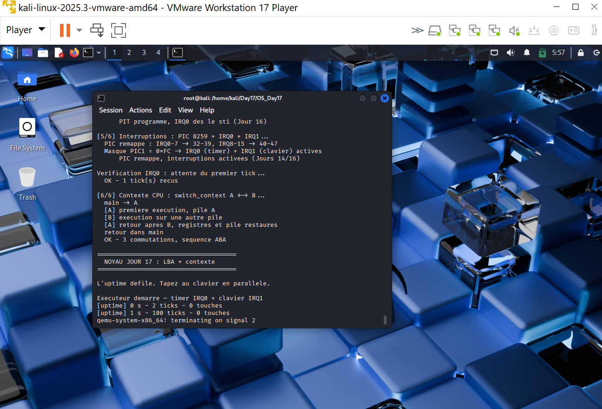

# Jour 17 : Bootloader LBA et commutation de contexte

---

## Introduction

Deux dettes du Jour 16 se règlent le même jour, dans l'ordre obligatoire.

La première est le **plafond de 59 secteurs**. `boot.asm` lisait 60 secteurs en CHS, un pour `stage2`, 59 pour le noyau. 21 464 octets tenaient encore, avec 8,5 Ko de marge. Le Jour 17 ajoute une structure de contexte et de l'assembleur : cette marge n'aurait pas suffi. Tant que le chargeur est borgne, agrandir le noyau revient à sauter dans des zéros (`RIP : 0x3`).

La seconde est l'absence de **contexte CPU**. Sans sauvegarde et restauration des registres, un ordonnanceur n'a rien à permuter. Le Jour 18 appellera `schedule()` depuis IRQ0 ; aujourd'hui on construit l'outil, en commutation **coopérative**, pour le voir fonctionner avant de le brancher sur le timer.

---

## Partie 1 : la chaîne de chargement

### Pourquoi le CHS ne suffisait plus

```
mov ah, 0x02
mov al, 60        ; un seul appel, 30 208 octets utiles
mov cl, 2         ; secteur sur 6 bits, mur au 63
int 0x13
jc $              ; gel silencieux
```

Quatre limites s'additionnent : 59 secteurs pour le noyau, frontière 64 Ko (`0x8000 + 64 × 512 = 0x10000`), adressage CHS obsolète, et zéro diagnostic.

### Le Disk Address Packet

`INT 13h AH=0x42` prend un paquet de 16 octets, pas une géométrie :

```
db 16            ; taille du paquet
db 0             ; reserve
dw count         ; nombre de secteurs
dw offset        ; buffer offset
dw segment       ; buffer segment
dq lba           ; indice lineaire depuis le debut du disque
```

Le BIOS remplit `DL` avec le numéro du lecteur de boot. On le sauve dès l'entrée : sans ça, QEMU peut bootir depuis `0x80` alors qu'on lirait le lecteur `0`.

Avant la première lecture, `AH=0x41`, `BX=0x55AA` vérifie que les extensions LBA existent. Si `BX` ne revient pas à `0xAA55`, le MBR affiche `LBA` et s'arrête. QEMU les implémente ; une machine sans EDD ne ment plus.

### Chargement en plusieurs blocs

Image disque inchangée en apparence :

```
LBA 0 : boot.bin     (MBR, 512 o)
LBA 1 : stage2.bin   (512 o, destination 0x8000)
LBA 2+: kernel.bin   (destination 0x10000)
```

Le kernel n'est plus collé derrière `stage2` à `0x8200`. Il part de `0x10000`, aligné 64 Ko. Chaque appel demande **au plus 64 secteurs** (32 Ko). Un paquet de 64 secteurs depuis un segment aligné ne franchit pas la frontière que le BIOS interdit.

Après un paquet réussi :

```
remaining -= count
lba       += count
segment   += count * 32     ; 512 / 16 = 32 paragraphes par secteur
```

Trois essais, `AH=0x00` (reset) entre deux. Échec définitif : `DISK` à l'écran, `hlt`.

### Taille réelle, plus de 128 Ko fictifs

`stage2` recopiait `0x8000` dwords (128 Ko) depuis `0x8200`. Le build écrit maintenant deux champs dans le MBR, offsets 500 et 504 :

| Offset | Champ | Rôle |
|---|---|---|
| 500 | `kernel_bytes` (`u32` LE) | octets exacts pour `rep movsd` |
| 504 | `kernel_sectors` (`u16` LE) | nombre de paquets LBA à lire |

`0x7C00 + 500 = 0x7DF4`. En 32 bits, `stage2` fait :

```
mov ecx, [0x7DF4]
add ecx, 3
shr ecx, 2
mov esi, 0x10000
mov edi, 0x200000
rep movsd
```

`patch_boot_size.sh` (Python, struct `<IH`) est appelé par `build.sh`, `run_tests.sh` et `run_demo.sh`, pour que `cargo run` sans `./build.sh` préalable patche quand même une copie du MBR.

### A20 avec repli

Le Fast A20 du port `0x92` suffit à QEMU. Le Jour 17 enchaîne trois méthodes et **vérifie** après chacune : écrire `0x00` à `0000:0500` et `0xFF` à `FFFF:0510`. Si les deux cellules sont la même mémoire, A20 est encore fermée (repli à 1 Mo).

Ordre : port `0x92`, `INT 15h AX=0x2401`, contrôleur 8042 (`0xD0` / `0xD1`, bit 1). Échec des trois : `A20` puis gel.

### Nouveau plafond

Le tampon kernel va de `0x10000` à `0x6ffff`. Les tables de pages tiennent à `0x70000`. Au-delà, le chargement écraserait la pagination avant même `stage2`.

**768 secteurs = 384 Ko.** On passe de 30 Ko à 384 Ko. Suffisant jusqu'au shell du Jour 25. `build.sh` refuse un binaire plus gros.

---

## Partie 2 : le contexte CPU

### Ce qu'on sauve, et ce qu'on laisse

La convention System V AMD64 promet que `r12-r15`, `rbx`, `rbp` et `rsp` survivent à un appel. `switch_context` sauve exactement ça, plus `rip` et `rflags`.

```
0  r15    8  r14    16 r13    24 r12
32 rbx    40 rbp    48 rsp    56 rip    64 rflags
```

Ce n'est pas un `fxsave` complet. Un `movaps` émis par LLVM au milieu d'une tâche, interrompu par IRQ0, corromprait les XMM de l'autre tâche. Tant que la commutation est **volontaire** (un `call`), le compilateur a déjà spillé les caller-saved. Le Jour 18, qui preemptre depuis le handler, devra ajouter FXSAVE.

### L'assembleur

```
; rdi = *old, rsi = *new
switch_context:
    mov [rdi + 0], r15
    ...
    lea rax, [rsp + 8]      ; RSP apres le retour
    mov [rdi + 48], rax
    mov rax, [rsp]          ; adresse de retour = RIP
    mov [rdi + 56], rax
    pushfq
    pop rax
    mov [rdi + 64], rax

    ; restauration miroir, puis :
    mov rsp, [rsi + 48]
    jmp qword [rsi + 56]
```

On ne fait pas `ret` : on `jmp` vers le RIP enregistré. Pour une tâche déjà vue, ce RIP est l'instruction qui suit son dernier `switch`. Pour une tâche neuve, c'est le point d'entrée.

### Préparer une tâche

```
rsp = (fin_de_pile alignee 16) - 8
rip = entry
rflags = 0x202    ; bit 1 reserve + IF
```

`RSP % 16 == 8` à l'entrée, comme après un `call`. Deux piles statiques de 4 Ko, assez pour la démo, sans toucher au heap (le heap sert encore au test `0xC0FFEE`).

### La démo ABA

```
main  --switch-->  A
 A affiche, enregistre 'A', switch vers B
 B affiche, enregistre 'B', switch vers A
 A affiche, enregistre 'A', switch vers main
main reprend, verifie sequence == ABA et 3 commutations
```

Si les piles étaient partagées, le second passage dans A écraserait le cadre de B, ou l'inverse. Si `RIP` / `RSP` étaient inversés, on ne reviendrait jamais dans `main`. Le test est binaire : `OK (3 switch, ABA)` ou `ECHEC`.

Les interruptions restent actives pendant la démo (IRQ0 continue d'incrémenter `TICKS`). Le handler ne commute pas encore : pas de deadlock VGA, pas de course sur les contextes.

---

## Résultat obtenu

### Compilation


```
[4/5] Taille reelle et patch du MBR...
      Image kernel : 22536 octets = 45 secteurs (max 768)

OK : MBR patche, 45 secteurs LBA a charger (plafond 768)
```

21 464 octets au Jour 16, 22 536 aujourd'hui : le contexte et `switch_context` tiennent. Surtout, le plafond n'est plus 59.

### Commutation ABA



Les cinq lignes `[A]` / `[B]` / retour `main` plus `OK - 3 commutations, sequence ABA` sont la preuve que deux piles distinctes ont survécu à l'aller-retour.

### Image pour les visiteurs

`build.sh` écrit `Day17/os_day17.img` (disque raw 4 Mo, MBR + stage2 + kernel). Pas un fichier `.iso` : un ISO exigerait El Torito et un autre chemin de boot, alors que tout le travail du jour porte sur LBA disque.

```bash
qemu-system-x86_64 -drive format=raw,file=os_day17.img -serial stdio
```

---

## Séquence de démarrage

```
[1/6] Securite CPU
[2/6] Memoire
[3/6] Ecran
[4/6] Timer PIT
[5/6] IRQ0 + IRQ1, verification du premier tick
[6/6] switch_context, sequence ABA
puis executeur : uptime + clavier
```

---

## Arborescence

```
Day17/
├── Jour17_LBA_Contexte_Resume.md
├── Jour17_LBA_Contexte_Complet.md
├── sortie_du_build_sh.png
├── sortit_avec_6_6ABA.png
├── os_day17.img              <- disque bootable pour QEMU
└── OS_Day17/
    ├── build.sh
    ├── patch_boot_size.sh
    ├── run_tests.sh
    ├── run_demo.sh
    ├── linker.ld                 <- switch_context.o dans .text
    └── src/
        ├── boot.asm              <- REECRIT : LBA + A20 + erreurs
        ├── stage2.asm            <- MODIFIE : copie taille reelle
        ├── switch_context.asm    <- NOUVEAU
        ├── context.rs            <- NOUVEAU
        └── main.rs               <- 6 phases + demo ABA
```

---

## Angle Cyber

| Mécanisme | Enjeu |
|---|---|
| Chargement LBA sans vérifier la taille | Un attaquant qui contrôle l'image injecte du code avant toute protection du noyau |
| Taille écrite par le host, lue par `stage2` | Première amorce d'une chaîne de confiance ; il manque encore une signature |
| Message d'erreur au lieu d'un `jc $` | Un boot qui ment (gel) est indiscernable d'un succès pour l'opérateur |
| A20 non vérifiée | Adresses au-dessus de 1 Mo qui wrappent : corruption, parfois exploitable |
| Contexte incomplet (pas de FXSAVE) | Une préemption trop tôt fuiterait l'état SSE d'une tâche vers une autre |

> Le bootloader est le premier maillon. Un chargeur qui copie 128 Ko aveugles et ignore les erreurs est exactement le point d'injection visé avant que GDT, IDT, NX et le heap n'existent.

---

## Limites laissées au Jour 18

- La commutation est **coopérative**. Un `while true {}` gèle encore la machine.
- Pas de file de tâches, pas de quantum, pas de `schedule()` dans IRQ0.
- Pas de FXSAVE / XRSTOR.
- Le tampon réel-mode plafonne à 384 Ko (conflit avec les pages à `0x70000`).
- Le MBR tient encore dans 512 octets : pas de signature, pas de GPT.

---

## Lancer sur Kali

```bash
cd /home/kali/Day17/OS_Day17
sed -i 's/\r$//' *.sh
chmod +x build.sh run_tests.sh run_demo.sh patch_boot_size.sh
./build.sh
cargo run
```

`python3` est requis pour `patch_boot_size.sh`. Les chemins de `.cargo/config.toml` pointent vers `/home/kali/Day17/OS_Day17`.

---

## Conclusion

Le chargeur n'est plus le goulot. Le noyau sait quitter une fonction, en reprendre une autre, et revenir. Il manque l'ordre venu du timer : c'est le Jour 18.
