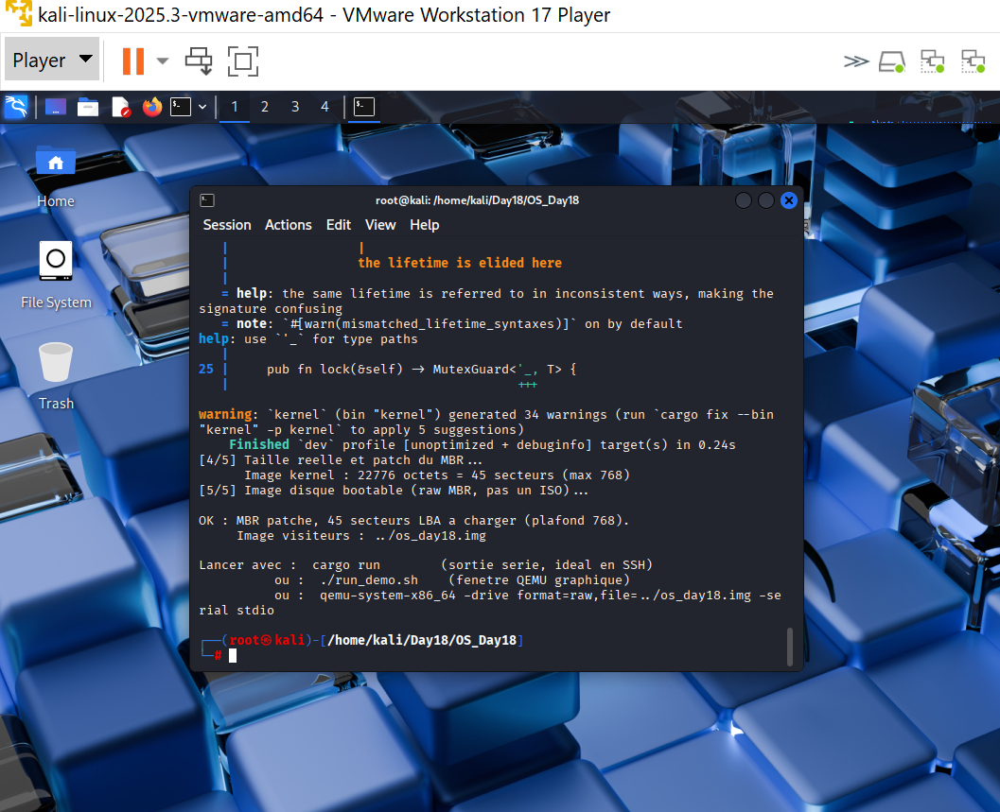
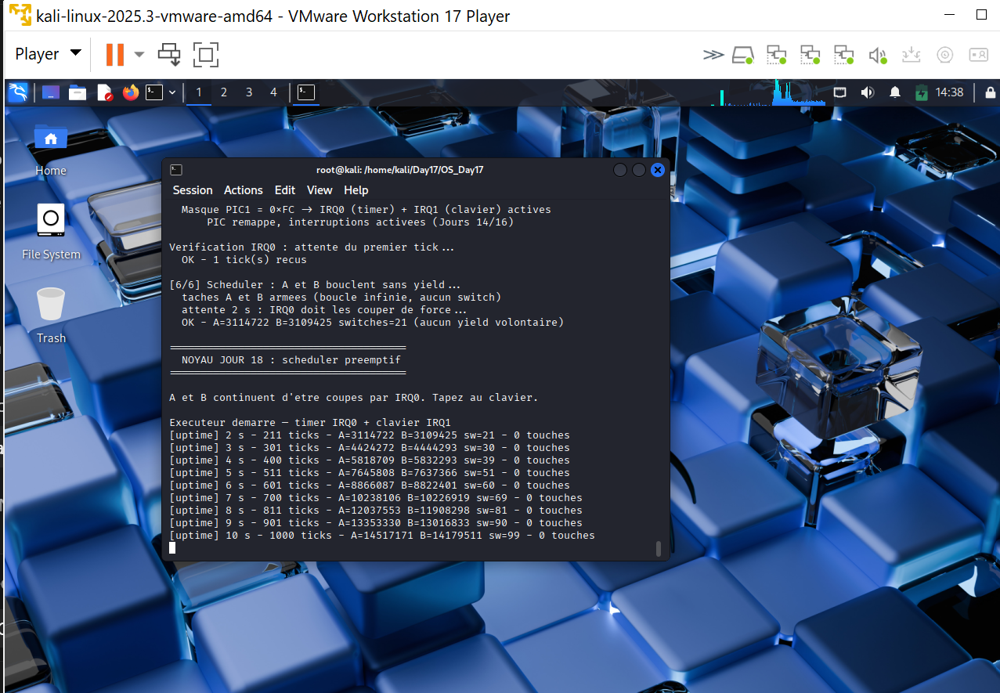
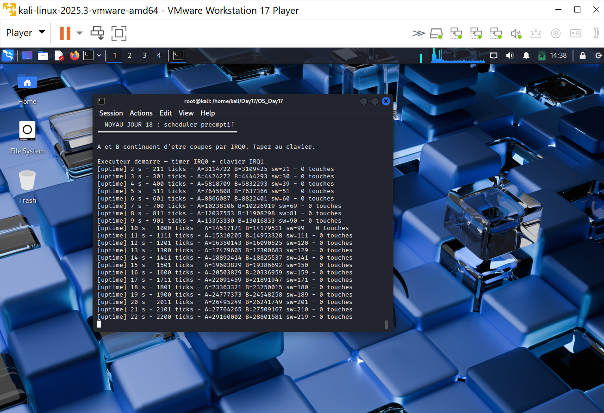

# Jour 18 : du coopératif au préemptif

---

## Introduction

Le Jour 17 a prouvé qu'on savait sauver une pile et en reprendre une autre. Mais A appelait `switch` vers B. C'est du **coopératif** : la tâche rend la main quand elle veut. Un processus hostile, ou simplement un `loop {}` oublié, gèle la machine.

Le Jour 16 a donné le timer. Le Jour 18 s'en sert : **IRQ0 décide** qui tourne. A et B n'ont plus le choix.

---

## Round-Robin à trois

| Slot | Tâche | Comportement |
|---|---|---|
| 0 | MAIN | attend 2 s (`hlt`), puis exécuteur clavier / uptime |
| 1 | A | `loop { COUNTER_A += 1 }` |
| 2 | B | `loop { COUNTER_B += 1 }` |

Quantum : **10 ticks = 100 ms**. À 100 Hz, on tourne A, B, MAIN, A, ...

Le premier `switch_context` depuis l'IRQ sauve MAIN (qui était dans le handler, pile noyau) dans le slot 0, puis saute dans A. Quand MAIN reprend, le handler termine, `iret` rend la main à la boucle d'attente. Pas besoin de préparer le contexte de MAIN à l'avance.

---

## Le handler IRQ0

```
timer::on_tick();
pic::send_eoi(0);
scheduler::on_timer_tick();   // peut appeler switch_context
```

L'EOI est **avant** le switch. Sinon le PIC garde IRQ0 occupée : plus de ticks, plus de rotation, symptôme « le préemptif a tué le timer ».

`on_timer_tick` ne prend **aucun** verrou. Un `println!` VGA ici recréerait le deadlock du Jour 16.

---

## FXSAVE

`x86_64-unknown-none` émet du SSE. Une préemption au milieu d'un `movaps` sans sauver XMM corrompt l'autre tâche (ou lève `#UD` / #XM). `ThreadContext` commence par 512 octets alignés 16. `switch_context` fait `fxsave64` / `fxrstor64`.

Une zone FX toute à zéro n'est pas toujours restaurable. À la création d'une tâche on pose `FCW = 0x037F` et `MXCSR = 0x1F80` (état x87/SSE au reset).

---

## La preuve

A et B n'appellent jamais `switch`. Si après 2 secondes les deux compteurs ont avancé, seul IRQ0 a pu leur donner le CPU.

### Compilation



```
[4/5] Taille reelle et patch du MBR...
      Image kernel : 22776 octets = 45 secteurs (max 768)
[5/5] Image disque bootable (raw MBR, pas un ISO)...

OK : MBR patche, 45 secteurs LBA a charger (plafond 768).
     Image visiteurs : ../os_day18.img
```

22 536 octets au Jour 17, 22 776 aujourd'hui (+240). Le scheduler Round-Robin et les 512 octets FX par tâche tiennent. Le plafond LBA (768) n'est pas en jeu.

Les 34 warnings (`print_hex` inutilisé, `MutexGuard<'_, T>`, etc.) sont hérités. Ils n'empêchent pas le `Finished`.

### Instant 1 : 10 s



```
[6/6] Scheduler : A et B bouclent sans yield...
  taches A et B armees (boucle infinie, aucun switch)
  attente 2 s : IRQ0 doit les couper de force...
  OK - A=3114722 B=3109425 switches=21 (aucun yield volontaire)

[uptime] 10 s - 1000 ticks - A=14517171 B=14179511 sw=99 - 0 touches
```

21 switches en 2 s, 99 en 10 s : le quantum de 10 ticks (100 ms à 100 Hz) donne ~10 rotations par seconde. A et B sont collés. Le Round-Robin n'a pas favorisé l'un des deux.

### Instant 2 : 22 s



```
[uptime] 10 s - 1000 ticks - A=14517171 B=14179511 sw= 99 - 0 touches
[uptime] 22 s - 2200 ticks - A=29160002 B=28801581 sw=219 - 0 touches
```

| Instant | A | B | switches | ticks |
|---|---|---|---|---|
| 2 s (`[6/6] OK`) | 3 114 722 | 3 109 425 | 21 | 211 |
| 10 s (capture 1) | 14 517 171 | 14 179 511 | 99 | 1000 |
| 22 s (capture 2) | 29 160 002 | 28 801 581 | 219 | 2200 |

De 10 s à 22 s : A ×2,01, B ×2,03, `sw` +120 (toujours ~10/s). Personne n'a gelé, personne n'a tout pris. L'exécuteur affiche l'uptime pendant que IRQ0 continue de couper A et B.

---

## Ce que ça ne fait pas encore

- Pas de priorités, pas de sleep, pas de join.
- Trois tâches noyau seulement, pas de processus utilisateur.
- Pas de protection : A pourrait écraser la pile de B.
- Ring 3 et syscalls : Jours 19-20.

---

## Angle Cyber

| Mécanisme | Enjeu |
|---|---|
| Préemption | Un `while(true)` en userspace ne gèle plus la machine (une fois Ring 3 en place) |
| Quantum trop court | Le CPU passe son temps dans les handlers : DoS |
| Switch depuis l'IRQ sans EOI | Toute une ligne d'interruptions meurt |
| FXSAVE oublié | Fuite ou corruption d'état SSE entre tâches |
| Handler qui prend un verrou | Deadlock, déjà vu au Jour 16 |

---

## Lancer

```bash
cd /home/kali/Day18/OS_Day18
sed -i 's/\r$//' *.sh
chmod +x build.sh run_tests.sh run_demo.sh patch_boot_size.sh
./build.sh
cargo run
```

```powershell
scp root@192.168.126.129:/home/kali/Day18/os_day18.img C:\Users\MOH\Documents\Project_OS_Rust\Day18\
```

```bash
qemu-system-x86_64 -drive format=raw,file=os_day18.img -serial stdio
```

---

## Arborescence

```
Day18/
├── Jour18_Scheduler_Preemptif_Resume.md
├── Jour18_Scheduler_Preemptif_Complet.md
├── sortie_du_build_sh.png
├── imagea10secondeaveclesvaleurdeAetBquetuconnais.png
├── imagea22secondeaveclesvaleurdeAetBquetuconnais.png
├── os_day18.img                 <- disque bootable pour QEMU
└── OS_Day18/
    └── src/
        ├── scheduler.rs         <- NOUVEAU
        ├── switch_context.asm   <- FXSAVE
        ├── context.rs           <- buffer FX
        ├── idt.rs               <- schedule depuis IRQ0
        └── main.rs              <- demo 2 s
```
