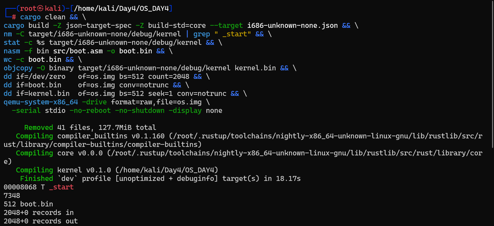

# Jour 4 — VGA Buffer I : Accès direct à la mémoire vidéo

---

## Concept — C'est quoi le VGA Buffer ?

En mode texte VGA, l'écran est mappé directement en mémoire à l'adresse fixe **`0xb8000`**. Tout octet écrit à cette adresse s'affiche immédiatement à l'écran — sans pilote, sans OS, sans appel système.

```
RAM
...
0xb8000  ← début buffer VGA (coin haut gauche de l'écran)
0xb8001
0xb8002
...
0xb8F9E  ← fin buffer VGA (coin bas droite)
```

### Structure d'une cellule VGA

L'écran est une grille de **80 colonnes × 25 lignes = 2000 caractères**. Chaque caractère occupe **2 octets** :

```
┌──────────────┬──────────────┐
│  Octet 1     │  Octet 2     │
│  ASCII char  │  Couleur     │
└──────────────┴──────────────┘

Octet couleur :
┌─────────────────┬─────────────────┐
│ bits 7-4 (fond) │ bits 3-0 (texte)│
└─────────────────┴─────────────────┘
```

### Calcul d'adresse

```
adresse = 0xb8000 + (ligne * 80 + colonne) * 2
```

Exemple : caractère à la ligne 0, colonne 0 → `0xb8000`  
Exemple : caractère à la ligne 1, colonne 0 → `0xb8000 + 160`

---

## Angle Cyber — Risques de corruption mémoire

En bare-metal, **personne ne t'arrête** si tu écris au mauvais endroit.

| Risque | Description | Conséquence |
|---|---|---|
| **Écriture hors buffer** | Écrire après `0xb8F9E` | Corrompt d'autres zones mémoire |
| **Offset mal calculé** | Erreur dans `ligne * 80 + colonne` | Écrase du code ou des données |
| **Pointeur brut non vérifié** | Pas de bounds checking | Buffer overflow classique |

C'est exactement le mécanisme derrière les **buffer overflow** et les **memory corruption exploits**.

---

## Structure du projet OS_DAY4

```
OS_DAY4/
├── Cargo.toml
├── linker.ld
├── i686-unknown-none.json
├── os.img
├── boot.bin
├── kernel.bin
├── .cargo/
│   └── config.toml
└── src/
    ├── main.rs
    ├── vga.rs
    └── boot.asm
```

---

## Fichiers de configuration

### `Cargo.toml`

```toml
[package]
name = "kernel"
version = "0.1.0"
edition = "2024"

[profile.dev]
panic = "abort"

[profile.release]
panic = "abort"
```

### `.cargo/config.toml`

```toml
[build]
target = "i686-unknown-none.json"

[target.i686-unknown-none]
rustflags = [
    "-C", "link-arg=-Tlinker.ld",
    "-C", "linker=rust-lld",
    "-C", "opt-level=z",
    "-C", "strip=debuginfo",
    "-C", "panic=abort",
    "-C", "code-model=kernel",
    "-C", "relocation-model=static",
    "-C", "target-cpu=i686",
]
```

> `link-arg=-Tlinker.ld` est **indispensable** : c'est lui qui place `_start` exactement à l'adresse `0x8000` attendue par le bootloader.

### `linker.ld`

```ld
ENTRY(_start)

SECTIONS {
    . = 0x8000;                     /* Adresse d'entrée pour le bootloader */
    .text.entry : { *(.text.entry) }   /* _start doit être ici */
    .text       : { *(.text) }
    .rodata     : { *(.rodata) }
    .data       : { *(.data) }
    .bss        : { *(.bss) }
}
```

### `i686-unknown-none.json`

```json
{
  "llvm-target": "i686-unknown-none",
  "data-layout": "e-m:e-p:32:32-p270:32:32-p271:32:32-p272:64:64-i128:128-f64:32:64-f80:32-n8:16:32-S128",
  "arch": "x86",
  "os": "none",
  "vendor": "unknown",
  "linker": "rust-lld",
  "linker-flavor": "ld.lld",
  "disable-redzone": true,
  "executables": true,
  "panic-strategy": "abort",
  "relocation-model": "static",
  "code-model": "kernel",
  "target-c-int-width": 32,
  "target-pointer-width": 32,
  "target-endian": "little",
  "features": "-mmx,-sse",
  "pre-link-args": {
    "ld.lld": ["-z", "noexecstack"]
  }
}
```

---

## `src/boot.asm`

```nasm
BITS 16
ORG 0x7C00

start:
    cli
    xor ax, ax
    mov ds, ax
    mov es, ax
    mov ss, ax
    mov sp, 0x7C00

    mov si, msg_boot
    call print16

    ; Charger 32 secteurs du kernel à 0x8000
    mov ax, 0x0800
    mov es, ax
    xor bx, bx

    mov ah, 0x02
    mov al, 32
    mov ch, 0
    mov cl, 2
    mov dh, 0
    int 0x13
    jc disk_error

    mov si, msg_ok
    call print16

    lgdt [gdt_descriptor]
    mov eax, cr0
    or eax, 1
    mov cr0, eax
    jmp 0x08:protected_mode

disk_error:
    mov si, msg_err
    call print16
    hlt

print16:
    lodsb
    or al, al
    jz print16_done
    mov ah, 0x0E
    int 0x10
    jmp print16
print16_done:
    ret

msg_boot db 'Booting kernel...', 0x0D, 0x0A, 0
msg_ok   db 'Kernel loaded!', 0x0D, 0x0A, 0
msg_err  db 'Disk error!', 0x0D, 0x0A, 0

gdt_start:
    dq 0
    dq 0x00CF9A000000FFFF
    dq 0x00CF92000000FFFF
gdt_end:

gdt_descriptor:
    dw gdt_end - gdt_start - 1
    dd gdt_start

BITS 32
protected_mode:
    mov ax, 0x10
    mov ds, ax
    mov es, ax
    mov ss, ax
    mov esp, 0x90000
    call 0x8000
    hlt

times 510-($-$$) db 0
dw 0xAA55
```

---

## `src/vga.rs`

```rust
//! VGA text‑mode driver – Day 4
#![allow(dead_code)]
#![allow(unsafe_op_in_unsafe_fn)]

pub const VGA_BUFFER: *mut u8 = 0xb8000 as *mut u8;
pub const VGA_WIDTH:  usize = 80;
pub const VGA_HEIGHT: usize = 25;

#[repr(u8)]
#[derive(Clone, Copy)]
pub enum Color {
    Black = 0, Blue = 1, Green = 2, Cyan = 3, Red = 4,
    Magenta = 5, Brown = 6, LightGray = 7, DarkGray = 8,
    LightBlue = 9, LightGreen = 10, LightCyan = 11,
    LightRed = 12, Pink = 13, Yellow = 14, White = 15,
}

/// Construit l'octet d'attribut VGA : fond (4 bits hauts) + texte (4 bits bas)
pub const fn make_color(fg: Color, bg: Color) -> u8 {
    (bg as u8) << 4 | (fg as u8)
}

/// Écrit un caractère en (row, col) 
// 
 ignoré si hors bornes (anti-corruption)
pub unsafe fn write_char(row: usize, col: usize, ascii: u8, color: u8) {
    if row >= VGA_HEIGHT || col >= VGA_WIDTH { return; }
    let offset = (row * VGA_WIDTH + col) * 2;
    let ptr = VGA_BUFFER.add(offset);
    core::ptr::write_volatile(ptr,        ascii);
    core::ptr::write_volatile(ptr.add(1), color);
}

/// Remplit tout l'écran de blancs (blanc sur noir)
pub unsafe fn clear_screen() {
    let blank  = b' ';
    let colour = make_color(Color::White, Color::Black);
    for row in 0..VGA_HEIGHT {
        for col in 0..VGA_WIDTH {
            write_char(row, col, blank, colour);
        }
    }
}

/// Écrit une chaîne à partir de (row, col), s'arrête en bord d'écran
pub unsafe fn write_str(row: usize, col: usize, s: &str, colour: u8) {
    for (i, byte) in s.bytes().enumerate() {
        if col + i >= VGA_WIDTH { break; }
        write_char(row, col + i, byte, colour);
    }
}
```

---

## `src/main.rs`

```rust
//! Day 4 – VGA Buffer kernel (bare‑metal i686)
#![no_std]
#![no_main]
#![allow(unsafe_op_in_unsafe_fn)]

mod vga;

use core::panic::PanicInfo;
use vga::{Color, make_color};

const COM1: u16 = 0x3F8;   // Port série COM1

unsafe fn write_serial(byte: u8) {
    core::arch::asm!("out dx, al", in("dx") COM1, in("al") byte);
}

unsafe fn print_serial(s: &str) {
    for b in s.bytes() { write_serial(b); }
}

unsafe fn halt() -> ! {
    loop { core::arch::asm!("hlt"); }
}

/// Point d'entrée du kernel — placé à 0x8000 par le linker script
#[unsafe(no_mangle)]
#[unsafe(link_section = ".text.entry")]
pub extern "C" fn _start() -> ! {
    unsafe {
        vga::clear_screen();

        // Ligne 0 : 'A' en jaune
        let yellow = make_color(Color::Yellow, Color::Black);
        vga::write_char(0, 0, b'A', yellow);
        print_serial("A\n");

        // Ligne 1 : message d'accueil en cyan
        let cyan = make_color(Color::Cyan, Color::Black);
        let msg = "Hello from VGA Buffer!";
        vga::write_str(1, 0, msg, cyan);
        print_serial(msg); print_serial("\n");

        // Ligne 2 : démonstration du bounds-check
        let red = make_color(Color::Red, Color::Black);
        vga::write_char(99, 99, b'X', red);   // ignoré par write_char (hors bornes)
        vga::write_str(2, 0, "Out-of-bounds write blocked!", red);
        print_serial("Out-of-bounds write blocked!\n");

        print_serial("VGA Buffer test done.\n");
        halt();
    }
}

#[panic_handler]
fn panic(info: &PanicInfo) -> ! {
    unsafe {
        let panic_color = make_color(Color::White, Color::Red);
        vga::write_str(24, 0, "KERNEL PANIC", panic_color);
        print_serial("\n=== KERNEL PANIC ===\n");
        if let Some(msg) = info.message().as_str() {
            print_serial("Reason: "); print_serial(msg); print_serial("\n");
        }
        if let Some(loc) = info.location() {
            print_serial("File: "); print_serial(loc.file()); print_serial("\n");
        }
        print_serial("System halted.\n");
        halt();
    }
}
```

> **Note Rust nightly ≥ 1.97** : les attributs `no_mangle` et `link_section` sont désormais considérés comme `unsafe` et doivent être écrits `#[unsafe(no_mangle)]` / `#[unsafe(link_section = "...")]`. Le flag `#![allow(unsafe_op_in_unsafe_fn)]` supprime les avertissements liés aux appels unsafe dans des fonctions déjà déclarées `unsafe`.

---

## Compilation & exécution

```bash
# 1. Assembler le boot sector (doit faire 512 bytes)
nasm -f bin src/boot.asm -o boot.bin
wc -c boot.bin   # → 512

# 2. Compiler le kernel
cargo build -Z json-target-spec -Z build-std=core --target i686-unknown-none.json

# 3. Convertir l'ELF en binaire plat
objcopy -O binary target/i686-unknown-none/debug/kernel kernel.bin

# 4. Créer l'image disque (1 MiB)
dd if=/dev/zero of=os.img bs=512 count=2048
dd if=boot.bin   of=os.img conv=notrunc               # secteur 0
dd if=kernel.bin of=os.img bs=512 seek=1 conv=notrunc # secteur 1+

# 5. Lancer QEMU — sortie série dans le terminal
qemu-system-x86_64 -drive format=raw,file=os.img \
  -serial stdio -no-reboot -no-shutdown -display none
```

---

## Résultats

### Compilation réussie



### Sortie QEMU dans le terminal


```
Booting kernel...
Kernel loaded!
A
Hello from VGA Buffer!
Out-of-bounds write blocked!
VGA Buffer test done.
```

### Pourquoi la sortie est dans le terminal ?

L'option `-serial stdio` redirige le **port série COM1** (`0x3F8`) vers le terminal courant. Toutes les chaînes envoyées par `print_serial` y apparaissent directement.

L'option `-display none` désactive la fenêtre graphique QEMU — c'est intentionnel pour un environnement de développement sans interface graphique.

**Pour afficher les messages dans la fenêtre QEMU graphique**, supprimez `-display none` :

```bash
qemu-system-x86_64 -drive format=raw,file=os.img \
  -serial stdio -no-reboot -no-shutdown
```

Vous verrez alors simultanément :

- **Fenêtre QEMU** : `A` (jaune), `Hello from VGA Buffer!` (cyan), `Out-of-bounds write blocked!` (rouge) - lus directement depuis le buffer VGA `0xb8000`.
- **Terminal** : les mêmes messages, doublés par le port série.

---

## Résumé - Angle Cyber

| Concept | Ce qu'on démontre |
|---|---|
| Accès `0xb8000` via pointeur brut | Manipulation directe du hardware sans OS |
| Calcul d'offset `(row * 80 + col) * 2` | Une erreur ici = buffer overflow |
| Vérification bounds dans `write_char` | La défense contre la corruption mémoire |
| Écriture `row=99` refusée | Démonstration concrète de la protection |
| `#[unsafe(no_mangle)]` obligatoire | Rust force à identifier explicitement les zones dangereuses |

> En C, écrire à `row=99` passerait silencieusement et corromprait la mémoire. En Rust, le mot-clé `unsafe` et les attributs `#[unsafe(...)]` forcent le développeur à assumer consciemment chaque accès direct au hardware.
