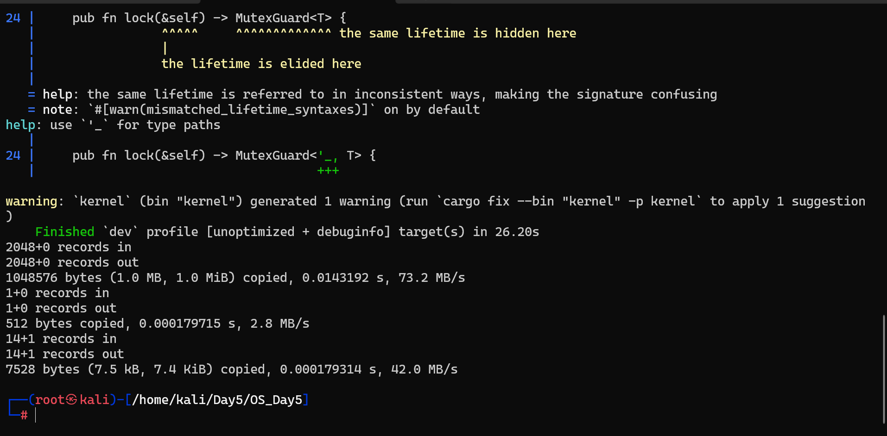
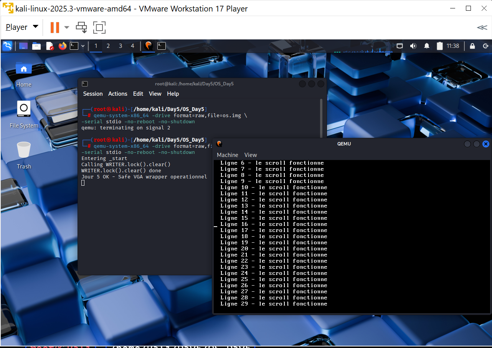

# Jour 5 — VGA Buffer II : Safe Wrapper & macro println!

---

## Transition depuis le Jour 4

Au Jour 4, nous avons accédé directement à la mémoire vidéo `0xb8000` via des **pointeurs bruts** et des fonctions `unsafe`. Nous pouvions écrire des caractères à l'écran, mais tout était exposé :

- Chaque appel à `write_char` ou `write_str` nécessitait un bloc `unsafe`
- Aucune gestion de position courante (curseur)
- Aucune protection contre les accès concurrents
- Pas de macro `println!` — il fallait appeler les fonctions manuellement

Au Jour 5, nous **encapsulons tout cela** dans une interface sécurisée :
- Un `Writer` struct qui gère le curseur et l'état de l'écran
- Une interface `safe` — le code appelant n'a plus besoin d'`unsafe`
- Un `Mutex` global pour protéger contre les accès concurrents
- Une macro `println!` utilisable comme en Rust standard

---

## Étape importante sautée ?

Honnêtement, **une étape a été implicitement sautée** : le passage complet en **mode 64 bits (Long Mode)**. Notre kernel tourne encore en 32 bits (`i686`) alors que nous compilons pour du bare-metal x86. Ce n'est pas bloquant pour les exercices actuels, mais à noter pour plus tard lors de l'étude des exceptions CPU au Jour 7 — l'IDT 64 bits sera différente. Pour l'instant c'est acceptable, nous continuons.

---

## Concept — C'est quoi un Safe Wrapper ?

Au Jour 4 :
```rust
// Le code appelant doit gérer unsafe lui-même
unsafe {
    vga::write_char(0, 0, b'A', color);
    vga::write_str(1, 0, "Hello", color);
}
```

Au Jour 5 :
```rust
// Plus d'unsafe visible — l'interface est sûre
println!("Hello from my OS!");
println!("Ligne 2 en couleur");
```

Le `unsafe` existe toujours en dessous, mais il est **isolé dans le module VGA**. Le reste du kernel interagit avec une interface propre et sécurisée.

---

## Concept — Accès concurrents et pourquoi c'est dangereux

Dans un OS, plusieurs parties du code peuvent vouloir écrire à l'écran en même temps (interruptions, kernel, drivers). Sans protection :

```
Thread A : écrit "Hello"   → H e l
Thread B : écrit "World"   → W o r
Résultat à l'écran : H W e o r l l d → données corrompues
```

La solution : un **Mutex** (Mutual Exclusion). Une seule partie du code peut accéder au Writer à la fois.

```
Thread A prend le lock → écrit "Hello" → libère le lock
Thread B attend        → prend le lock → écrit "World"
Résultat : Hello\nWorld → correct
```

---

## Structure du projet OS_Day5

```
OS_Day5/
├── Cargo.toml
├── linker.ld
├── i686-unknown-none.json
├── os.img
├── boot.bin
├── kernel.bin
├── .cargo/
│   └── config.toml
└── src/
    ├── main.rs
    ├── vga.rs       ← réécriture complète avec Writer + Mutex
    └── boot.asm
```

---

## Résumé — Angle Cyber

| Concept | Jour 4 (dangereux) | Jour 5 (sécurisé) |
|---|---|---|
| Accès VGA | `unsafe` partout dans main.rs | `unsafe` isolé dans `write_cell` uniquement |
| Accès concurrent | Aucune protection | `Mutex` spinlock — un seul accès à la fois |
| Formatage | Manuel octet par octet | `fmt::Write` + `println!` avec formatage complet |
| Scroll | Absent — débordement silencieux | Scroll automatique géré par `Writer` |
| Caractères invalides | Écrits tels quels | Remplacés par `■` (0xfe) |
| Bounds check | Dans chaque fonction | Centralisé dans `write_cell` uniquement |

> Le principe du **Safe Wrapper** est fondamental en sécurité système : isoler les opérations dangereuses dans le minimum de code possible, puis exposer une interface sûre au reste du système. C'est exactement la philosophie des **capability-based OS** comme seL4.

---

## Résultats finaux

### Compilation réussie



### Sortie QEMU avec Safe Wrapper


