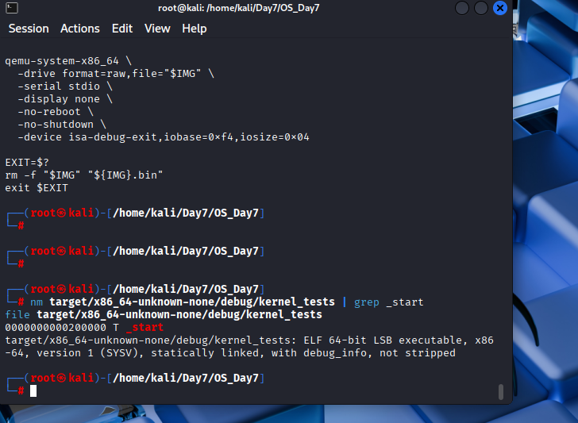

# Jour 6.5 - Switch 32 bits → 64 bits (Long Mode x86_64)

---

## Transition depuis le Jour 6

Au Jour 6, tous les tests passaient en **mode protégé 32 bits** (`i686`). Le kernel, le VGA, le port série et l'infrastructure de test fonctionnaient correctement.

Le Jour 7 introduit l'IDT (Interrupt Descriptor Table) et les exceptions CPU - ces mécanismes sont fondamentalement différents en 32 et 64 bits, et les ressources modernes (CVEs, exploits, mitigations) ciblent exclusivement le 64 bits. Ce jour intermédiaire effectue donc la migration complète vers le **Long Mode x86_64** avant d'aborder l'IDT.

---

## Pourquoi on a commencé en 32 bits

Commencer en 32 bits n'est pas une erreur - c'est la progression naturelle et pédagogiquement solide :

```
32 bits (Jours 2-6) :
✅ Boot sector simple - pas de paging obligatoire
✅ no_std, panic handler, VGA, Mutex, println! → fondamentaux acquis
✅ Tests automatisés QEMU → infrastructure de qualité
→ Tous les concepts de base sans complexité inutile

64 bits (Jour 6.5+) :
→ Long Mode sur des bases solides
→ Paging obligatoire - compris et implémenté manuellement
→ IDT 64 bits, exceptions CPU modernes
→ Mitigations de sécurité réelles (SMEP, SMAP, KASLR)
```

C'est exactement la progression de Linux (32 bits en 1991, 64 bits en 2001), xv6 (MIT) et SerenityOS.

---

## Différence fondamentale 32 bits vs 64 bits

### Architecture

```
32 bits (Protected Mode) :
- Registres : EAX, EBX, ECX... (32 bits)
- Espace mémoire max : 4 Go
- Paging : optionnel
- Segments : obligatoires pour la protection mémoire

64 bits (Long Mode) :
- Registres : RAX, RBX, RCX... (64 bits)
- Espace mémoire : 128 To en pratique
- Paging : OBLIGATOIRE pour entrer en Long Mode
- Segments : quasi inutilisés (flat memory model)
```

### Impact cyber

```
32 bits :
- ASLR faible (peu d'entropie)
- Heap spray possible
- Exploits plus prévisibles

64 bits :
- ASLR fort (47 bits d'entropie)
- Heap spray quasi impossible
- Mitigations : NX, SMEP, SMAP, CET, KASLR
- Exploits modernes : Spectre, Meltdown, Rowhammer
```

---

## Les étapes obligatoires pour entrer en Long Mode

```
1. Mode Réel 16 bits (démarrage BIOS)
        ↓
2. Activer la ligne A20 (accès mémoire > 1Mo)
        ↓
3. Charger GDT 32 bits + passer en Mode Protégé
        ↓
4. Activer PAE (Physical Address Extension)
        ↓
5. Créer les tables de pages (PML4 → PDPT → PD)
        ↓
6. Activer le paging (CR0.PG)
        ↓
7. Activer Long Mode (EFER.LME)
        ↓
8. Charger GDT 64 bits + saut long
        ↓
9. Kernel Rust s'exécute en 64 bits ✅
```

### Le paging - pourquoi obligatoire en 64 bits

```
Sans paging (32 bits) :
programme → adresse physique directe

Avec paging (64 bits) :
programme → adresse virtuelle → PML4 → PDPT → PD → physique
```

On utilise des **huge pages 2Mo** (PD → physique directement) pour simplifier - on évite le niveau PT.

### Tables de pages utilisées

```
0x1000 → PML4  : PML4[0] → PDPT à 0x2000
0x2000 → PDPT  : PDPT[0] → PD à 0x3000
0x3000 → PD    : PD[0]   → 0x000000 (2Mo, identité map)
                 PD[1]   → 0x200000 (2Mo, adresse du kernel)
```

---

## Architecture en deux secteurs

Le boot sector (512 octets) ne peut pas contenir tout le code de transition. On sépare donc en deux fichiers :

```
os.img :
├── Secteur 1 (512o) → boot.bin   : code 16 bits, charge stage2+kernel
├── Secteur 2 (512o) → stage2.bin : code 32 bits → 64 bits, active Long Mode
└── Secteur 3+       → kernel.bin : kernel Rust 64 bits
```

---

## Ce qui change par rapport au Jour 6

```
Supprimé :
❌ i686-unknown-none.json    (target custom 32 bits)
❌ boot.asm monolithique     (trop grand pour 512 octets)

Ajouté :
✅ src/stage2.asm            (code 32 bits → 64 bits séparé)

Modifié :
🔄 src/boot.asm              (16 bits uniquement, charge stage2+kernel)
🔄 linker.ld                 (ELF64, adresse 0x200000)
🔄 .cargo/config.toml        (target x86_64-unknown-none)
🔄 Cargo.toml                (test=false pour éviter conflit core)
🔄 run_tests.sh              (inclut stage2.bin, seek=2 pour kernel)

Inchangé :
✅ src/vga1.rs, vga2.rs, vga.rs
✅ src/serial.rs
✅ src/test_runner.rs
✅ src/main.rs
✅ tests/src/ (tout)
```

---

## Points critiques - Ce qu'il faut absolument retenir

### 1. `cargo test` vs build manuel

`cargo test` dans un workspace no_std cause un conflit de `core` - deux versions compilées avec des flags différents. La solution : compiler avec `cargo build` et lancer le runner manuellement :

```bash
cargo build -Z build-std=core --target x86_64-unknown-none -p tests
/home/kali/Day7/OS_Day7/run_tests.sh \
  target/x86_64-unknown-none/debug/kernel_tests
```

### 2. `test = false` dans Cargo.toml

Sans ça, cargo essaie de compiler des tests intégrés pour le binaire kernel - ce qui crée un conflit avec le projet `tests/` :

```toml
[[bin]]
name = "kernel"
path = "src/main.rs"
test = false
bench = false
```

### 3. Le kernel est à `0x200000`, pas `0x8000`

En 64 bits, on ne peut pas charger directement à `0x200000` en mode réel (limite 1Mo). Le boot sector charge à `0x8000`, le stage2 copie vers `0x200000` en mode protégé.

**Vérification obligatoire :**
```bash
nm target/x86_64-unknown-none/debug/kernel | grep _start
# Doit afficher : 0000000000200000 T _start

file target/x86_64-unknown-none/debug/kernel_tests
# Doit afficher : ELF 64-bit LSB executable, x86-64
```

### 4. `objcopy` avec `--only-section`

Sans `--only-section`, `objcopy -O binary` génère un fichier de 2Mo de zéros suivi du code - trop grand. Avec les sections explicites, on extrait uniquement le code utile :

```bash
objcopy -O binary \
  --only-section=.text \
  --only-section=.rodata \
  --only-section=.data \
  --only-section=.bss \
  kernel kernel.bin
```

---

## Fichiers complets

### `src/boot.asm` - Secteur de boot 16 bits

```nasm
BITS 16
ORG 0x7C00

start:
    cli
    xor ax, ax
    mov ds, ax
    mov es, ax
    mov ss, ax
    mov sp, 0x7C00

    ; Activer la ligne A20 - accès mémoire > 1Mo
    in al, 0x92
    or al, 2
    out 0x92, al

    ; Charger 60 secteurs à 0x8000
    ; Le payload contient : [stage2 (512o)] + [kernel]
    mov ax, 0x0800
    mov es, ax
    xor bx, bx
    mov ah, 0x02
    mov al, 60
    mov ch, 0
    mov cl, 2
    mov dh, 0
    int 0x13
    jc $                        ; si erreur disque → boucle infinie

    ; Charger GDT 32 bits et passer en mode protégé
    lgdt [gdt_ptr]
    mov eax, cr0
    or eax, 1
    mov cr0, eax

    ; Saut long vers le stage2 à 0x8000
    jmp 0x08:0x8000

gdt:
    dq 0                        ; descripteur nul
    dq 0x00CF9A000000FFFF       ; code 32 bits
    dq 0x00CF92000000FFFF       ; data 32 bits
gdt_ptr:
    dw 23
    dd gdt

times 510-($-$$) db 0
dw 0xAA55
```

### `src/stage2.asm` - Transition 32 bits → 64 bits

```nasm
BITS 32
ORG 0x8000

mode32:
    ; Initialiser les segments 32 bits
    mov ax, 0x10
    mov ds, ax
    mov es, ax
    mov ss, ax
    mov fs, ax
    mov gs, ax
    mov esp, 0x90000

    ; Copier kernel de 0x8200 → 0x200000
    ; 0x8200 = 0x8000 + 512 = juste après ce secteur
    mov esi, 0x8200
    mov edi, 0x200000
    mov ecx, 0x8000             ; 0x8000 dwords = 128Ko
    rep movsd

    ; Créer tables de pages pour le Long Mode
    ; Effacer 3 pages à partir de 0x1000
    mov edi, 0x1000
    xor eax, eax
    mov ecx, 0xC00
    rep stosd

    ; PML4[0] → PDPT à 0x2000
    mov dword [0x1000], 0x2000 | 0x3
    ; PDPT[0] → PD à 0x3000
    mov dword [0x2000], 0x3000 | 0x3
    ; PD[0] → Huge Page 0x000000 (identité map 2Mo)
    mov dword [0x3000], 0x000083
    ; PD[1] → Huge Page 0x200000 (adresse du kernel)
    mov dword [0x3008], 0x200083

    ; Activer PAE (Physical Address Extension)
    mov eax, cr4
    or eax, 0x20
    mov cr4, eax

    ; CR3 pointe vers PML4
    mov eax, 0x1000
    mov cr3, eax

    ; Activer Long Mode dans EFER
    mov ecx, 0xC0000080
    rdmsr
    or eax, 0x100               ; bit LME
    wrmsr

    ; Activer le paging → Long Mode effectif
    mov eax, cr0
    or eax, 0x80000000
    mov cr0, eax

    ; Charger GDT 64 bits
    lgdt [gdt64_ptr]

    ; Saut long vers le code 64 bits
    jmp 0x08:mode64

gdt64:
    dq 0                        ; descripteur nul
    dq 0x00AF9A000000FFFF       ; code 64 bits (L=1)
    dq 0x00AF92000000FFFF       ; data 64 bits
gdt64_ptr:
    dw 23
    dd gdt64

BITS 64
mode64:
    ; Initialiser les segments 64 bits
    mov ax, 0x10
    mov ds, ax
    mov es, ax
    mov ss, ax
    mov rsp, 0x90000

    ; Appeler le kernel à 0x200000
    mov rax, 0x200000
    call rax

    ; Ne devrait jamais arriver
    hlt
    jmp $

times 512-($-$$) db 0
```

### `linker.ld`

```ld
OUTPUT_FORMAT("elf64-x86-64")
ENTRY(_start)

SECTIONS
{
    . = 0x200000;
    .text : { *(.text.entry) *(.text*) }
    .rodata : { *(.rodata*) }
    .data : { *(.data*) }
    .bss : { *(.bss*) }
}
```

### `.cargo/config.toml`

```toml
[build]
target = "x86_64-unknown-none"

[target.x86_64-unknown-none]
rustflags = [
    "-C", "link-arg=-T/home/kali/Day7/OS_Day7/linker.ld",
    "-C", "linker=rust-lld",
    "-C", "opt-level=z",
    "-C", "panic=abort",
    "-C", "code-model=kernel",
    "-C", "relocation-model=static",
]
runner = "/home/kali/Day7/OS_Day7/run_tests.sh"
```

### `Cargo.toml`

```toml
[workspace]
members = [
    ".",
    "tests",
]
resolver = "3"

[package]
name = "kernel"
version = "0.1.0"
edition = "2024"

[[bin]]
name = "kernel"
path = "src/main.rs"
test = false
bench = false

[profile.dev]
panic = "abort"

[profile.release]
panic = "abort"

[profile.test]
panic = "abort"
```

### `run_tests.sh`

```bash
#!/bin/bash
BINARY=$1
IMG=$(mktemp /tmp/kernel_test_XXXXXX.img)

# Extraire uniquement les sections utiles
objcopy -O binary \
  --only-section=.text \
  --only-section=.rodata \
  --only-section=.data \
  --only-section=.bss \
  "$BINARY" "${IMG}.bin"

# Créer l'image disque
dd if=/dev/zero of="$IMG" bs=512 count=8192 2>/dev/null

# Secteur 1 : boot sector 16 bits
dd if=/home/kali/Day7/OS_Day7/boot.bin of="$IMG" conv=notrunc 2>/dev/null

# Secteur 2 : stage2 (transition 32→64 bits)
dd if=/home/kali/Day7/OS_Day7/stage2.bin of="$IMG" bs=512 seek=1 conv=notrunc 2>/dev/null

# Secteur 3+ : kernel de test
dd if="${IMG}.bin" of="$IMG" bs=512 seek=2 conv=notrunc 2>/dev/null

qemu-system-x86_64 \
  -drive format=raw,file="$IMG" \
  -serial stdio \
  -display none \
  -no-reboot \
  -no-shutdown \
  -device isa-debug-exit,iobase=0xf4,iosize=0x04

EXIT=$?
rm -f "$IMG" "${IMG}.bin"
exit $EXIT
```

---

## Commandes complètes - Migration & Run

### Étape 1 - Compiler les binaires ASM

```bash
nasm -f bin src/boot.asm -o boot.bin
nasm -f bin src/stage2.asm -o stage2.bin
ls -la boot.bin stage2.bin
# boot.bin  doit faire 512 octets exactement
# stage2.bin doit faire 512 octets exactement
```

### Étape 2 - Compiler le kernel

```bash
cargo build -Z build-std=core --target x86_64-unknown-none
```

### Étape 3 - Vérifier l'adresse de `_start`

```bash
nm target/x86_64-unknown-none/debug/kernel | grep _start
# Doit afficher : 0000000000200000 T _start

file target/x86_64-unknown-none/debug/kernel
# Doit afficher : ELF 64-bit LSB executable, x86-64
```

### Étape 4 - Créer l'image et booter

```bash
objcopy -O binary \
  --only-section=.text \
  --only-section=.rodata \
  --only-section=.data \
  --only-section=.bss \
  target/x86_64-unknown-none/debug/kernel kernel.bin

dd if=/dev/zero   of=os.img bs=512 count=8192
dd if=boot.bin    of=os.img conv=notrunc
dd if=stage2.bin  of=os.img bs=512 seek=1 conv=notrunc
dd if=kernel.bin  of=os.img bs=512 seek=2 conv=notrunc

qemu-system-x86_64 \
  -drive format=raw,file=os.img \
  -serial stdio \
  -display none \
  -no-reboot \
  -no-shutdown
```

### Étape 5 - Lancer les tests

```bash
cargo build -Z build-std=core --target x86_64-unknown-none -p tests

/home/kali/Day7/OS_Day7/run_tests.sh \
  target/x86_64-unknown-none/debug/kernel_tests
```

---

## Résultats obtenus

Le passage au Long Mode 64 bits s'est effectué avec succès. On observe le bon chargement et l'adresse de `_start` à `0x200000` :



---

## Résumé - Angle Cyber

| Concept | 32 bits (Jours 2-6) | 64 bits (Jour 6.5+) |
|---|---|---|
| Espace mémoire | 4 Go max | 128 To en pratique |
| ASLR | Faible entropie | Forte entropie (47 bits) |
| Paging | Optionnel | Obligatoire |
| Isolation mémoire | Segments | Pages + SMEP/SMAP |
| Heap spray | Possible | Quasi impossible |
| Exploits modernes | Rares | Spectre, Meltdown, Rowhammer |
| IDT | Structure 32 bits | Structure 64 bits (Jour 7) |

> Le paging obligatoire en 64 bits est la **base de toutes les mitigations modernes**. Comprendre comment on l'active manuellement dans le boot sector c'est comprendre exactement ce qu'un **bootkit** doit contourner pour compromettre un système avant le démarrage de l'OS - c'est précisément ce que font des malwares comme BlackLotus ou FinSpy.
