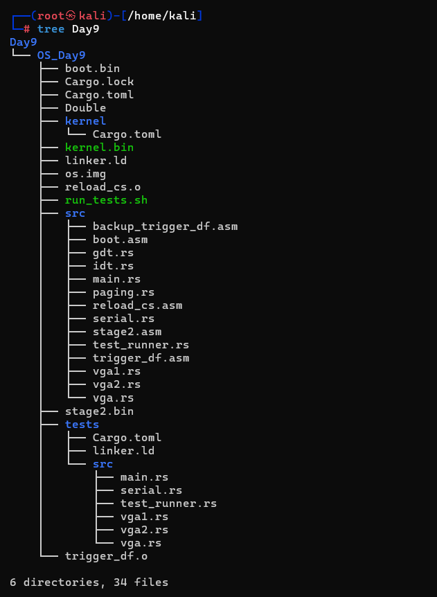
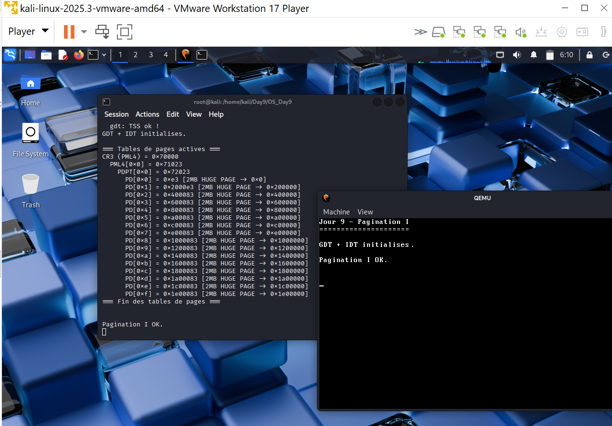

# Jour 9 - Pagination I : Théorie & Lecture des tables de pages

---

## Introduction

Au Jour 6.5, on a activé le paging manuellement dans `stage2.asm` pour passer en Long Mode 64 bits. On a créé des tables de pages avec des **huge pages 2Mo** pour mapper 32Mo de RAM. On savait que ça fonctionnait car le kernel s'exécutait - mais on ne comprenait pas vraiment ce qu'on avait créé.

Au Jour 9, on explore ces tables de pages depuis le kernel Rust lui-même. On lit CR3, on parcourt les 4 niveaux (PML4 -> PDPT -> PD -> PT) et on affiche le mapping complet. C'est la base de tout ce qui suit : allocation de frames, mapping du heap, isolation entre processus.

---

## Théorie — Les 4 niveaux de tables de pages x86_64

### Pourquoi 4 niveaux ?

En 64 bits, l'espace d'adressage virtuel est de **128 To** (47 bits utilisables). Une table plate de 4Ko de pages couvrant 128 To nécessiterait des milliards d'entrées - impossible. La solution : une hiérarchie de tables à 4 niveaux où seules les parties utilisées sont allouées.

### Structure d'une adresse virtuelle

```
Adresse virtuelle 64 bits :
┌────────┬─────────┬─────────┬─────────┬─────────┬────────────┐
│ 63-48  │  47-39  │  38-30  │  29-21  │  20-12  │   11-0     │
│(signe) │ PML4 i  │ PDPT i  │  PD i   │  PT i   │  offset    │
│16 bits │  9 bits │  9 bits │  9 bits │  9 bits │  12 bits   │
└────────┴─────────┴─────────┴─────────┴─────────┴────────────┘
```

Chaque niveau a **512 entrées** (2^9) × 8 octets = 4Ko par table.

### Les 4 niveaux

```
CR3 → PML4 (Page Map Level 4)
         ↓ [index bits 47-39]
      PDPT (Page Directory Pointer Table)
         ↓ [index bits 38-30]
      PD   (Page Directory)
         ↓ [index bits 29-21]
      PT   (Page Table)
         ↓ [index bits 20-12]
      Page physique 4Ko
         ↓ [offset bits 11-0]
      Octet exact
```

### Huge Pages — raccourcis dans la hiérarchie

Au lieu d'aller jusqu'au niveau PT, on peut s'arrêter à PD (bit 7 = 1) :

```
PD avec bit 7 (PS) = 1 :
PML4 → PDPT → PD → Page physique 2Mo directement
                    (pas de niveau PT)
```

C'est ce qu'on utilise dans notre `stage2.asm` - 16 huge pages de 2Mo = 32Mo mappés avec seulement 3 niveaux de tables.

### Les flags d'une entrée

```
Bit 0  (P)   : Present - page présente en RAM
Bit 1  (R/W) : Read/Write — 0=lecture seule, 1=lecture+écriture
Bit 2  (U/S) : User/Supervisor — 0=kernel only, 1=userspace accessible
Bit 3  (PWT) : Page Write Through
Bit 4  (PCD) : Page Cache Disable
Bit 5  (A)   : Accessed — mis à 1 par le CPU au premier accès
Bit 6  (D)   : Dirty — mis à 1 par le CPU à la première écriture
Bit 7  (PS)  : Page Size - 1=huge page (2Mo en PD, 1Go en PDPT)
Bit 63 (NX)  : No-Execute - empêche l'exécution (Jour 10)
Bits 12-51   : Adresse physique de la page suivante
```

### Ce que notre mapping produit

```
stage2.asm crée :
PML4[0] → PDPT à 0x71000
PDPT[0] → PD   à 0x72000
PD[0]   → 0x000000 (2Mo, Present+Write+Huge)  → zone basse
PD[1]   → 0x200000 (2Mo, Present+Write+Huge)  → kernel
PD[2]   → 0x400000 ...
...
PD[15]  → 0x1E00000 (2Mo)                     → fin mapping

Total : 16 × 2Mo = 32Mo mappés en identité (virtuel = physique)
```

---

## Isolation mémoire entre processus

C'est la fonctionnalité de sécurité fondamentale du paging.

### Sans paging

```
Processus A : peut lire/écrire n'importe quelle adresse physique
Processus B : peut lire/écrire n'importe quelle adresse physique
→ Processus A peut lire les données de B
→ Processus A peut écrire dans le kernel
→ Pas d'isolation
```

### Avec paging

```
Processus A : a ses propres tables de pages dans CR3
Processus B : a ses propres tables de pages dans CR3
→ Adresse virtuelle 0x1000 de A ≠ adresse virtuelle 0x1000 de B
→ Chaque processus voit son propre espace isolé
→ Accès hors mapping → Page Fault → kernel reprend le contrôle
```

### Le context switch

```
Processus A s'exécute → CR3 = tables_A
    ↓
Context switch
    ↓
mov cr3, tables_B    ← une seule instruction change tout l'espace mémoire
    ↓
Processus B s'exécute → CR3 = tables_B
```

C'est pour ça que `mov cr3, x` est une instruction privilégiée Ring 0 uniquement.

---

## Implémentation — `src/paging.rs`

```rust
//! Jour 9 — Lecture et affichage des tables de pages x86_64

use crate::serial;

/// Lit CR3 — pointe vers la PML4
pub fn read_cr3() -> u64 {
    let cr3: u64;
    unsafe { core::arch::asm!("mov {}, cr3", out(reg) cr3); }
    cr3
}

/// Lit une entrée de table de pages
/// En bare-metal identité-mappé : adresse physique = adresse virtuelle
unsafe fn read_entry(phys_addr: u64) -> u64 {
    core::ptr::read_volatile(phys_addr as *const u64)
}

fn is_present(entry: u64) -> bool { entry & 1 != 0 }
fn is_huge(entry: u64)    -> bool { entry & (1 << 7) != 0 }
fn phys_addr(entry: u64)  -> u64  { entry & 0x000FFFFF_FFFFF000 }

pub fn print_page_tables() {
    let cr3 = read_cr3();
    let pml4_addr = cr3 & !0xFFF;

    // Niveau 1 : PML4 (512 entrées)
    for pml4_i in 0..512usize {
        let pml4_entry = unsafe { read_entry(pml4_addr + (pml4_i * 8) as u64) };
        if !is_present(pml4_entry) { continue; }

        // Niveau 2 : PDPT
        let pdpt_addr = phys_addr(pml4_entry);
        for pdpt_i in 0..512usize {
            let pdpt_entry = unsafe { read_entry(pdpt_addr + (pdpt_i * 8) as u64) };
            if !is_present(pdpt_entry) { continue; }
            if is_huge(pdpt_entry) { /* 1Go huge page */ continue; }

            // Niveau 3 : PD
            let pd_addr = phys_addr(pdpt_entry);
            for pd_i in 0..512usize {
                let pd_entry = unsafe { read_entry(pd_addr + (pd_i * 8) as u64) };
                if !is_present(pd_entry) { continue; }

                if is_huge(pd_entry) {
                    // Huge page 2Mo - pas de niveau PT
                    // phys_addr(pd_entry) = adresse physique de la page
                    continue;
                }

                // Niveau 4 : PT (4Ko pages normales)
                let pt_addr = phys_addr(pd_entry);
                for pt_i in 0..512usize {
                    let pt_entry = unsafe { read_entry(pt_addr + (pt_i * 8) as u64) };
                    if !is_present(pt_entry) { continue; }
                    // Adresse virtuelle reconstruite :
                    // pml4_i<<39 | pdpt_i<<30 | pd_i<<21 | pt_i<<12
                }
            }
        }
    }
}
```

### Point clé — identité mapping

En bare-metal, nos tables de pages utilisent l'**identité mapping** :

```
adresse virtuelle == adresse physique

→ Pour lire la table PD à l'adresse physique 0x72000,
  on peut simplement déréférencer le pointeur 0x72000
  car l'adresse virtuelle 0x72000 = adresse physique 0x72000

→ Sans identité mapping, il faudrait un "physical memory mapper"
  pour accéder aux tables de pages depuis le kernel
  (c'est le Jour 10)
```

---

## Arborescence



```
OS_Day9/
├── src/
│   ├── main.rs      ← "Jour 9 - Pagination I"
│   ├── paging.rs    ← NOUVEAU : lecture tables de pages
│   ├── gdt.rs
│   ├── idt.rs
│   ├── trigger_df.asm
│   ├── vga1.rs / vga2.rs / vga.rs
│   ├── serial.rs
│   └── ...
└── ...
```

---

## Commandes

```bash
cargo build -Z build-std=core --target x86_64-unknown-none

objcopy -O binary \
  --only-section=.text \
  --only-section=.rodata \
  --only-section=.data \
  target/x86_64-unknown-none/debug/kernel kernel.bin

dd if=/dev/zero   of=os.img bs=512 count=8192
dd if=boot.bin    of=os.img conv=notrunc
dd if=stage2.bin  of=os.img bs=512 seek=1 conv=notrunc
dd if=kernel.bin  of=os.img bs=512 seek=2 conv=notrunc

qemu-system-x86_64 \
  -drive format=raw,file=os.img \
  -serial stdio \
  -display none \
  -no-reboot -no-shutdown
```

---

## Résultat obtenu



```
Jour 9 - Pagination I
=====================
GDT + IDT initialises.

=== Tables de pages actives ===
CR3 (PML4) = 0x70000
  PML4[0x0] = 0x71023
    PDPT[0x0] = 0x72023
      PD[0x0] = 0xe3         [2MB HUGE PAGE -> 0x0]
      PD[0x1] = 0x2000e3     [2MB HUGE PAGE -> 0x200000]
      PD[0x2] = 0x400083     [2MB HUGE PAGE -> 0x400000]
      PD[0x3] = 0x600083     [2MB HUGE PAGE -> 0x600000]
      ...
      PD[0xf] = 0x1e00083    [2MB HUGE PAGE -> 0x1e00000]
=== Fin des tables de pages ===

Pagination I OK.
```

### Interprétation

| Valeur | Signification |
|---|---|
| `CR3 = 0x70000` | PML4 placée à 0x70000 par stage2.asm |
| `PML4[0] = 0x71023` | PDPT à 0x71000, flags `0x23` = Present+Write+Accessed |
| `PDPT[0] = 0x72023` | PD à 0x72000, flags `0x23` = Present+Write+Accessed |
| `PD[0] = 0xe3` | Huge page, flags `0xe3` = Present+Write+Accessed+Dirty+Huge |
| `PD[1] = 0x2000e3` | Kernel à 0x200000, mêmes flags |
| 16 entrées PD | 16 × 2Mo = 32Mo mappés en identité |

---

## Résumé - Angle Cyber

| Concept | Implication sécurité |
|---|---|
| 4 niveaux de tables | Seul le kernel (Ring 0) peut modifier CR3 et les tables |
| Identité mapping | Vulnérable : toute la RAM physique est accessible depuis le kernel |
| Huge pages 2Mo | Granularité grossière - impossible de protéger page par page |
| Flags Present+Write | Toutes nos pages sont Read/Write - pas de pages Read-Only |
| Bit NX absent | Toutes nos pages sont exécutables - à corriger au Jour 10 |
| Isolation processus | Pas encore implémentée - un seul espace d'adressage |

> Notre mapping actuel est **fonctionnel mais non sécurisé** : toute la RAM est accessible en lecture/écriture/exécution depuis n'importe quelle adresse. Le Jour 10 ajoute le bit NX pour séparer code et données. Les Jours 11-12 ajoutent l'allocateur de frames et le heap pour pouvoir créer des espaces d'adressage isolés par processus.
