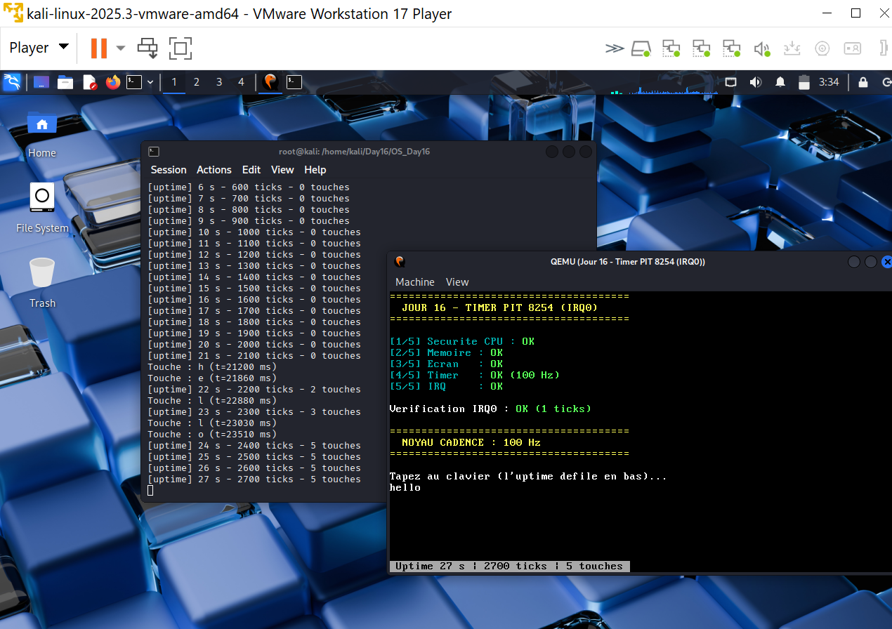

# Writing an OS in Rust : Perspective Cybersécurité

Développement pas à pas d'un noyau **x86_64** en Rust (`no_std`), de l'environnement bare-metal jusqu'aux interruptions matérielles, la pagination, l'allocation dynamique et le multitâche coopératif. Chaque journée est documentée avec rapports techniques, captures QEMU et angle **offensif/défensif**.

> **16 jours** · kernel fonctionnel · clavier + écran + mémoire + sécurité CPU  
> Projet éducatif, consolidation en **livre** en cours.

---

## Démo finale (Jour 15)

Aperçu en boucle : validation des 4 sous-systèmes puis saisie clavier interactive.


Vidéo complète : [jour15_demo_finale.mp4](./Day15/jour15_demo_finale.mp4) · Rapport : [Resume](./Day15/Jour15_Synthese_Finale_Resume.md) · [Complet](./Day15/Jour15_Synthese_Finale_Complet.md)

```bash
cd Day15/OS_Day15 && cargo run
```

---

## Progression du noyau


| Jour | Thème | Arch. | Documentation |
|------|-------|-------|---------------|
| **1** | Environnement bare-metal, Rust Nightly | n/a | [README](./Day01/README.md) |
| **2** | Binaire freestanding, linker | `i686` | [README](./Day02/README.md) |
| **3** | Boot sector ASM, panic handler | `i686` | [README](./Day03/README.md) |
| **4** | VGA Buffer I : `0xb8000` | `i686` | [Rapport](./Day04/Jour4_VGA_Buffer.md) · [code](./Day04/OS_DAY4/) |
| **5** | VGA II : `Writer`, `Mutex`, `println!` | `i686` | [Rapport](./Day05/Jour5_VGA_Buffer_II.md) · [code](./Day05/OS_Day5/) |
| **6** | Tests automatisés QEMU + série | `i686` | [Rapport](./Day06/Jour6_Tests_Kernel_Final.md) · [code](./Day06/OS_Day6/) |
| **6.5** | Migration → Long Mode x86_64 | `x86_64` | [Rapport](./Day06_switch/Jour6_5_Switch_64bits_Final.md) · [code](./Day06_switch/Day06_switch/) |
| **7** | IDT, exceptions CPU | `x86_64` | [Resume](./Day07/Day7_IDT_Resume_Technique.md) · [code](./Day07/OS_Day7/) |
| **8** | Double Fault + IST | `x86_64` | [Resume](./Day08/Jour8_DoubleFault_IST_Resume.md) · [Complet](./Day08/Jour8_DoubleFault_IST_Complet.md) |
| **9** | Pagination I : huge pages 2 Mo | `x86_64` | [Resume](./Day09/Jour9_Pagination_I_Resume.md) · [Complet](./Day09/Jour9_Pagination_I_Complet.md) |
| **10** | Pagination II : bit NX | `x86_64` | [Resume](./Day10/Jour10_Pagination_II_NX_Resume.md) · [Complet](./Day10/Jour10_Pagination_II_NX_Complet.md) |
| **11** | Frame allocator | `x86_64` | [Resume](./Day11/Jour11_Allocation_I_Resume.md) · [Complet](./Day11/Jour11_Allocation_I_Complet.md) |
| **12** | Heap mapping dynamique | `x86_64` | [Resume](./Day12/Jour12_Allocation_II_Resume.md) · [Complet](./Day12/Jour12_Allocation_II_Complet.md) |
| **13** | Linked list heap allocator | `x86_64` | [Resume](./Day13/Jour13_Heap_Allocator_Resume.md) · [Complet](./Day13/Jour13_Heap_Allocator_Complet.md) |
| **14** | PIC + IRQ clavier + executeur async | `x86_64` | [Resume](./Day14/Jour14_Async_Clavier_Resume.md) · [Complet](./Day14/Jour14_Async_Clavier_Complet.md) |
| **15** | Synthèse intégrée + démo | `x86_64` | [Resume](./Day15/Jour15_Synthese_Finale_Resume.md) · [GIF](./Day15/jour15_demo_finale.gif) · [code](./Day15/OS_Day15/) |
| **16** | Timer PIT 8254 : IRQ0 à 100 Hz, noyau cadencé | `x86_64` | [Resume](./Day16/Jour16_Timer_IRQ0_Resume.md) · [Complet](./Day16/Jour16_Timer_IRQ0_Complet.md) · [code](./Day16/OS_Day16/) |
| **17** | Bootloader LBA + `switch_context` | `x86_64` | [Resume](./Day17/Jour17_LBA_Contexte_Resume.md) · [Complet](./Day17/Jour17_LBA_Contexte_Complet.md) · [code](./Day17/OS_Day17/) |
| **18** | Scheduler préemptif Round-Robin | `x86_64` | [Resume](./Day18/Jour18_Scheduler_Preemptif_Resume.md) · [Complet](./Day18/Jour18_Scheduler_Preemptif_Complet.md) · [code](./Day18/OS_Day18/) |

---

## Jalons visuels

Quelques captures représentatives. Chaque jour a davantage d'images dans son dossier.

| Phase | Jour | Capture |
|-------|------|---------|
| **Affichage VGA** | 5 |  |
| **Tests automatisés** | 6 |  |
| **Exceptions CPU / IDT** | 7 |  |
| **Pagination** | 9 |  |
| **Heap allocator** | 13 |  |
| **Clavier interactif** | 14 |  |
| **Noyau cadencé** | 16 |  |
| **Scheduler préemptif** | 18 |  |

---

## Ce que le noyau sait faire

- Démarrer en **Long Mode 64 bits** avec paging (huge pages 2 Mo)
- Afficher du texte couleur sur **VGA** et logger sur le **port série**
- Intercepter les **exceptions CPU** via IDT (fin des triple faults silencieux)
- Survivre aux **double faults** grâce à une stack IST dédiée
- Appliquer **DEP/NX** sur les pages de données
- Allouer des **frames** et mapper un **heap** de 8 Mo
- **Alloc/free** de blocs variables (linked list allocator)
- Recevoir les **frappes clavier** via IRQ1 + executeur cooperatif
- **Valider l'intégration** (Jour 15) : test `0xC0FFEE`, bannière `TOUS LES SOUS-SYSTEMES : OK`
- Se **cadencer tout seul** (Jour 16) : timer PIT à 100 Hz, uptime, base du préemptif
- **Charger un kernel de plusieurs centaines de Ko** (Jour 17) : LBA multi-blocs, plus de plafond 59 secteurs
- **Sauvegarder et restaurer un contexte CPU** (Jour 17) : `switch_context`, deux piles, sequence ABA
- **Préempter une tâche qui refuse de s'arrêter** (Jour 18) : `schedule()` depuis IRQ0, A et B sans `yield`

---

## Prérequis

| Outil | Rôle |
|-------|------|
| [Rust Nightly](https://rustup.rs/) | `#![no_std]`, `asm!` |
| `x86_64-unknown-none` | Cible bare-metal 64 bits |
| [QEMU](https://www.qemu.org/) | `qemu-system-x86_64` |
| `nasm`, `lld` | Boot ASM + linker |
| Linux / WSL | Scripts `run_tests.sh` |

```bash
sudo apt update && sudo apt install -y curl build-essential gcc lld nasm qemu-system-x86 git
curl --proto '=https' --tlsv1.2 -sSf https://sh.rustup.rs | sh
rustup default nightly
rustup target add x86_64-unknown-none i686-unknown-none
```

---

## Lancer le kernel

**Sans compiler** (image du Jour 17, déjà dans le dépôt après génération) :

```bash
qemu-system-x86_64 -drive format=raw,file=Day18/os_day18.img -serial stdio
```

C'est un disque MBR brut, pas un ISO. Pour l'écran VGA et le clavier, compiler puis `./run_demo.sh`.

**Depuis les sources** (Kali / Linux) :

```bash
cd Day18/OS_Day18   # version la plus récente
./build.sh          # bootloader, kernel, et ../os_day18.img
cargo run           # sortie série, idéal en SSH
./run_demo.sh       # fenêtre QEMU graphique (VGA + clavier PS/2)

# ou un jour spécifique :
cd Day07/OS_Day7 && cargo run
cd Day06/OS_Day6 && ./run_tests.sh
```

---

## Structure du dépôt

```
Project_OS_Rust/
├── Day01/ … Day18/     # Code, rapports, captures
├── Day06_switch/       # Jour 6.5 : passage 64 bits
└── README.md
```

Par jour (à partir du Jour 8) : `JourN_*_Resume.md` · `JourN_*_Complet.md` · `rendu*.png`

---

## Angle cybersécurité

| Mécanisme | Enjeu |
|-----------|-------|
| `no_std` / panic abort | Surface d'exposition réduite |
| IDT + handlers | Traçabilité des crashes CPU |
| IST (Jour 8) | Double fault même si stack corrompue |
| Bit NX (Jour 10) | W^X, pas d'exécution sur données |
| Heap (Jour 13) | Overflow, double-free, UAF |
| PIC remappé (Jour 14) | IRQ ne tombe pas sur vecteur d'exception |
| Timer (Jour 16) | Canal auxiliaire temporel, DoS par flood d'IRQ, deadlock handler |
| Boot LBA (Jour 17) | Premier maillon de confiance : taille réelle, plus de copie à l'aveugle |
| Préemption (Jour 18) | Quota CPU, DoS par quantum trop court, deadlock si le handler prend un verrou |

---

## Références

- [Writing an OS in Rust](https://os.phil-opp.com/), par Philipp Oppermann
- [OSDev Wiki](https://wiki.osdev.org/)
- [Intel SDM](https://www.intel.com/content/www/us/en/developer/articles/technical/intel-sdm.html)

---

## Roadmap

- [x] Jours 1 à 15 : code, rapports, [GIF démo](./Day15/jour15_demo_finale.gif)
- [x] **Jour 16** : timer PIT 8254 / IRQ0
- [x] **Jour 17** : bootloader LBA + `switch_context`
- [x] **Jour 18** : scheduler préemptif (Round-Robin)
- [ ] Jours 19-20 : syscalls & Ring 3
- [ ] Consolidation en **livre**
- [ ] Publication (GitHub Pages / PDF)

---

*Projet éducatif personnel, juillet 2026*
