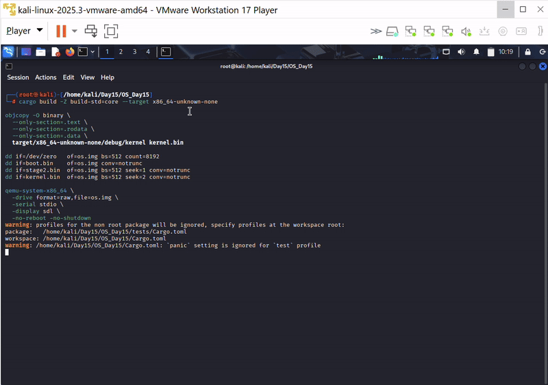
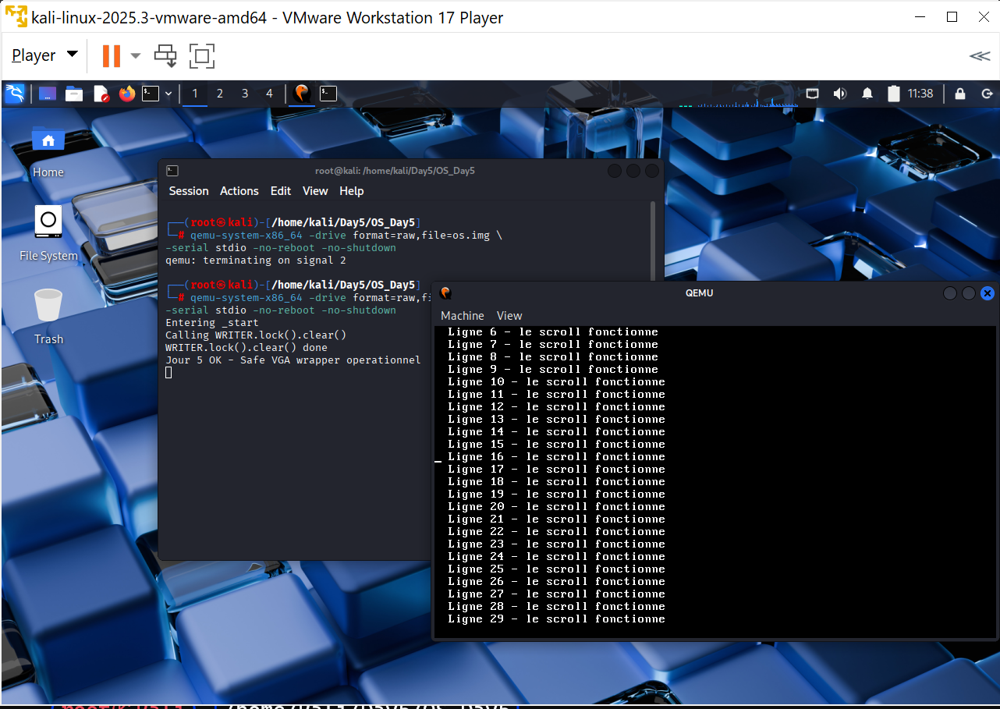
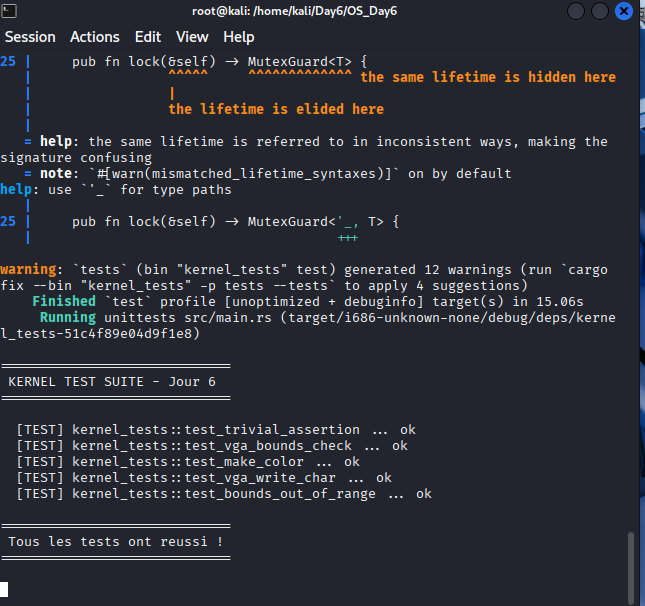
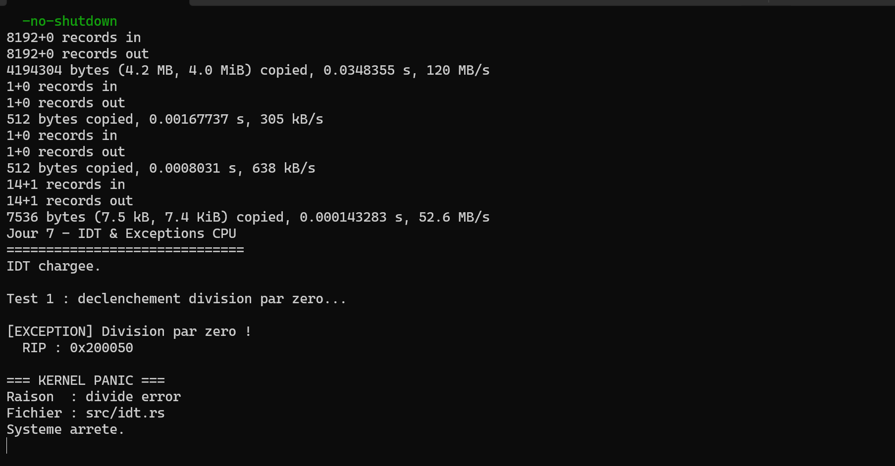
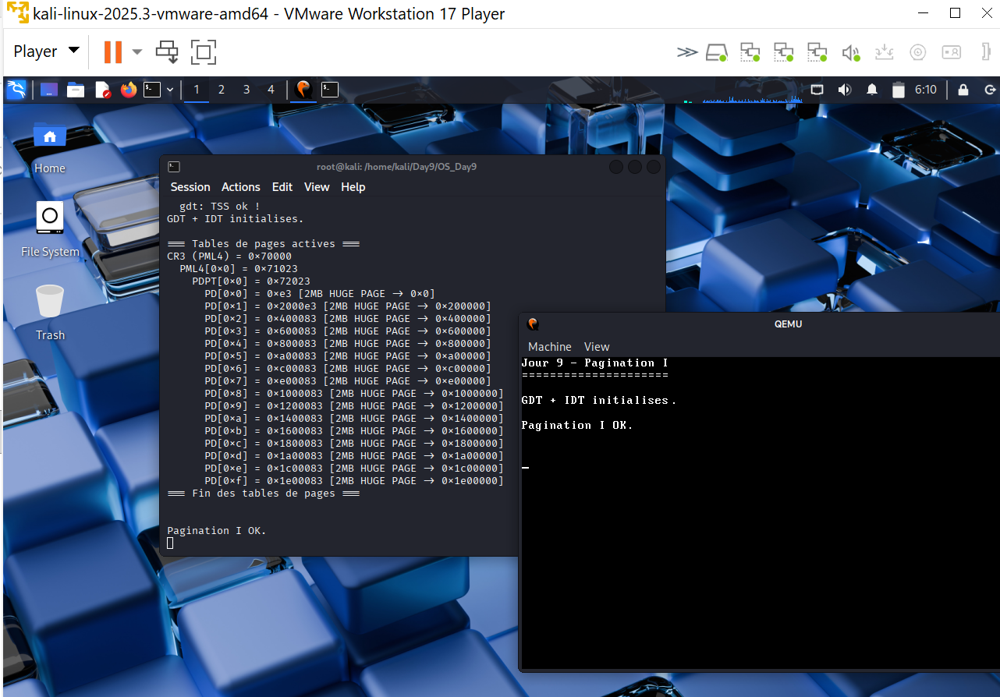
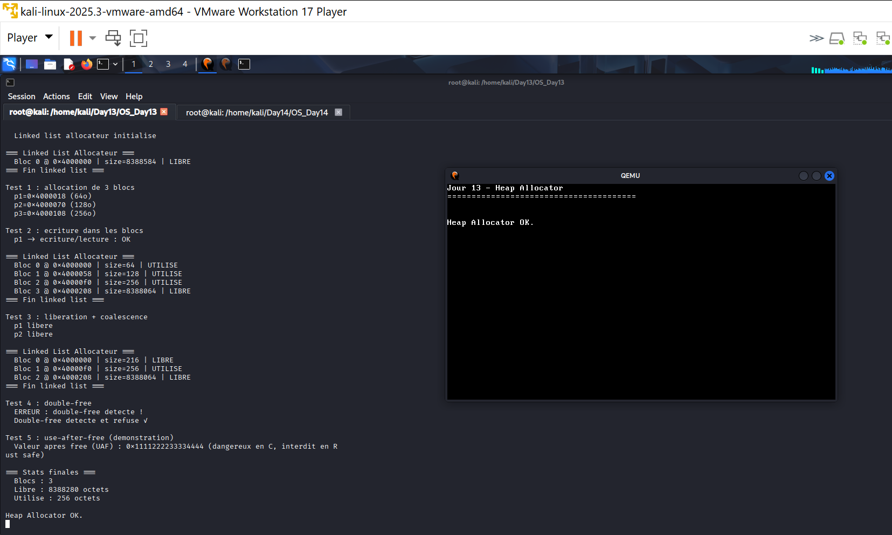
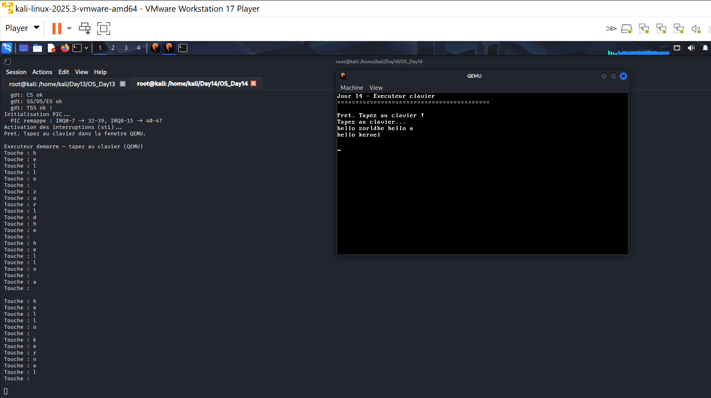
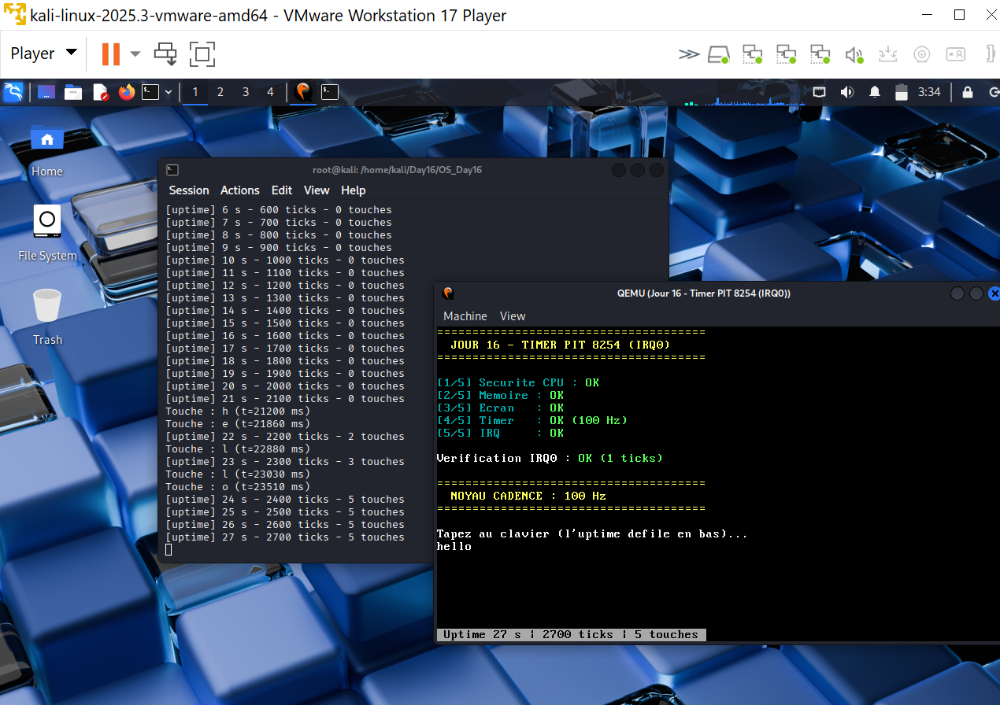
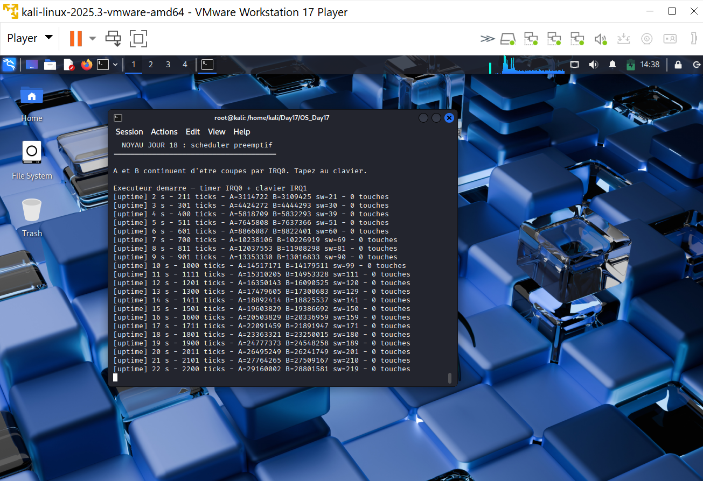

# Writing an OS in Rust, noyau x86_64 bare-metal

<p>


</p>

## Le projet

Ce dépôt est le journal de construction d'un **noyau x86_64 écrit en Rust**, du premier secteur de boot jusqu'à un ordonnanceur préemptif. Le binaire ne s'appuie sur aucun système d'exploitation hôte : `#![no_std]`, `#![no_main]`, pas de libc, pas du runtime standard de Rust. Sous QEMU, un disque MBR brut charge le kernel ; à partir de là, le code parle au matériel. L'écran VGA, le PIC 8259, le PIT 8254, le clavier PS/2 et les tables de pages sont programmés explicitement. Le projet s'inspire du tutoriel *Writing an OS in Rust* de Philipp Oppermann et de l'OSDev Wiki, mais il n'en est pas une copie : chaque journée a un livrable, des captures, et un rapport qui relie le mécanisme à un enjeu de sécurité.

L'objectif n'est pas de produire un Linux miniature. Il s'agit de **comprendre, en les implémentant, les couches qu'un attaquant ou un défenseur finit toujours par rencontrer** : ce qui s'exécute avant tout userspace, comment une interruption arrive jusqu'au CPU, pourquoi une page de données ne doit pas être exécutable, ce qu'il reste d'un processus quand on lui coupe le processeur sans son consentement. Le noyau est un objet d'étude. La cybersécurité n'est pas un chapitre collé à la fin, c'est le fil qui traverse les 18 jours.

Les **jours 1 à 3** posent l'environnement. Rust Nightly, cible freestanding, linker, secteur de boot en assembleur, handler de panic. Rien ne s'affiche encore de façon confortable, mais le contrat est clair : le compilateur ne peut plus s'appuyer sur un OS. Un oubli de `no_std` ou un lien accidentel contre glibc ferait retomber le projet dans un programme utilisateur déguisé. Cette contrainte, ennuyeuse au premier abord, est déjà un geste de réduction de surface : moins de runtime, moins de code que l'on n'a pas lu.

Les **jours 4 et 5** donnent une voix au noyau. Le buffer VGA à l'adresse `0xb8000` devient un `Writer` protégé par un mutex, puis une macro `println!`. Sans cet affichage, le reste du travail serait aveugle : on ne saurait pas si un test a passé, si une exception a été attrapée, si le timer avance. Le Jour 6 ajoute des **tests automatisés** sous QEMU, avec une sortie sur le port série. Le kernel n'est plus seulement « quelque chose qui boote ». Il devient un binaire que l'on peut faire échouer de façon reproductible.

Le **jour 6.5** casse l'architecture 32 bits. Passage en Long Mode, pagination d'identité, cible `x86_64-unknown-none`. À partir de là, les registres, les tables et les interruptions sont ceux d'un CPU 64 bits. C'est aussi le moment où le bootloader et le kernel doivent se mettre d'accord sur ce qui a vraiment été chargé en mémoire, un thème qui reviendra violemment au Jour 17 quand le plafond CHS de 59 secteurs ne suffira plus.

Les **jours 7 et 8** installent l'IDT. Les exceptions CPU cessent d'être des triple faults silencieux. Un handler dédié, une stack IST pour le double fault : même si la pile courante est corrompue, le processeur a encore un endroit où atterrir. En termes de sécurité, c'est de la traçabilité. Un crash devient un vecteur, un RIP, un code d'erreur, plutôt qu'un écran noir. Sans ça, on ne debug pas un noyau, on devine.

Les **jours 9 et 10** portent sur la pagination. Huge pages de 2 Mo d'abord, puis le **bit NX**. Une page de données ne s'exécute plus. C'est le W^X élémentaire, le même principe que DEP sur un OS abouti. Le mapper qui oublie NX transforme un overflow quelconque en gadget exécutable. Le mapper qui le pose correctement force l'attaquant à une autre voie. Le projet rend ce bit visible, au lieu de le laisser dans une case à cocher de firmware.

Les **jours 11 à 13** construisent la mémoire dynamique : allocateur de frames, mapping d'un heap de 8 Mo, puis un **linked list allocator** capable d'`alloc` et de `free`, avec coalescence. C'est le premier vrai tas du noyau, donc le premier endroit où l'on peut parler d'overflow, de double-free, d'use-after-free, sans se cacher derrière la libc. L'allocateur n'est pas durci comme celui d'un kernel de production. Il existe, il est observé, et les rapports de ces journées disent précisément où il est encore fragile.

Le **jour 14** branche le monde extérieur. Le PIC 8259 est remappé pour que les IRQ matérielles ne tombent pas sur les vecteurs d'exception. IRQ1 (clavier) arrive dans un handler, les scancodes sont mis en file, un exécuteur coopératif les consomme. Le noyau n'est plus un monologue : on peut taper, et le texte apparaît. Le **jour 15** ne rajoute presque aucun concept. C'est une **synthèse** : CPU, mémoire, écran et clavier dans un seul binaire, bannière de validation, GIF de démonstration. À ce stade le noyau est déjà un monolithe fonctionnel, mais il a un trou : sans frappe, le `hlt` de la boucle principale le fige. Le temps n'existe pas encore.

Le **jour 16** programme le **PIT 8254**, canal 0, 100 Hz. IRQ0 réveille le CPU toutes les 10 ms. L'uptime s'affiche pendant que l'on tape au clavier. Deux leçons de sécurité sortent tout de suite. Un handler qui prend le mutex VGA deadlock avec le code qui imprime depuis le contexte normal. Un EOI oublié, ou mal placé, tue toute une ligne d'interruptions. Le timer n'est pas un gadget d'horloge. C'est le canal qui rendra possible, deux jours plus tard, d'arracher le CPU à une tâche qui refuse de s'arrêter.

Le **jour 17** a deux visages. D'un côté le bootloader passe en **LBA** (INT 13h AH=0x42), paquets de 64 secteurs, taille réelle écrite dans le MBR : le kernel n'est plus plafonné à 59 secteurs CHS. De l'autre, `switch_context` sauve et restaure une pile 64 bits. La démo ABA prouve que deux contextes distincts survivent à l'aller-retour. C'est encore du **coopératif** : A appelle B, B rend la main. Un `loop {}` sans `switch` gèle toujours la machine. Mais les briques sont là : un timer, une commutation de registres, des piles séparées.

Le **jour 18** relie ces briques. L'ordonnanceur Round-Robin a trois slots (MAIN, A, B). A et B incrémentent un compteur dans une boucle infinie, **sans jamais appeler `switch`**. Toutes les 10 ticks (100 ms), le handler IRQ0 envoie l'EOI puis appelle `schedule()`. Si l'EOI est après le switch, le PIC croit qu'IRQ0 est encore en cours et le préemptif tue le timer. Le contexte sauve aussi l'état SSE (`fxsave64` / `fxrstor64`), parce qu'une préemption au milieu d'un `movaps` corromprait l'autre tâche. La preuve n'est pas un schéma : après 2 secondes A et B sont tous les deux au-dessus de 3 millions d'incréments, vers 10 switches par seconde, et 20 secondes plus tard les deux compteurs ont encore doublé. Personne n'a rendu la main. IRQ0 les a coupés.

Le noyau du Jour 18 sait donc booter en 64 bits, afficher, logger, attraper les exceptions, paginer avec NX, allouer, lire un clavier, se cadencer, charger plus que 59 secteurs, et préempter des tâches noyau. **Ce n'est pas un système d'exploitation complet.** Il n'y a pas de Ring 3, pas d'appels système, pas de processus utilisateur isolés, pas de système de fichiers, pas de réseau. A pourrait encore écraser la pile de B. Un quantum trop court transformerait le scheduler en DoS contre lui-même. Les jours 19 et 20 visent les syscalls et l'espace utilisateur.

Chaque dossier `DayNN/` (zéro devant 1 à 9, pour que GitHub trie dans l'ordre) contient le code de la journée, un Resume, un Complet à partir du Jour 8, des captures, et souvent `os_dayNN.img` : un disque raw MBR, pas un ISO, lançable avec QEMU sans compiler. Le visiteur peut donc relire le raisonnement, relancer le binaire, et vérifier que le compteur A n'est pas une capture figée.

---

## Démo (Jour 15)

Aperçu en boucle : validation des 4 sous-systèmes puis saisie clavier interactive.



Vidéo complète : [jour15_demo_finale.mp4](./Day15/jour15_demo_finale.mp4) · Rapport : [Resume](./Day15/Jour15_Synthese_Finale_Resume.md) · [Complet](./Day15/Jour15_Synthese_Finale_Complet.md)

```bash
cd Day15/OS_Day15 && cargo run
```

---

## Progression du noyau


```mermaid
graph LR
    A[Jours 1-3<br/>Boot & no_std] --> B[Jours 4-5<br/>VGA & println!]
    B --> C[Jour 6<br/>Tests QEMU]
    C --> D[Jour 6.5<br/>Long Mode 64 bits]
    D --> E[Jours 7-8<br/>IDT & Double Fault]
    E --> F[Jours 9-10<br/>Pagination & NX]
    F --> G[Jours 11-13<br/>Frames, Heap, Allocateur]
    G --> H[Jour 14<br/>Async & Clavier]
    H --> I[Jour 15<br/>Synthèse & Démo]
    I --> J[Jour 16<br/>Timer PIT / IRQ0]
    J --> K[Jour 17<br/>LBA + contexte CPU]
    K --> L[Jour 18<br/>Scheduler préemptif]
```

| Jour | Thème | Arch. | Documentation |
|------|-------|-------|---------------|
| **1** | Environnement bare-metal, Rust Nightly | n/a | [README](./Day01/README.md) |
| **2** | Binaire freestanding, linker | `i686` | [README](./Day02/README.md) |
| **3** | Boot sector ASM, panic handler | `i686` | [README](./Day03/README.md) |
| **4** | VGA Buffer I : `0xb8000` | `i686` | [Rapport](./Day04/Jour4_VGA_Buffer.md) · [code](./Day04/OS_DAY4/) |
| **5** | VGA II : `Writer`, `Mutex`, `println!` | `i686` | [Rapport](./Day05/Jour5_VGA_Buffer_II.md) · [code](./Day05/OS_Day5/) |
| **6** | Tests automatisés QEMU + série | `i686` | [Rapport](./Day06/Jour6_Tests_Kernel_Final.md) · [code](./Day06/OS_Day6/) |
| **6.5** | Migration → Long Mode x86_64 | `x86_64` | [Rapport](./Day06_switch/Jour6_5_Switch_64bits_Final.md) · [code](./Day06_switch/Day06_switch/) |
| **7** | IDT, exceptions CPU | `x86_64` | [Resume](./Day07/Day7_IDT_Resume_Technique.md) · [code](./Day07/OS_Day7/) |
| **8** | Double Fault + IST | `x86_64` | [Resume](./Day08/Jour8_DoubleFault_IST_Resume.md) · [Complet](./Day08/Jour8_DoubleFault_IST_Complet.md) |
| **9** | Pagination I : huge pages 2 Mo | `x86_64` | [Resume](./Day09/Jour9_Pagination_I_Resume.md) · [Complet](./Day09/Jour9_Pagination_I_Complet.md) |
| **10** | Pagination II : bit NX | `x86_64` | [Resume](./Day10/Jour10_Pagination_II_NX_Resume.md) · [Complet](./Day10/Jour10_Pagination_II_NX_Complet.md) |
| **11** | Frame allocator | `x86_64` | [Resume](./Day11/Jour11_Allocation_I_Resume.md) · [Complet](./Day11/Jour11_Allocation_I_Complet.md) |
| **12** | Heap mapping dynamique | `x86_64` | [Resume](./Day12/Jour12_Allocation_II_Resume.md) · [Complet](./Day12/Jour12_Allocation_II_Complet.md) |
| **13** | Linked list heap allocator | `x86_64` | [Resume](./Day13/Jour13_Heap_Allocator_Resume.md) · [Complet](./Day13/Jour13_Heap_Allocator_Complet.md) |
| **14** | PIC + IRQ clavier + executeur async | `x86_64` | [Resume](./Day14/Jour14_Async_Clavier_Resume.md) · [Complet](./Day14/Jour14_Async_Clavier_Complet.md) |
| **15** | Synthèse intégrée + démo | `x86_64` | [Resume](./Day15/Jour15_Synthese_Finale_Resume.md) · [GIF](./Day15/jour15_demo_finale.gif) · [code](./Day15/OS_Day15/) |
| **16** | Timer PIT 8254 : IRQ0 à 100 Hz, noyau cadencé | `x86_64` | [Resume](./Day16/Jour16_Timer_IRQ0_Resume.md) · [Complet](./Day16/Jour16_Timer_IRQ0_Complet.md) · [code](./Day16/OS_Day16/) |
| **17** | Bootloader LBA + `switch_context` | `x86_64` | [Resume](./Day17/Jour17_LBA_Contexte_Resume.md) · [Complet](./Day17/Jour17_LBA_Contexte_Complet.md) · [code](./Day17/OS_Day17/) |
| **18** | Scheduler préemptif Round-Robin | `x86_64` | [Resume](./Day18/Jour18_Scheduler_Preemptif_Resume.md) · [Complet](./Day18/Jour18_Scheduler_Preemptif_Complet.md) · [code](./Day18/OS_Day18/) |

---

## Jalons visuels

Quelques captures représentatives. Chaque jour a davantage d'images dans son dossier.

| Phase | Jour | Capture |
|-------|------|---------|
| **Affichage VGA** | 5 |  |
| **Tests automatisés** | 6 |  |
| **Exceptions CPU / IDT** | 7 |  |
| **Pagination** | 9 |  |
| **Heap allocator** | 13 |  |
| **Clavier interactif** | 14 |  |
| **Noyau cadencé** | 16 |  |
| **Scheduler préemptif** | 18 |  |

---

## Ce que le noyau sait faire

- Démarrer en **Long Mode 64 bits** avec paging (huge pages 2 Mo)
- Afficher du texte couleur sur **VGA** et logger sur le **port série**
- Intercepter les **exceptions CPU** via IDT (fin des triple faults silencieux)
- Survivre aux **double faults** grâce à une stack IST dédiée
- Appliquer **DEP/NX** sur les pages de données
- Allouer des **frames** et mapper un **heap** de 8 Mo
- **Alloc/free** de blocs variables (linked list allocator)
- Recevoir les **frappes clavier** via IRQ1 + executeur cooperatif
- **Valider l'intégration** (Jour 15) : test `0xC0FFEE`, bannière `TOUS LES SOUS-SYSTEMES : OK`
- Se **cadencer tout seul** (Jour 16) : timer PIT à 100 Hz, uptime, base du préemptif
- **Charger un kernel de plusieurs centaines de Ko** (Jour 17) : LBA multi-blocs, plus de plafond 59 secteurs
- **Sauvegarder et restaurer un contexte CPU** (Jour 17) : `switch_context`, deux piles, sequence ABA
- **Préempter une tâche qui refuse de s'arrêter** (Jour 18) : `schedule()` depuis IRQ0, A et B sans `yield`

---

## Prérequis

| Outil | Rôle |
|-------|------|
| [Rust Nightly](https://rustup.rs/) | `#![no_std]`, `asm!` |
| `x86_64-unknown-none` | Cible bare-metal 64 bits |
| [QEMU](https://www.qemu.org/) | `qemu-system-x86_64` |
| `nasm`, `lld` | Boot ASM + linker |
| Linux / WSL | Scripts `run_tests.sh` |

```bash
sudo apt update && sudo apt install -y curl build-essential gcc lld nasm qemu-system-x86 git
curl --proto '=https' --tlsv1.2 -sSf https://sh.rustup.rs | sh
rustup default nightly
rustup target add x86_64-unknown-none i686-unknown-none
```

---

## Lancer le kernel

**Sans compiler** (image du Jour 17, déjà dans le dépôt après génération) :

```bash
qemu-system-x86_64 -drive format=raw,file=Day18/os_day18.img -serial stdio
```

C'est un disque MBR brut, pas un ISO. Pour l'écran VGA et le clavier, compiler puis `./run_demo.sh`.

**Depuis les sources** (Kali / Linux) :

```bash
cd Day18/OS_Day18   # version la plus récente
./build.sh          # bootloader, kernel, et ../os_day18.img
cargo run           # sortie série, idéal en SSH
./run_demo.sh       # fenêtre QEMU graphique (VGA + clavier PS/2)

# ou un jour spécifique :
cd Day07/OS_Day7 && cargo run
cd Day06/OS_Day6 && ./run_tests.sh
```

---

## Structure du dépôt

```
Project_OS_Rust/
├── Day01/ … Day18/     # Code, rapports, captures
├── Day06_switch/       # Jour 6.5 : passage 64 bits
└── README.md
```

Par jour (à partir du Jour 8) : `JourN_*_Resume.md` · `JourN_*_Complet.md` · `rendu*.png`

---

## Angle cybersécurité

| Mécanisme | Enjeu |
|-----------|-------|
| `no_std` / panic abort | Surface d'exposition réduite |
| IDT + handlers | Traçabilité des crashes CPU |
| IST (Jour 8) | Double fault même si stack corrompue |
| Bit NX (Jour 10) | W^X, pas d'exécution sur données |
| Heap (Jour 13) | Overflow, double-free, UAF |
| PIC remappé (Jour 14) | IRQ ne tombe pas sur vecteur d'exception |
| Timer (Jour 16) | Canal auxiliaire temporel, DoS par flood d'IRQ, deadlock handler |
| Boot LBA (Jour 17) | Premier maillon de confiance : taille réelle, plus de copie à l'aveugle |
| Préemption (Jour 18) | Quota CPU, DoS par quantum trop court, deadlock si le handler prend un verrou |

---

## Références

- [Writing an OS in Rust](https://os.phil-opp.com/), par Philipp Oppermann
- [OSDev Wiki](https://wiki.osdev.org/)
- [Intel SDM](https://www.intel.com/content/www/us/en/developer/articles/technical/intel-sdm.html)

---

## Roadmap

- [x] Jours 1 à 15 : code, rapports, [GIF démo](./Day15/jour15_demo_finale.gif)
- [x] **Jour 16** : timer PIT 8254 / IRQ0
- [x] **Jour 17** : bootloader LBA + `switch_context`
- [x] **Jour 18** : scheduler préemptif (Round-Robin)
- [ ] Jours 19-20 : syscalls & Ring 3

---

*Projet éducatif personnel, juillet 2026*
